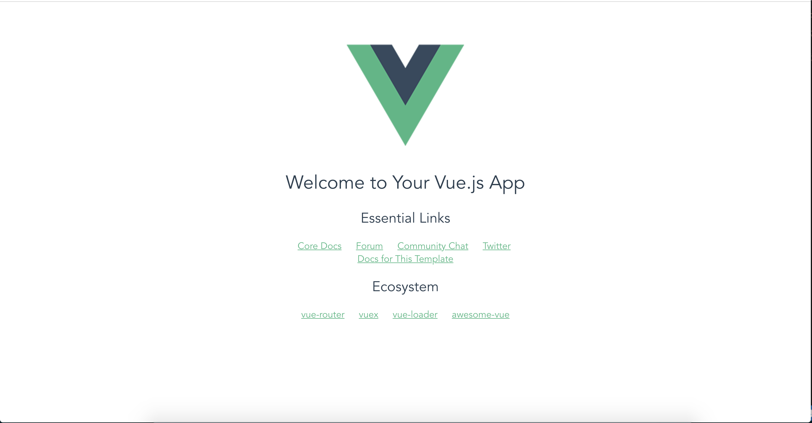

# {{ $page.title }}

<PostMeta/>

## 準備
### vue-cliでプロジェクトを作成
``` sh
$ vue init webpack simple-modal

? Project name simple-modal
? Project description A Vue.js project
? Author 名前
? Vue build standalone
? Install vue-router? No
? Use ESLint to lint your code? Yes
? Pick an ESLint preset Standard
? Set up unit tests No
? Setup e2e tests with Nightwatch? No
? Should we run `npm install` for you after the project has been created? (recommended) npm
```

### 起動確認
``` sh
cd simple-modal
npm run dev
```

画面


### sassのインストール
``` sh
npm install sass-loader node-sass --save-dev
```

srcのディレクトリ
``` sh
src/
├── App.vue
├── assets
│   └── logo.png
├── components
│   └── HelloWorld.vue
└── main.js
```

``` vue
<template>
  <div id="app">
    こんにちは
  </div>
</template>

<style lang="scss">
$red: red;

#app {
  background-color: $red;
}
</style>
```

画面


## モーダルを作る
### ボタンをクリックして、開いた状態と、閉じた状態を変更できるようにする
``` vue
<template>
  <div id="app">
    {{ condition }}
    <button @click="open">モーダル</button>
  </div>
</template>

<script>
export default {
  data: function () {
    return {
      condition: false
    }
  },
  methods: {
    open: function () {
      this.condition = !this.condition
    }
  }
}
</script>
```

### Modalコンポーネントを用意する
Modal.vue
``` vue
<template>
  <div>
    モーダルです
  </div>
</template>
```

App.vue
``` vue
<template>
  <div id="app">
    {{ condition }}
    <button @click="open">モーダル</button>
    <modal />
  </div>
</template>

<script>
import Modal from './components/modal'
export default {
  components: { Modal },
  data: function () {
    return {
      condition: false
    }
  },
  methods: {
    open: function () {
      this.condition = !this.condition
    }
  }
}
</script>
```

画面  


### 