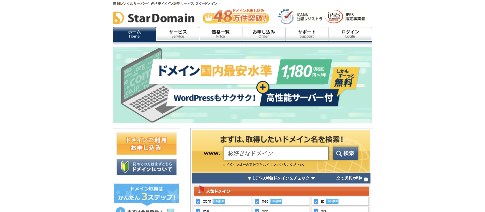
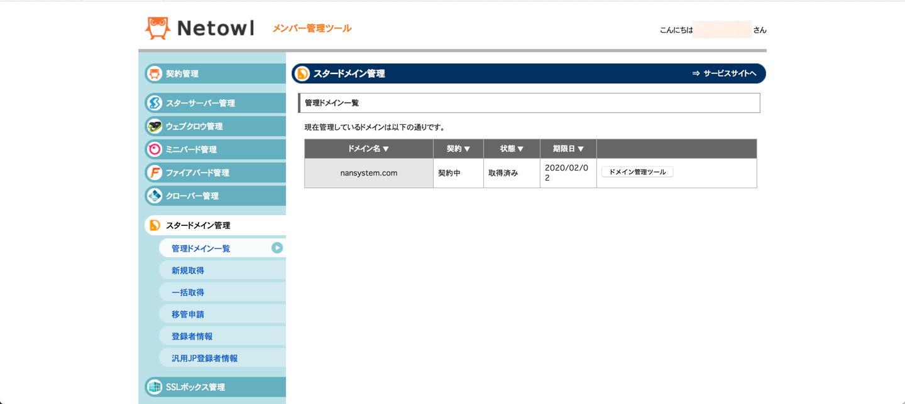
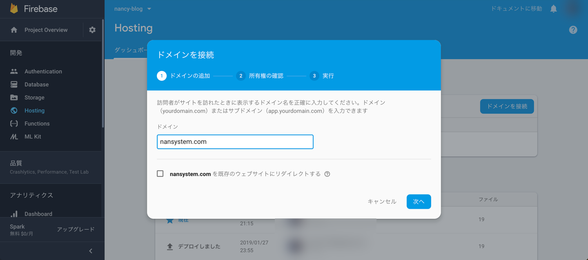
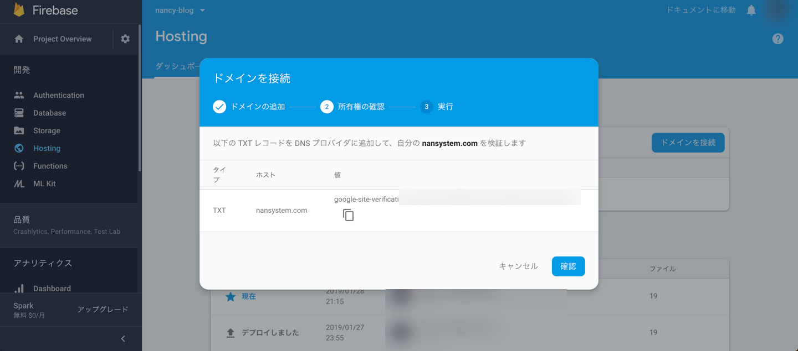
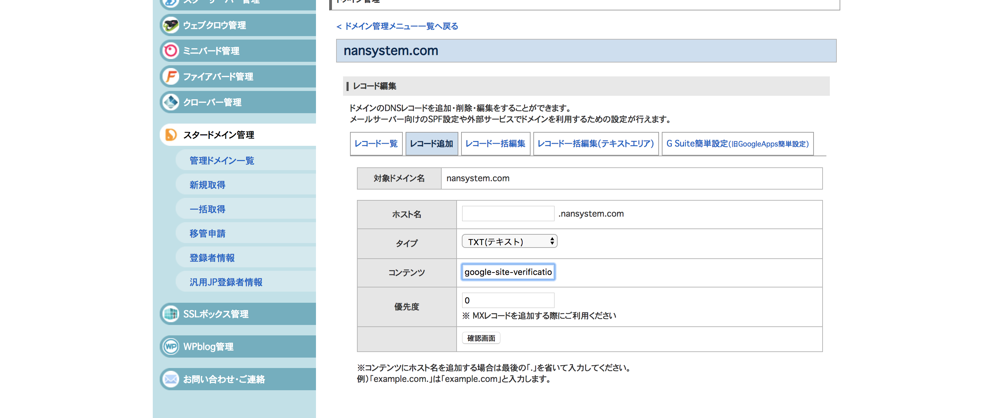
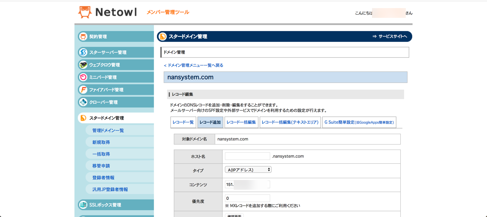
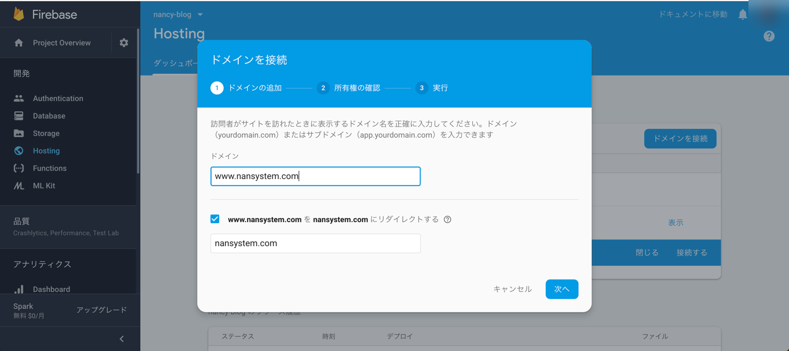
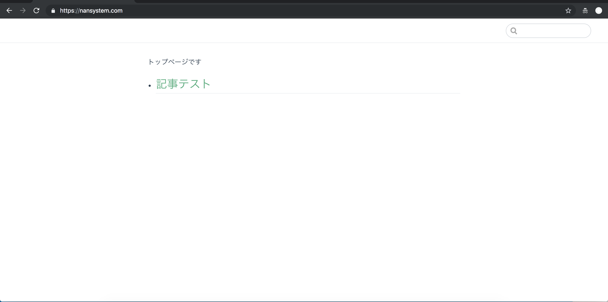

# Firebase Hostingサイトにスタードメインのドメインを設定する
VuePressで生成した静的サイトをFirebase Hostingに公開している。
ドメインを設定していないので、スタードメインでドメインを取得し、
そのドメインをFirebase Hostingに設定していく。

## Firebase Hostingでドメインを設定するには
Firebase Hostingでサイトを公開すると、プロジェクト名の後にfirebaseapp.comが続いたドメインでアクセスできるようになる。

```[プロジェクト名].firebaseapp.com```

Firebase Hostingには自分で取得したドメインであるカスタム ドメインを設定する機能があるので、
まずはドメインを取得する。

## スタードメインでドメインを取得する
<a href="https://px.a8.net/svt/ejp?a8mat=358PUA+7QP6Q+1WTI+C0B9U" target="_blank" rel="nofollow">スタードメイン</a>
で「お好きなドメイン名」に取得したいドメイン名を入力し、「検索」ボタンをクリックする。ドメイン検索結果で「取得できません」と表示されず、「取得する」と書かれているドメインであればOK。
ドメインは「.com」が安いかな。


ドメインを取得して管理画面を表示したら、サイドナビの「スタードメイン管理」から「管理ドメイン一覧」を選択する。
取得したドメイン名が管理されていることを確認できる。


## ドメインをFirebase Hostingに設定する
[Firebase Console](https://console.firebase.google.com/?hl=ja)からプロジェクト名を選択する。
サイドナビからHostingを選択し、「ドメインを接続」ボタンをクリックする。
ドメインを接続というモーダルウィンドウが表示されるので、先ほど取得したドメインを入力し、「次へ」ボタンをクリックする。


所有権の確認画面が表示される。TXTレコードの値が表示されるので、コピーボタンから値をコピーする。
この値を次にドメインの管理画面に設定する


スタードメインの管理ドメイン一覧画面に戻り、「ドメイン管理ツール」ボタンをクリックし、「DNSレコード編集」ボタンをクリックしてレコード追加画面を表示する。
タイプで「TXT(テキスト)」を選択し、コンテンツに先ほどコピーした値を貼り付け、「確認画面」ボタンをクリックする。確認画面で「確定する」ボタンをクリックしてレコードを追加する。


Firebase Consoleに戻り、実行画面でセットアップモードが「クイックセットアップ」が選択されていることを確認する。レコードタイプがAのものが2つ表示されている。値に表示されているIPアドレスをコピーし、1つずつスタードメインでレコードを追加する。



いい感じ。
続いて「www.ドメイン名」でもアクセスできるような設定をする。
ドメインに「www.ドメイン名」を入力し、リダイレクトをチェックする。
これで「www.ドメイン名」と「ドメイン名」どちらからでもアクセスでき、
コンテンツとして重複しないように設定できる。
さきほどと同じようにスタードメインでレコードを追加する。


ドメインの設定が一通り終わったら、ダッシュボードを表示する。
ドメインのステータスが「保留中」になっているのを確認する。

ためしにブラウザから設定したURLを表示してみると...
「この接続ではプライバシーが保護されません」と表示される。
...小一時間ほど待つ。すると、表示される！



設定お疲れ様でした✨


・関連リンク

[カスタム ドメインを接続する](https://firebase.google.com/docs/hosting/deploying?hl=ja)

<a href="https://px.a8.net/svt/ejp?a8mat=358PUA+7QP6Q+1WTI+C0B9U" target="_blank" rel="nofollow">スタードメイン</a>

