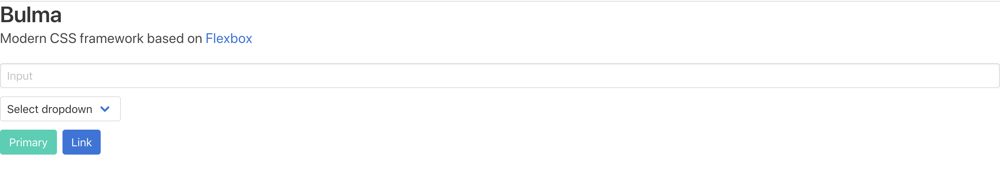

# BulmaをSCSSでカスタマイズできる環境をつくる

## 環境構築
BulmaをSCSSでカスタマイズできる環境を構築していく。  
まずはSCSSをコンパイルできるようにする。  
そして、BulmaをSCSSでカスタマイズできるようにしていく。

### node-sassでSCSSファイルをコンパイルできるようにする
npm initでnpmが使える環境を整える。  
パッケージ名やバージョン名を聞かれるので1つずつ入力していく。  
すべて入力すると、`Is this OK?`と聞かれるので`yes`と答えると、コマンドを実行したディレクトリにpackage.jsonが生成される。

``` bash
$ npm init

package name: (porfolio-website) 
version: (1.0.0) 
description: 
entry point: (index.js) 
test command: 
git repository: 
keywords: 
author: nansystem
license: (ISC) 

$ ls -lt
total 16
-rw-r--r--  1 nancy  staff  221  2 16 16:45 package.json
```

SCSSファイルをコンパイルできるようにするため、node-sassをインストールする。  
うむ。node-sassがインストールされてる。
``` bash{14}
$ npm install -D node-sass
$ cat package.json 
{
  "name": "porfolio-website",
  "version": "1.0.0",
  "description": "",
  "main": "index.js",
  "scripts": {
    "test": "echo \"Error: no test specified\" && exit 1"
  },
  "author": "nansystem",
  "license": "ISC",
  "devDependencies": {
    "node-sass": "^4.11.0"
  }
}
```

いちおうnode-sassが動くことを確認しておこう。  
scssにscssファイルを作成し、cssディレクトリにコンパイルされたcssファイルを配置する。
``` bash
$ mkdir scss css
$ touch scss/style.scss
# ディレクトリ確認
$ tree -I node_modules
.
├── css
├── package-lock.json
├── package.json
└── scss
    └── style.scss
```

style.scssで変数を使ってみてコンパイルされるのを確認する。
``` scss
$palette-sunnyRed: #FF141C;

body {
  background-color: $palette-sunnyRed;
}
```

コンパイルしてみる。
``` bash
$ npx node-sass scss/style.scss css/style.css
$ tree -I node_modules
.
├── css
│   └── style.css
├── package-lock.json
├── package.json
└── scss
    └── style.scss
$ cat css/style.css 
body {
  background-color: #FF141C; }
```
よし。style.cssが生成されてる。style.cssの中身を見てみると、変数が展開されて`$palette-sunnyRed`と記載していた部分が`#FF141C`になっている。
これでSCSSのコンパイルが確認できた。

### SCSSのコンパイルを自動化する
毎回`npx node-sass scss/style.scss css/style.css`とコマンドを打つのは手間なので、
SCSSを自動でコンパイルできるようにしよう。
package.jsonのscriptsに次の記述を追加する。

``` sh
"scripts": {
  "css-build": "node-sass scss/style.scss css/style.css",
  "css-watch": "npm run css-build -- --watch",
  "start": "npm run css-watch"
}
```

`npm run css-build`を実行すると、`node-sass`コマンドを打っていたのと同じようにstyle.cssが生成される。そして、`npm start`でstyle.scssが変更されるたびに自動でstyle.cssが生成されるようになる。

``` sh
$ npm run css-build

Rendering Complete, saving .css file...
Wrote CSS to /css/style.css
```

### BulmaをSCSSでカスタマイズできるようにする
次はBulmaをSCSSとともに使えるようにするため、bulmaをインストールする。

``` bash{14}
$ npm install -D bulma
$ cat package.json 
{
  "name": "porfolio-website",
  "version": "1.0.0",
  "description": "",
  "main": "index.js",
  "scripts": {
    "test": "echo \"Error: no test specified\" && exit 1"
  },
  "author": "nansystem",
  "license": "ISC",
  "devDependencies": {
    "bulma": "^0.7.4",
    "node-sass": "^4.11.0"
  }
}
```

style.scssにBulmaのcssを読み込む。

``` scss
@charset "utf-8";
@import "../node_modules/bulma/bulma.sass";
```

そして、index.htmlを作成してstyle.cssを読み込む。
``` sh{6}
$ touch index.html
$ tree -I node_modules
.
├── css
│   └── style.css
├── index.html
├── package-lock.json
├── package.json
└── scss
    └── style.scss
```

``` html{7}
<!DOCTYPE html>
<html>
<head>
    <meta charset="utf-8">
    <meta name="viewport" content="width=device-width, initial-scale=1">
    <title>My custom Bulma website</title>
    <link rel="stylesheet" href="css/style.css">
</head>
<body>
    <h1 class="title">
        Bulma
    </h1>

    <p class="subtitle">
        Modern CSS framework based on <a href="https://developer.mozilla.org/en-US/docs/Web/CSS/CSS_Flexible_Box_Layout/Basic_Concepts_of_Flexbox">Flexbox</a>
    </p>

    <div class="field">
        <div class="control">
            <input class="input" type="text" placeholder="Input">
        </div>
    </div>

    <div class="field">
        <p class="control">
            <span class="select">
                <select>
                    <option>Select dropdown</option>
                </select>
            </span>
        </p>
    </div>

    <div class="buttons">
        <a class="button is-primary">Primary</a>
        <a class="button is-link">Link</a>
    </div>
</body>
</html>
```

ブラウザでHTMLを確認してみると、いい感じで読み込めてる。


あと少し！  
最後に、style.scssでBulmaのスタイルを変更できるか確かめる。

``` scss
@charset "utf-8";

// カラーパレット
$palette-sunnyRed: #FF141C;

// Bulmaの変数を指定
$primary: $palette-sunnyRed;

@import "../node_modules/bulma/bulma.sass";
```

再度ブラウザでHTMLを確認してみると、Primaryボタンの色が赤色に変わっていることがわかる。


Bulmaの変数は[Variables | Bulma](https://bulma.io/documentation/customize/variables/)にまとまっている。
色だけでなく、フォントやグリッドの幅も変更できる。

準備はできた。あとはBulmaでサイトを作るだけだ✨


・参考リンク  
[With node-sass | Bulma](https://bulma.io/documentation/customize/with-node-sass/)