# Google フォームでお問い合わせフォームを作り、自動返信メールを送る
静的サイトにお問い合わせフォームを設定したい。  
その場合、AWS lambdaやGoogle Cloud Functionsでお問い合わせがあったことを知らせるアプリケーションを作成するか、
他サービスのフォームを埋め込むことになる。  
この記事ではGoogle フォームを使ってお問い合わせフォームを作成する。  
また、お問い合わせいただいた方に、問い合わせが行われたことを通知するための自動返信を行う。

## お問い合わせフォームの作成
Google フォームでお問い合わせフォームを作成し、お問い合わせ内容を保存しておくスプレッドシート作成する。
そして、お問い合わせがあったことを自分にメール通知する設定をする。  
まずはお問い合わせフォームの作成から始める。

### Google フォームでお問い合わせフォームを作成

Google フォーム(https://docs.google.com/forms/u/0/)にアクセスする。
新しいフォームを作成の空白を選択し、フォームの作成を進めていく。

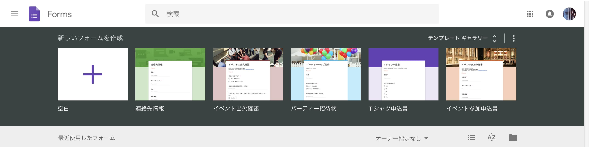

フォームタイトル、質問、回答方法を順次入力し、質問を追加ボタンでフォームを追加していく。

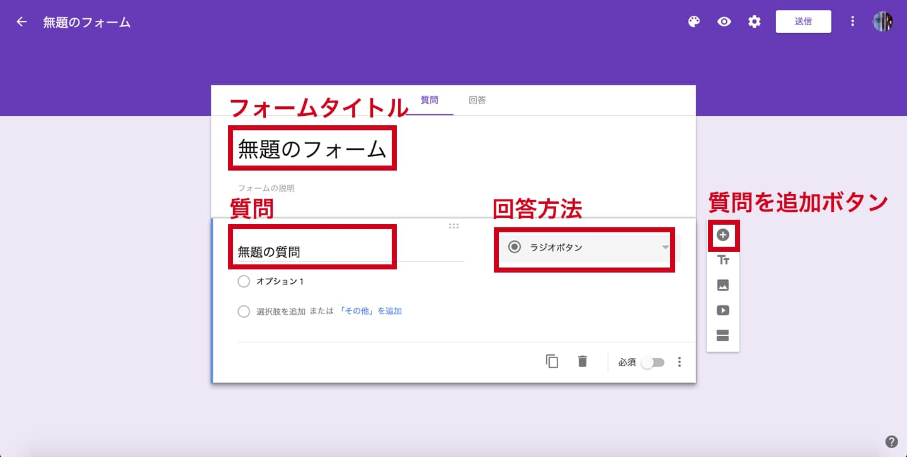

今回はブログの意見をいただけるようにするためにお問い合わせフォームを設置するので、項目は次の3つにした。  
1. お名前(ニックネーム、匿名可)(任意)
2. メールアドレス(任意)
3. お問い合わせ・ご意見・ご感想(必須)
すべて入力し終わると次のような画面になる。

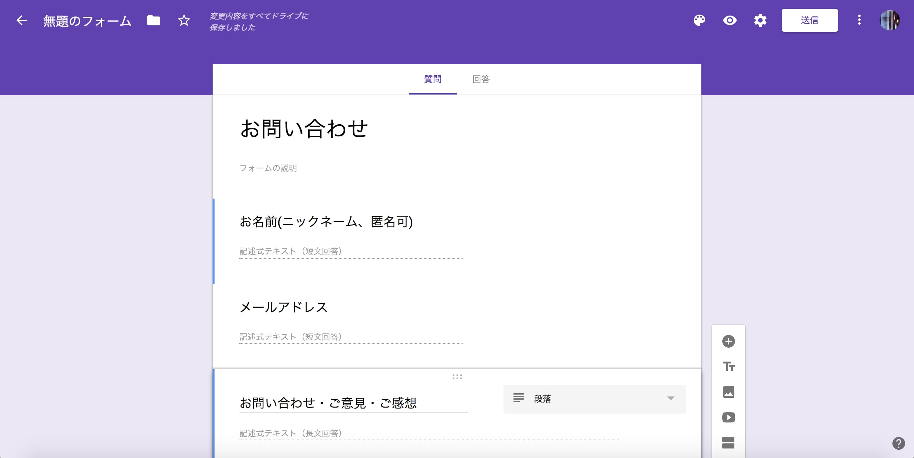

### テーマをカスタマイズ
お問い合わせフォームの見た目を変更することができる。  
テーマをカスタマイズボタンを押すと、右サイドにテーマオプションが表示される。  
ヘッダーの画像やテーマの色を選択できるので、サイトのテーマと合わせて設定する。  
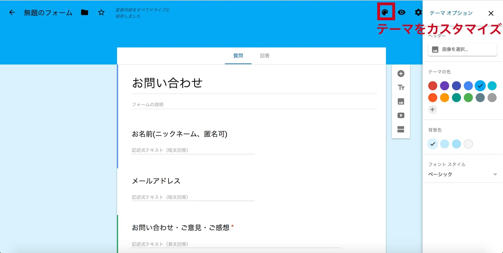

一通りフォームを作成したら、プレビューボタンから作成したお問い合わせフォームの内容を確認する。
うん、項目も色も設定した通りになっている。OK！
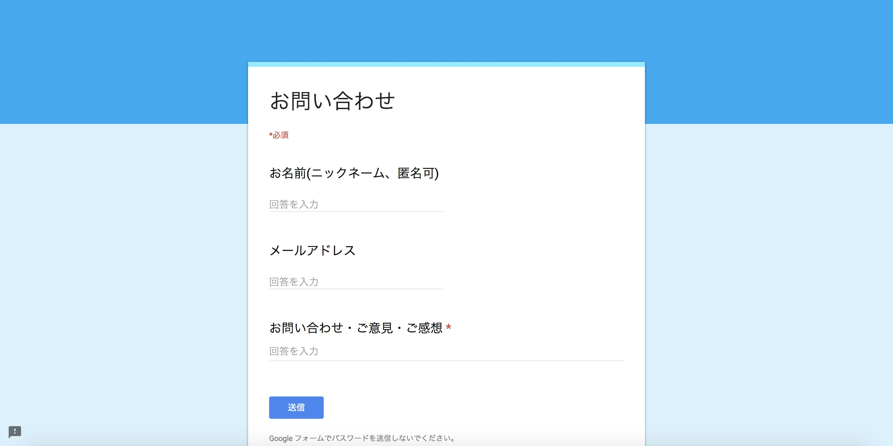

### お問い合わせ内容を保存しておくスプレッドシート作成
次は回答タブを押して、スプレッドシートの作成ボタンを押す。
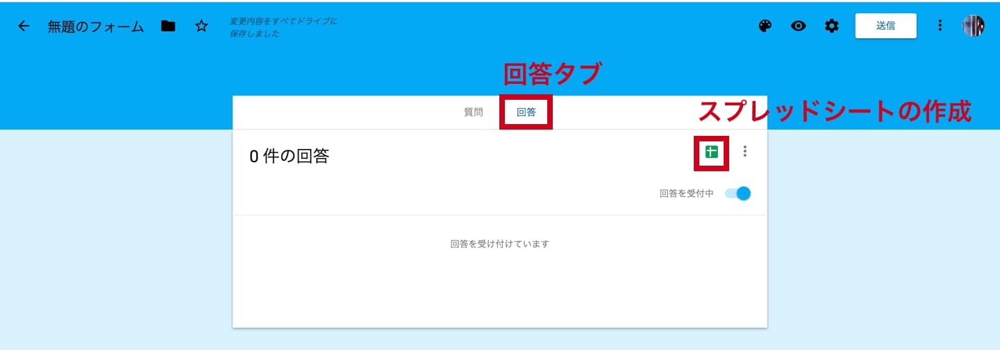

すると、回答先の選択というモーダルが表示される。  
新しいスプレッドシートを作成が選択されていることを確認して、「無題のフォーム(回答)」にお問い合わせ内容を格納するスプレッドシート名を入力し、作成ボタンを押す。

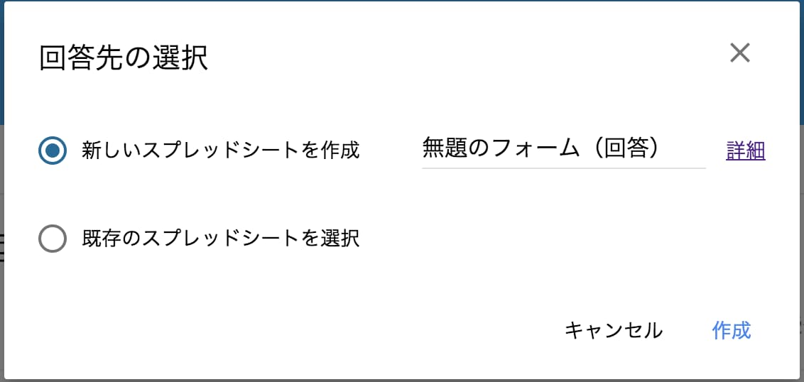
すると、作成したスプレッドシートが開く。

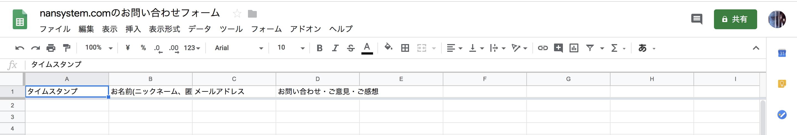

### お問い合わせがあったことを自分にメール通知する
回答タブから縦の3点リーダボタンを押す。

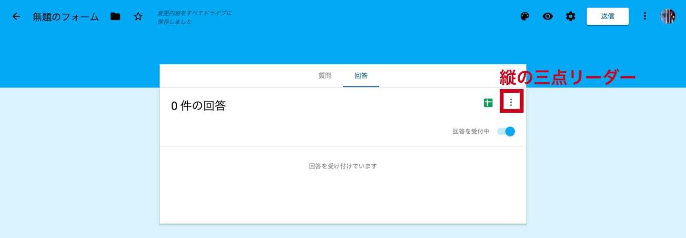
「新しい回答についてのメール通知を受け取る」という項目を押す。  
左下に「メール通知は有効になっています」という通知が一瞬表示されればOK。
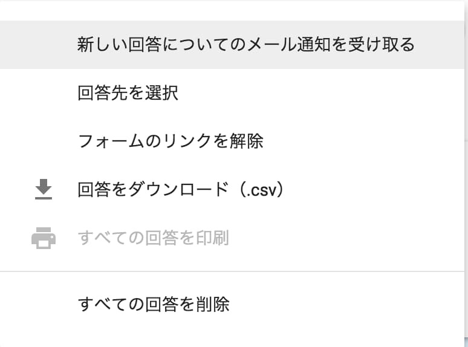


### フォーム送信後の表示設定
設定ボタンを押して、プレゼンテーションタブを開く。  
「別の回答を送信するためのリンクを表示」は回答後に不要なのでチェックを外し、  
確認メッセージにお問い合わせ後に表示される文言を入力する。
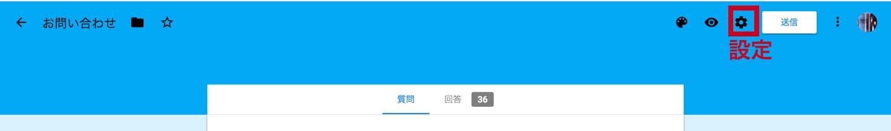


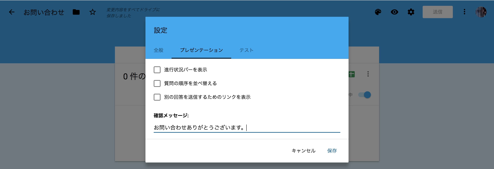

これでお問い合わせフォームが作成できた。

## 自動返信
Google Apps Scriptを使うことで、お問い合わせに対して自動返信メールを送ることができる。

### Google Apps Scriptを動かしてみる
まずは試しにGoogle Apps Scriptを動かしてみる。  
お問い合わせフォームの右上にある縦の3点リーダボタンを押し、スクリプトエディタを選択する。

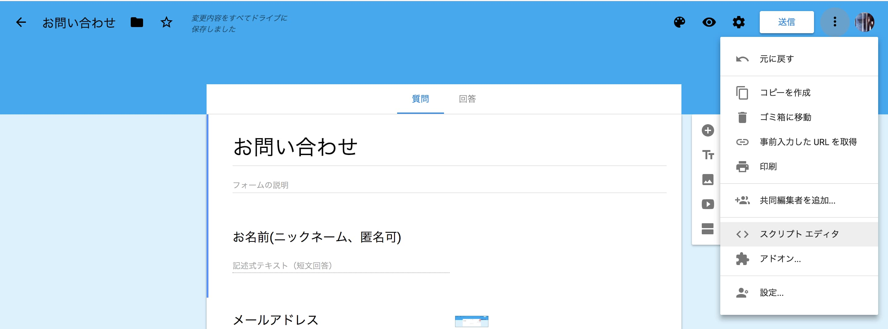

スクリプト エディタが開くので左上の「無題のプロジェクト」をクリックし、プロジェクト名を入力する。

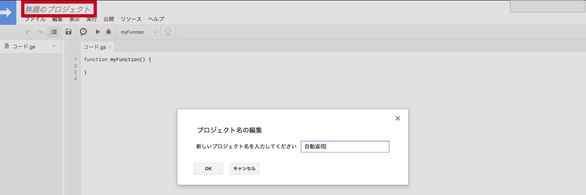
コード.gsに次のようなfunctionを定義する。
``` js
function onSubmit() {
  Logger.log("お問い合わせがありました");
}
```

試しにこのfunctionを実行してみる。  
実行、関数を実行からfunction名のonSubmitを選択する。
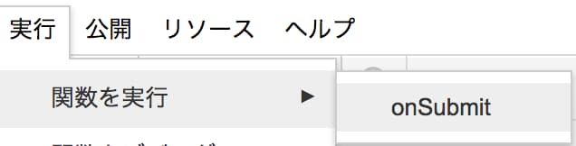

そして、表示、ログを選択する。  
すると、次のようなログが表示される。これでfunctionが動いていることを確認できた。
```
[19-02-19 03:12:17:618 PST] お問い合わせがありました
```

### functionをお問い合わせフォームが送信されたタイミングで実行する
お問い合わせがあったタイミングでメールが送信できるよう、トリガーを設定する。  
編集、現在のプロジェクトのトリガーを選択する。
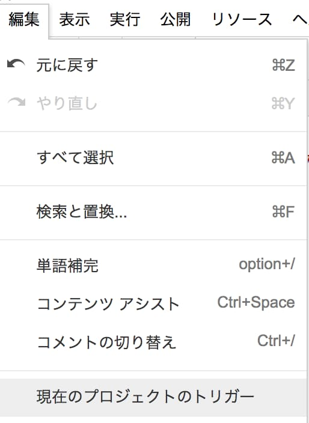

G Suite Developer Hubが表示されるので、右下にあるトリガーを追加ボタンを押す。

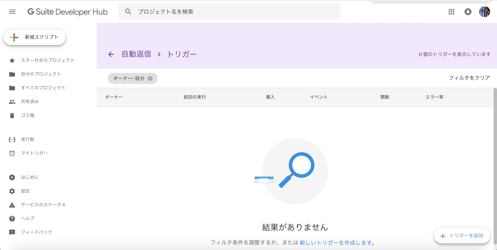
実行する関数に作成したfunctionが指定されていることを確認し、
イベントの種類をフォーム送信時に変更し、保存ボタンを押す。
アクセス権を求めらるので承認する。

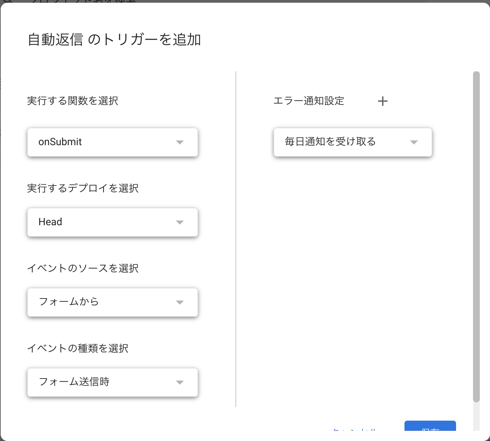
### フォームの内容を取得する
スクリプトエディタでフォームの内容を確認できるよう、次のようなLogger.logを追加する。  
引数の`e`でフォームのイベント情報を取得し、`e.response.getItemResonses()`で各フォームの項目の配列を取得する。
各フォームの値は`item.getItem().getTitle()`でフォームのタイトルを、`item.getResonse()`でフォームの内容を取得できる。

``` js
// フォームのイベントを取得するために必要
FormApp.getActiveForm();

function onSubmit(e) {
  Logger.log("お問い合わせがありました");
  const items = e.response.getItemResponses();
  items.forEach(function(item) {
      Logger.log(item.getItem().getTitle());
      Logger.log(item.getResponse());
  });
}
```

ためしに、次のようにフォームを入力して送信を押してみる。
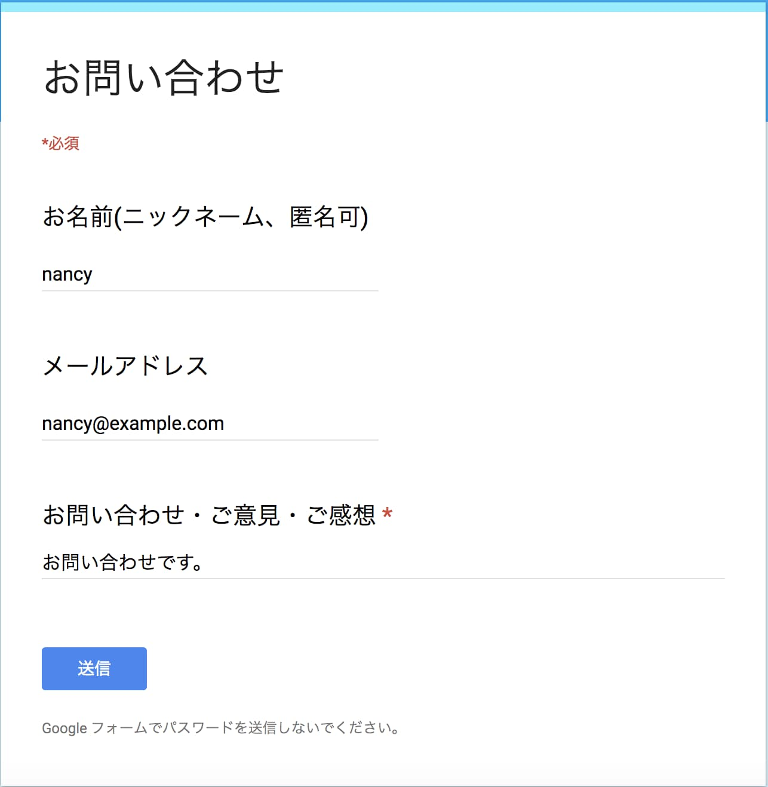
すると、スクリプトエディタのログには、フォームの項目名、そしてフォームの入力内容が出力され、ちゃんとフォームの値が取得できていることがわかる。

```
[19-02-19 03:48:26:203 PST] お問い合わせがありました
[19-02-19 03:48:26:610 PST] お名前(ニックネーム、匿名可)
[19-02-19 03:48:26:612 PST] あ
[19-02-19 03:48:26:700 PST] メールアドレス
[19-02-19 03:48:26:701 PST] い
[19-02-19 03:48:26:779 PST] お問い合わせ・ご意見・ご感想
[19-02-19 03:48:26:780 PST] う
```

### メールを送信する
メールは`GmailApp.sendEmail(email, subject, body);`により送信することができる。
初回に承認が必要ですというモーダルが表示されるので、許可を確認ボタンを押すし、アカウントを選択する。

``` js
GmailApp.sendEmail('[送信先のメールアドレス]', 'メールタイトル', 'メール本文');
```
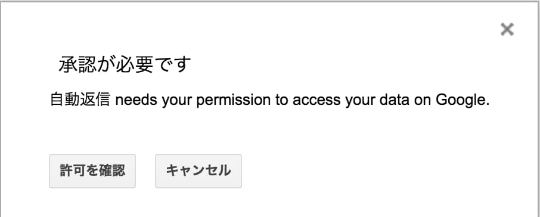
このアプリは確認されていませんと表示されるので、詳細を押し、自動返信(安全でないページ)に移動のリンクを押す。

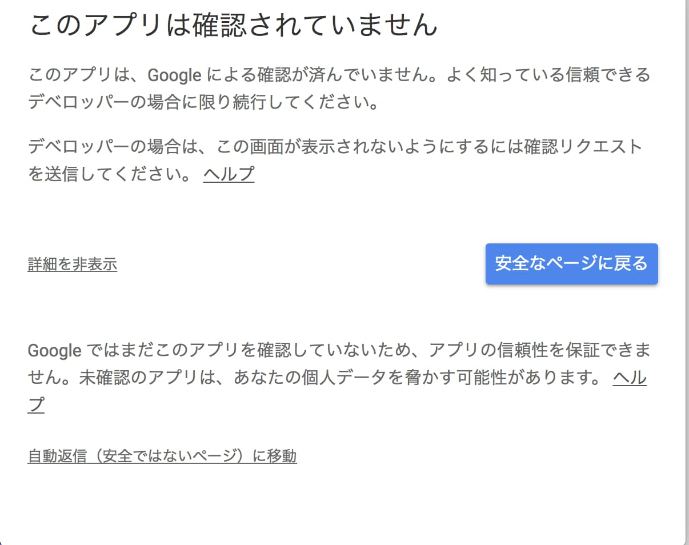

アカウントへのアクセスをリクエストされるので、問題なければ許可ボタンを押す。
これであなたのメールアドレスからfunctionでメールを送信することができるようになる。

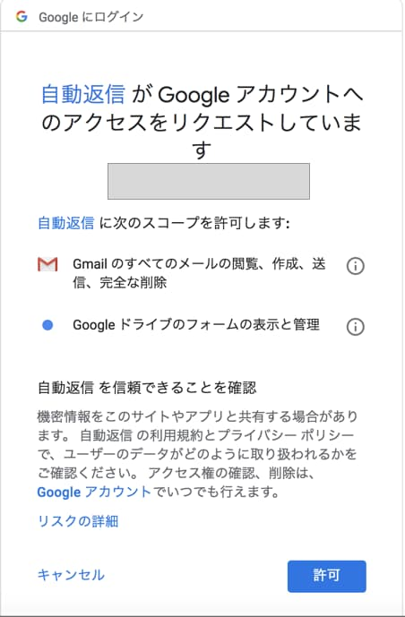

### メール本文にフォームの内容を記載する
`email`に送信先のメールアドレス、`subject`にメールタイトル、`body`にメール内容を指定する。
メール内の改行は`\n`と記載すればよいので、次のようにすればよい。

``` js
FormApp.getActiveForm();

function onSubmit(e) {
  // フォームのメールアドレスとお名前の項目名
  const emailTitle = 'メールアドレス';
  const nameTitle = 'お名前(ニックネーム、匿名可)';

  // メールで使う定数
  const subject = 'お問い合わせを受け付けました';
  const newLine = '\n';
  
  // フォームの内容一覧を取得する
  const items = e.response.getItemResponses();
  
  // 自動返信するお問い合わせのあったメールアドレスを取得する
  const email = getValueByTitle(items, emailTitle);

  // お名前を取得する
  const name = getValueByTitle(items, nameTitle);
  
  // メールアドレスがない場合は何もしない
  if(email === '') {
    Logger.log('メールアドレスが入力されていませんでした');
    return;
  }    
    
  // 本文を作成する
  var body = '';
  if(name !== '') { 
    body += name + '様' + newLine + newLine;
  }
  body += 'お問い合わせいただきありがとうございます。' + newLine;
  body += '以下の内容でお問い合わせを受け付けました。' + newLine + newLine;
  items.forEach(function(item) {
    body += '【' + item.getItem().getTitle() + '】' + newLine;
    body += item.getResponse() + newLine + newLine;
  });
  body += newLine + newLine;
  // 必要であれば、メールに心あたりがない方への導線を作成しておく。
  body += '※このメールに心あたりがない場合には、下記のページよりお問い合わせください。' + newLine;
  body += 'https://docs.google.com/forms/d/e/1FAIpQLSf_AdtSMzeKa6enG6tQAc_yoKDTpTM1D5DaDhkM1O4cxP4Zgg/viewform?fbzx=7126809378701652779';

  Logger.log(email);
  Logger.log(body);
  
  // メールを送信する
  GmailApp.sendEmail(email, subject, body);
}

/**
* itemsからtitleの値を取得する
*/
function getValueByTitle(items, title) {
  return items.filter(function(item) {
    return item.getItem().getTitle() === title;
  })[0].getResponse();
}
```

この自動返信が機能しているか確かめる。  
次のようにフォームを入力し、送信ボタンを押す。
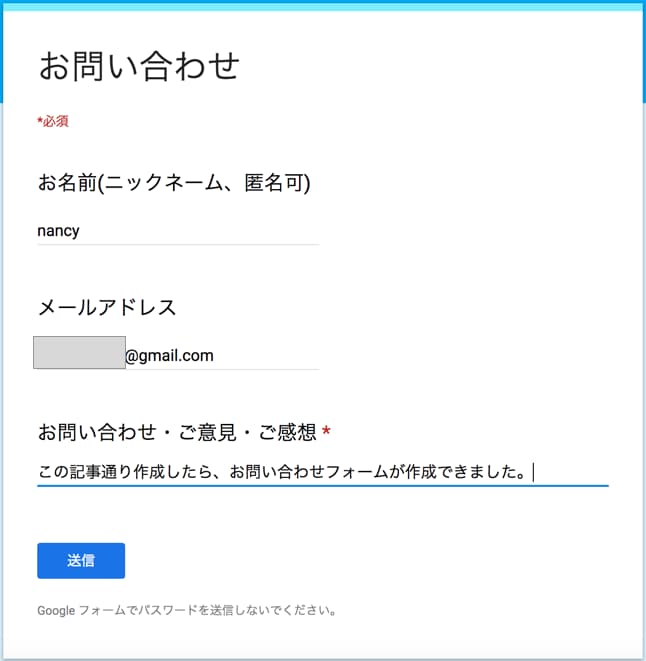

すると、入力したメールアドレスにメールが届いている！すばらしい。  
これで自動返信の設定もできた。

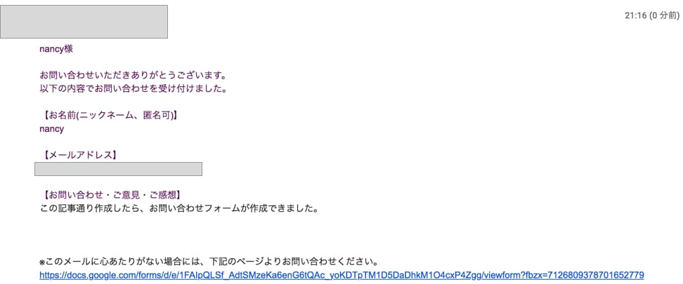


以上で、Google フォームでお問い合わせフォームを作成し、自動返信できるようになった。    


・参考サイト  
[【GAS入門】Googleフォームの回答があったらメール通知するスクリプトを作ってみよう](https://takakisan.com/gas-form-send-email-tutorial/)  
[Google Apps ScriptのObject、Array及びStringのメンバ一覧](https://qiita.com/kuinaein/items/bece0754eabfe72972a9)