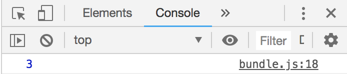

# {{ $page.title }}

<PostMeta/>

Rollupで複数のファイルを1つにまとめる際に`rollup-plugin-commonjs`、`rollup-plugin-node-resolve`プラグインが使われる。この2つのプラグインはいったいどんな役割があるのだろうか。Rollupの概要をおさえた上で、環境をつくり動きを確認していく。

[[toc]]

## Rollupとは
Rollupとは、モジュールバンドラ(module bundler)だ。  
モジュール(module)は機能ごとに分割されたファイルのことで、バンドラ(bundler)はそれらのモジュールをまとめることだ。RollupはES2015(ES6)をベースにしている。つまり、特に設定しなくても`import`、`export`文をつかって複数ファイルを1ファイルにまとめることができる。

## Rollupのインストール
さっそくRollupが動く環境を準備していく。
`package.json`を用意し、`rollup`をインストールする。  
それからsrc、distディレクトリを用意する。

``` bash
npm install --save-dev rollup
```

package.json
``` json
{
  "devDependencies": {
    "rollup": "^1.3.0"
  }
}
```

ディレクトリ
``` bash
.
├── dist
├── package-lock.json
├── package.json
└── src
```

## RollupでES2015のimport/export文のファイルをまとめる
ES2015のimport、export文で書かれた2ファイルを1ファイルにまとめられるか確認していく。  
`calculator.js`と`index.js`ファイルを用意する。

2つの引数を取り、引数同士を足し合わせた結果を返す関数`calculator.js`を作成する。そして、その`calculator.js`で定義した関数を`index.js`から呼び出す。

calculator.js
``` js
export default function(a, b) {
    return a + b;
}
```

index.js
``` js
import add from './calculator.js';

const result = add(1, 2);
console.log(result);
```

`calculator.js`と`index.js`を1ファイルにまとめるために`rollup`コマンドを実行する。  
`--file`オプションで出力ファイルを指定し、
`--format`オプションで出力ファイル形式を指定する。出力ファイル形式として指定している`umd`はサーバー、ブラウザいずれでも動く形式だ。`umd`を指定した場合は`--name`が求められる。

``` bash
$ npx rollup src/index.js --file dist/bundle.js --format umd --name "calculator"

src/index.js → dist/bundle.js...
created dist/bundle.js in 36ms
```

生成された`bundle.js`を見てみると、1ファイルにまとめられていることがわかる。

bundle.js
``` js
(function (factory) {
    typeof define === 'function' && define.amd ? define(factory) :
    factory();
}(function () { 'use strict';

    function add(a, b) {
        return a + b;
    }

    const result = add(1, 2);
    console.log(result);

}));
```

`node`コマンドで生成されたファイルが本当に動くのか確認する。

``` sh
$ node dist/bundle.js 
3
```

うん、動いてる。たしかにES2015の`import`、`export`で書かれたファイルを1ファイルにまとめることができた。

## RollupだけではCommonJSのrequire/exportsのファイルをまとめられない
CommonJSでは`exports`オブジェクトに格納されたモジュールを、`require`関数で呼び出すことでファイルを分割している。

さきほどの`calculator.js`と`index.js`をCommonJSで書き直してみる。

calculator.js
``` js
exports.add = function (a, b) {
    return a + b;
}
```

index.js
``` js
const add = require('./calculator.js').add;

const result = add(1, 2);
console.log(result);
```

`node src/index.js`と実行するとさきほどと同じように計算結果を出力することができる。
再度、`rollup`コマンドで`calculator.js`と`index.js`を1つにまとめてみる。`npx rollup src/index.js --file dist/bundle.js --format umd --name "calculator"`を実行すると次のファイルが出力される。

``` js {6}
(function (factory) {
	typeof define === 'function' && define.amd ? define(factory) :
	factory();
}(function () { 'use strict';

	const add = require('./calculator.js');

	const result = add(1, 2);
	console.log(result);

}));
```

ES2015のimport/export文で書かれたファイルは1ファイルにまとめられていた。しかし、CommonJSのrequire/exportsで書かれたファイルはrequireがそのまま残ってしまい、1ファイルにまとめられなかった。

念のため実行してみると、予想通りエラーになる。

``` bash{6}
$ node dist/bundle.js 
module.js:559
    throw err;
    ^

Error: Cannot find module './calculator.js'
    at Function.Module._resolveFilename (module.js:557:15)
    at Function.Module._load (module.js:484:25)
    at Module.require (module.js:606:17)
    at require (internal/module.js:11:18)
```

`Cannot find module`と出力されてmoduleが見つからないと怒られてしまう。`rollup`だけではCommonJS形式でかかれたファイルを1つにまとめられないのだ。

## rollup-plugin-commonjsでrequire/exportsのファイルをまとめる
require/exportsで指定したファイルを1つのファイルにまとめるには、`rollup-plugin-commonjs`プラグインが必要だ。さっそく`rollup-plugin-commonjs`をインストールする。

``` bash
npm install --save-dev rollup-plugin-commonjs
```

package.json
``` json {4}
{
  "devDependencies": {
    "rollup": "^1.3.0",
    "rollup-plugin-commonjs": "^9.2.1",
  }
}
```

さらに、インストールしたプラグインを使うために、`rollup.config.js`という設定ファイルを用意する。

``` bash{6}
.
├── dist
│   └── bundle.js
├── package-lock.json
├── package.json
├── rollup.config.js
└── src
    ├── calculator.js
    └── index.js
```

先ほどまでコマンドラインで実行していたことが、設定ファイルを使っても同じことができるか確認する。設定ファイルに入力先、出力先と出力形式を指定する。

rollup.config.js
```js
export default {
  input: 'src/index.js',
  output: {
    file: 'dist/bundle.js',
    format: 'umd',
    name: 'calculator'
  }
}
```


設定ファイルを読み込んで実行するには`npx rollup -c`とする。すると先ほどまでコマンドラインで実行していたのと同じファイルが出力される。

``` js
(function (factory) {
	typeof define === 'function' && define.amd ? define(factory) :
	factory();
}(function () { 'use strict';

	const add = require('./calculator.js').add;

	const result = add(1, 2);
	console.log(result);

}));
```

次は`rollup-plugin-commonjs`を使う。`rollup.config.js`の`plugins`に追加する。

``` js{1,10-12}
import commonjs from 'rollup-plugin-commonjs'

export default {
  input: 'src/index.js',
  output: {
    file: 'dist/bundle.js',
    format: 'umd',
    name: 'calculator'
  },
  plugins: [
    commonjs(),
  ],
}
```

`npx rollup -c`を実行してみると、`require`で指定したファイルが展開されて1ファイルになっている！

bundle.js
``` js
(function (global, factory) {
    typeof exports === 'object' && typeof module !== 'undefined' ? module.exports = factory() :
    typeof define === 'function' && define.amd ? define(factory) :
    (global = global || self, global.calculator = factory());
}(this, function () { 'use strict';

    var add = function (a, b) {
        return a + b;
    };

    var calculator = {
    	add: add
    };

    const add$1 = calculator.add;

    const result = add$1(1, 2);
    console.log(result);

    var src = {

    };

    return src;

}));
```

このファイルを実行してみると、1ファイルでもちゃんと実行できるようになった。
``` bash
$ node dist/bundle.js 
3
```


ブラウザでも同様に動くことを確認する。
`index.html`を作成し、生成したJavaScriptを読み込ませる。
このHTMLをGoogle Chromeでひらき、デベロッパーツールを見てみる。
``` html
<!DOCTYPE html>
<html>
<head>
    <meta charset="utf-8">
    <title>Rollup Test</title>
    <script src="dist/bundle.js"></script>
</head>
<body>
</body>
</html>
```

よし。ブラウザでも1ファイルで実行できていることが確認できた。


## まとめられたファイルに関数がexportされるようにする
ところで、先ほど生成した`bundle.js`をよく見てみると、空のオブジェクトを`return`している。これは生成元の`index.js`で何も`export`していないからだ。

``` js
    var src = {

    };

    return src;
```

関数が`export`できることを確認するために、`index.js`に次のような関数を定義して、`npx rollup -c`を実行する。

``` js
const add = require('./calculator.js').add;

module.exports = function (a, b) {
    return add(a, b) * 2;
}
```

生成された`bundle.js`には`src`に関数が代入されており、`exports.default`で関数が定義されている。

bundle.js
``` js{17-21}
(function (global, factory) {
    typeof exports === 'object' && typeof module !== 'undefined' ? factory(exports) :
    typeof define === 'function' && define.amd ? define(['exports'], factory) :
    (global = global || self, factory(global.calculator = {}));
}(this, function (exports) { 'use strict';

    var add = function (a, b) {
        return a + b;
    };

    var calculator = {
    	add: add
    };

    const add$1 = calculator.add;

    var src = function (a, b) {
        return add$1(a, b) * 2;
    };

    exports.default = src;

    Object.defineProperty(exports, '__esModule', { value: true });

}));
```

`bundle-use.js`を作成しこの関数が読み込めることを確認する。

bundle-use.js 
``` js
const addAndDouble = require('./dist/bundle.js').default;

console.info(addAndDouble(1,2));
```

`node bundle-use.js`を実行すると、関数が実行できていることがわかる。
``` sh
$ node bundle-use.js 
6
```

## サードパーティのライブラリ(node_modules)を使う
さて、自分自身でファイルを1つのファイルにまとめることはできた。  
次はサードパーティのライブラリを1つのファイルにまとめることができるか確認していく。  
ここでは便利な関数が多く用意されている`Lodash`を読み込んでみる。

``` bash
$ npm install --save lodash
```

`package.json`に`lodash`がインストールされている。
``` json{7}
{
  "devDependencies": {
    "rollup": "^1.3.0",
    "rollup-plugin-commonjs": "^9.2.1"
  },
  "dependencies": {
    "lodash": "^4.17.11"
  }
}
```

生成元の`index.js`に`lodashのadd関数`を追加する。

index.js
``` js　{2, 5}
const add = require('./calculator.js').add;
const _ = require('lodash');

module.exports = function (a, b) {
    return _.add(add(a, b) * 2, 3);
}
```

`npx rollup -c`で実行すると`Unresolved dependencies`とコンソールに出力される。どうやら`lodash`が読み込まれていないようだ。

``` bash{4}
$ npx rollup -c

src/index.js → dist/bundle.js...
(!) Unresolved dependencies
https://rollupjs.org/guide/en#warning-treating-module-as-external-dependency
lodash (imported by src/index.js, commonjs-external:lodash)
(!) Missing global variable name
Use output.globals to specify browser global variable names corresponding to external modules
lodash (guessing 'lodash')
created dist/bundle.js in 27ms
```

いちおう出力されたファイルをみてみるが、`lodashのadd関数`はどこにも定義されていない。  
`rollup-plugin-commonjs`だけではサードパーティのライブラリを使えないのだ。

dist.js
``` js
(function (global, factory) {
    typeof exports === 'object' && typeof module !== 'undefined' ? factory(exports, require('lodash')) :
    typeof define === 'function' && define.amd ? define(['exports', 'lodash'], factory) :
    (global = global || self, factory(global.calculator = {}, global.lodash));
}(this, function (exports, lodash) { 'use strict';

    lodash = lodash && lodash.hasOwnProperty('default') ? lodash['default'] : lodash;

    var add = function (a, b) {
        return a + b;
    };

    var calculator = {
    	add: add
    };

    const add$1 = calculator.add;


    var src = function (a, b) {
        return lodash.add(add$1(a, b) * 2, 3);
    };

    exports.default = src;

    Object.defineProperty(exports, '__esModule', { value: true });

}));
```

## rollup-plugin-node-resolveでサードパーティのライブラリを読み込めるようにする
サードパーティのライブラリを使うには、`rollup-plugin-node-resolve`プラグインを使う必要がある。

``` bash
$ npm install --save-dev rollup-plugin-node-resolve
```

package.json
``` json{5}
{
  "devDependencies": {
    "rollup": "^1.3.0",
    "rollup-plugin-commonjs": "^9.2.1",
    "rollup-plugin-node-resolve": "^4.0.1"
  },
  "dependencies": {
    "lodash": "^4.17.11"
  }
}
```

`rollup-plugin-node-resolve`をインストールしたら、設定ファイルの`plugins`でプラグインを読み込む。

rollup.config.js
``` js　{2,13}
import commonjs from 'rollup-plugin-commonjs'
import resolve from 'rollup-plugin-node-resolve';

export default {
  input: 'src/index.js',
  output: {
    file: 'dist/bundle.js',
    format: 'umd',
    name: 'calculator'
  },
  plugins: [
    commonjs(),
    resolve(),
  ],
}
```

`npx rollup -c`でファイルを生成すると、今度は`lodash`が定義されている！  
これで無事サードパーティのライブラリを含めて1つのファイルにまとめられるようになった。

dist.js
``` js {21}
(function (global, factory) {
    typeof exports === 'object' && typeof module !== 'undefined' ? factory(exports) :
    typeof define === 'function' && define.amd ? define(['exports'], factory) :
    (global = global || self, factory(global.calculator = {}));
}(this, function (exports) { 'use strict';

    var add = function (a, b) {
        return a + b;
    };

    var calculator = {
    	add: add
    };

    var commonjsGlobal = typeof window !== 'undefined' ? window : typeof global !== 'undefined' ? global : typeof self !== 'undefined' ? self : {};

    function createCommonjsModule(fn, module) {
    	return module = { exports: {} }, fn(module, module.exports), module.exports;
    }

    var lodash = createCommonjsModule(function (module, exports) {
    (function() {
    // ...略(lodashの関数が定義されている)
    }.call(commonjsGlobal));
    });

    const add$1 = calculator.add;


    var src = function (a, b) {
        return lodash.add(add$1(a, b) * 2, 3);
    };

    exports.default = src;

    Object.defineProperty(exports, '__esModule', { value: true });

}));

```

## まとめ
- ES2015のimport/exportで書かれた自分でつくったファイルを1つにまとめるなら`rollup`だけあればよい。
- CommonJSのrequire/exportsで書かれたファイルを1つにまとめるには`rollup-plugin-commonjs`プラグインが必要。
- サードパーティのライブラリを読み込むには`rollup-plugin-node-resolve`が必要。

・参考  
https://github.com/rollup/rollup  
https://github.com/rollup/rollup-plugin-commonjs  
https://github.com/rollup/rollup-plugin-node-resolve  
http://wiki.commonjs.org/wiki/Modules/1.1  
