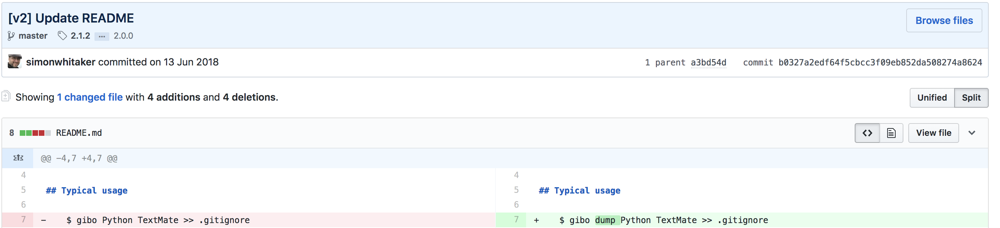

# {{ $page.title }}

<PostMeta/>

ローカル環境でちょっとしたことを試すために`Git`を使うことがある。毎回手でコミットしないファイルを`.gitignore`に書くのは面倒なので、`gibo`でGitHubが公開している.gitignoreのテンプレートをもとに、自分用の`.gitignore`ファイルを用意する。

## giboのインストール
OS XではHomebrewを使って、`gibo`をインストールできる。

``` sh
$ brew install gibo
$ gibo -v
gibo 2.1.2 by Simon Whitaker <sw@netcetera.org>
https://github.com/simonwhitaker/gibo

Fetches gitignore boilerplates from https://github.com/github/gitignore

Usage:
    gibo [command]

Example:
    gibo dump Swift Xcode >> .gitignore

Commands:
    dump BOILERPLATE...   Write boilerplate(s) to STDOUT
    help                  Display this help text
    list                  List available boilerplates
    search STR            Search for boilerplates with STR in the name
    update                Update list of available boilerplates
    version               Display current script version
```

## giboの使い方
``` sh
gibo dump [gitignoreのテンプレート名] >> .gitignore
```

`dump`なしで紹介されていることが多いが、v2より`gibo`コマンド実行時に`dump`が必要になったようだ。


https://github.com/simonwhitaker/gibo/commit/b0327a2edf64f5cbcc3f09eb852da508274a8624#diff-04c6e90faac2675aa89e2176d2eec7d8

gitignoreのテンプレートは[gitignore](https://github.com/github/gitignore)に公開されている。
テンプレート名は大文字、小文字どちらで指定してもよく、複数指定できる。  

MacでVisual Studio Codeをエディタとして使い、JavaScriptの開発をしている場合は、下記のコマンドで簡単に`.gitignore`を生成できる。
``` sh
gibo dump Node VisualStudioCode macOS >> .gitignore
```


・参考  
https://github.com/simonwhitaker/gibo  
https://github.com/github/gitignore  
