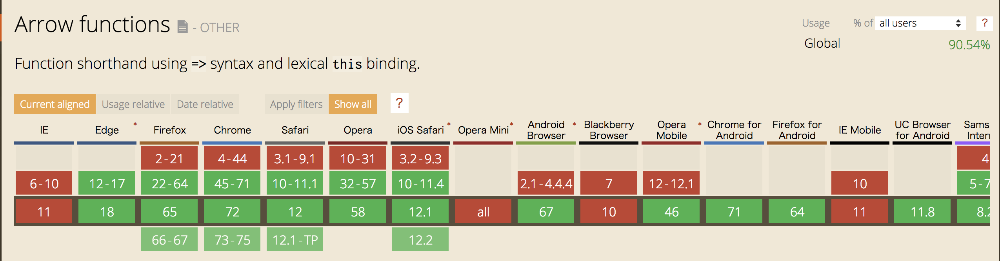

# {{ $page.title }}

<PostMeta/>

webpackやrollupのようなバンドラーや、Vue CLIのような開発ツールとともに[Babel](https://babeljs.io/)が使われている。しかし、そもそもBabelは何なのか、そしてどう使えばよいのだろうか。  
この記事では、Babel7の挙動を確認していく。

2019/5/22追記  
[Babel 7.4.0で非推奨になった@babel/polyfillからcore-js@3に移行する](/migrate-babel-polyfill-to-core-js)方法についてはこちらの記事に書いた。  
  
[[toc]]

## Babelとは
Babelとは、ブラウザでサポートされていないJavaScriptの新機能を、現在のブラウザで使えるようにするツールだ。JavaScriptの新機能は毎年追加されるが、ブラウザでその機能が使えるようになるのは数年先だ。Babelを使うことで、開発者は最新の機能をつかってコードを読みやすく、メンテナンスしやすい形で書くことができ、現在のブラウザでも動くようにすることができる。

## BabelでES2015のアロー関数を変換する
さっそく、BabelでES2015のアロー関数をどのブラウザでも動くようにしてみる。
コマンドラインでBabelを使えるようにするため`@babel/cli`と、`@babel/core`をインストールする。

``` sh
npm install --save-dev @babel/core @babel/cli
```

package.json
``` json
{
  "devDependencies": {
    "@babel/cli": "^7.2.3",
    "@babel/core": "^7.3.4"
  }
}
```

そして、アロー関数の書かれた`index.js`を用意する。

index.js
``` js
[1, 2, 3].map((n) => n + 1);
```

ディレクトリ
``` sh
.
├── index.js
├── package-lock.json
└── package.json
```

`babel [入力ファイル] --out-file [出力ファイル]`として変換する。

``` sh
＄npx babel index.js --out-file script-compiled.js
```

出力されたファイルを確認すると、もとのままだ。

script-compiled.js
``` js
[1, 2, 3].map(n => n + 1);
```

どうやら`@babel/core`だけでは何も変換してくれないようだ。  
アロー関数を使えるようにするには**プラグイン**、または**プリセット**を使う。  
まずはプラグインから見ていく。

## プラグイン(@babel/plugin-transform-arrow-functions)で変換する
アロー関数を変換するために`@babel/plugin-transform-arrow-functions`をインストールする。

``` sh
npm install --save-dev @babel/plugin-transform-arrow-functions
```

``` json{5}
{
  "devDependencies": {
    "@babel/cli": "^7.2.3",
    "@babel/core": "^7.3.4",
    "@babel/plugin-transform-arrow-functions": "^7.2.0"
  }
}
```
`--plugins`オプションでプラグインを指定する。

``` sh
npx babel index.js --out-file script-compiled.js --plugins=@babel/plugin-transform-arrow-functions
```

script-compiled.js
``` js
[1, 2, 3].map(function (n) {
  return n + 1;
});
```

今度は`()=>{}`で書いていた部分が`function(){}`に変換できた。  
プラグインはアロー関数だけでなく、仕様ごとに個別に用意されている。  
https://babeljs.io/docs/en/plugins

## プリセット(@babel/preset-env)で変換する
プラグインでアロー関数を使えるようになったが、他にもletやconstを使ったブロックスコープや、クラス構文など策定済みの仕様をまとめて使えるようにしたい。  
Babelにはプラグインをまとめて設定できる**プリセット**というものが用意されている。このプリセットを試してみる。

``` sh
npm install --save-dev @babel/preset-env
```

package.json
``` json{5}
{
  "devDependencies": {
    "@babel/cli": "^7.2.3",
    "@babel/core": "^7.3.4",
    "@babel/preset-env": "^7.3.4"
  }
}
```

`--presets`オプションでプリセットを指定する。
``` sh
npx babel index.js --out-file script-compiled.js --presets=@babel/env
```

出力された`script-compiled.js`をみると、プラグインを使ったときと同じようにアロー関数がES5で動くように変換されている。

script-compiled.js
``` js
"use strict";

[1, 2, 3].map(function (n) {
  return n + 1;
});
```

<br>
また、アロー関数だけではなく、ブロックスコープやクラス構文をつかったコードも変換できるようになっている。

index.js
``` js
(() => {
  class Counter {
    constructor() {
      this.count = 0;
    }

    increment() {
      this.count++;
    }

  }

  const counter = new Counter();
  console.info(counter.count); // 0
  counter.increment()
  console.info(counter.count); // 1

})();
```

出力された`script-compiled.js`では、`class`や`const`のような記述がなくなり、ES5で動く形に変換されている。

script-compiled.js
``` js
"use strict";

function _classCallCheck(instance, Constructor) { if (!(instance instanceof Constructor)) { throw new TypeError("Cannot call a class as a function"); } }

function _defineProperties(target, props) { for (var i = 0; i < props.length; i++) { var descriptor = props[i]; descriptor.enumerable = descriptor.enumerable || false; descriptor.configurable = true; if ("value" in descriptor) descriptor.writable = true; Object.defineProperty(target, descriptor.key, descriptor); } }

function _createClass(Constructor, protoProps, staticProps) { if (protoProps) _defineProperties(Constructor.prototype, protoProps); if (staticProps) _defineProperties(Constructor, staticProps); return Constructor; }

(function () {
  var Counter =
  /*#__PURE__*/
  function () {
    function Counter() {
      _classCallCheck(this, Counter);

      this.count = 0;
    }

    _createClass(Counter, [{
      key: "increment",
      value: function increment() {
        this.count++;
      }
    }]);

    return Counter;
  }();

  var counter = new Counter();
  console.info(counter.count); // 0

  counter.increment();
  console.info(counter.count); // 1
})();
```

## babel.config.jsでプラグインやプリセットを設定する
コマンドラインに引数を増やしていくと実行するのが手間になる。Babelではどのプラグインやプリセットを使うかを予めファイルで指定しておくことができる。  
`babel.config.js`という名前のファイルを`package.json`と同じ階層に配置しておくと、`babel`コマンドを実行した際にそのファイルの設定を参照するようになる。  

`babel.config.js`でプリセットを設定する。

babel.config.js
``` js
module.exports = function (api) {
  api.cache(true);
  const presets = [
    ['@babel/preset-env'],
  ];
  return {
    presets,
  };
}
```

ついでに入力ファイルと出力ファイルはnpm-scriptsで指定する。

package.json
``` json
  "scripts": {
    "build": "babel index.js --out-file script-compiled.js"
  },
```

これで`npm run build`と実行するだけで、先ほどまでと同じ結果が出力できるようになった。

## .browserslistrcでサポートするブラウザを指定する
サポートするブラウザがすでにJavaScriptの新機能をサポートしていれば、Babelで変換する必要はない。Babelで必要な変換だけするためにサポートブラウザを指定できる。  
指定する方法としては`babel.config.js`、`package.json`、`.browserslistrc`がある。  
Babelでは`.browserslistrc`で設定することが推奨されている。  
ただし、browserslistでは`package.json`が推奨されていたので、好みの方を選ぶ。

> For browser- or Electron-based projects, we recommend using a .browserslistrc file to specify targets.
https://babeljs.io/docs/en/babel-preset-env

<br>

> browserslist key in package.json file in current or parent directories. We recommend this way.
https://github.com/browserslist/browserslist

アロー関数で`browserslist`の挙動を確かめてみる。  
Chromeはバージョン44までは未対応、バージョン45からは対応している。つまり、バージョン44ならアロー関数は`function`の形に変換されるし、バージョン45なら`()=>{}`のままのはずだが...



index.js
``` js
[1, 2, 3].map((n) => n + 1);
```

.browserslistrc
```
Chrome 44
```

バージョン44では予想どうり変換された。

script-compiled.js
``` js
"use strict";

[1, 2, 3].map(function (n) {
  return n + 1;
});
```

ところが、バージョン45ではブラウザがサポートしているから変換されないと思っていたのだけど、変換された。バージョン47までバージョンをあげると変換されなくなった。要確認。

.browserslistrc
```
Chrome 45
```

script-compiled.js
``` js
"use strict";

[1, 2, 3].map(function (n) {
  return n + 1;
});
```

なお、`browserslist`でサポート対象にしているブラウザのバージョンは`npx browserslist`で確認できる。

## 提案中の仕様を使う
プライベートメソッドのような提案中(2019年の3月時点)の仕様を使うには、個別にプラグインを指定する。

``` sh
npm install --save-dev @babel/plugin-proposal-private-methods
``` 

package.json
``` json {4}
  "devDependencies": {
    "@babel/cli": "^7.2.3",
    "@babel/core": "^7.3.4",
    "@babel/plugin-proposal-private-methods": "^7.3.4",
    "@babel/preset-env": "^7.3.4"
  }
```

babel.config.js
``` js {6-8,11}
module.exports = function (api) {
  api.cache(true);
  const presets = [
    ['@babel/preset-env'],
  ];
  const plugins = [
    ['@babel/plugin-proposal-private-methods'],
  ];
  return {
    presets,
    plugins,
  };
}
```

プラグインに`@babel/plugin-proposal-private-methods`を追加することで、メソッド名の先頭に`#`のついたメソッドは外部からアクセスできなくなる。  
つまり、次の`Counter`クラスの`increment`は外部からアクセスできないが、クラス内のメソッドからはアクセスできる。

index.js
``` js {6,11}
class Counter {
  constructor() {
    this.count = 0;
  }

  #increment() {
    this.count++;
  }

  publicIncrement() {
    return this.#increment();
  }
}

const counter = new Counter();
console.info(counter.increment);
console.info(counter.publicIncrement);
```

Babelで変換して実行すると、`counter.increment`は`undefined`、`counter.incrementOutside`は`[Function: incrementOutside]`となり`#`のついたメソッドは外からアクセスできないことがわかる。

script-compiled.js
``` js
"use strict";

function _classCallCheck(instance, Constructor) { if (!(instance instanceof Constructor)) { throw new TypeError("Cannot call a class as a function"); } }

function _defineProperties(target, props) { for (var i = 0; i < props.length; i++) { var descriptor = props[i]; descriptor.enumerable = descriptor.enumerable || false; descriptor.configurable = true; if ("value" in descriptor) descriptor.writable = true; Object.defineProperty(target, descriptor.key, descriptor); } }

function _createClass(Constructor, protoProps, staticProps) { if (protoProps) _defineProperties(Constructor.prototype, protoProps); if (staticProps) _defineProperties(Constructor, staticProps); return Constructor; }

function _classPrivateMethodGet(receiver, privateSet, fn) { if (!privateSet.has(receiver)) { throw new TypeError("attempted to get private field on non-instance"); } return fn; }

var Counter =
/*#__PURE__*/
function () {
  function Counter() {
    _classCallCheck(this, Counter);

    _increment.add(this);

    this.count = 0;
  }

  _createClass(Counter, [{
    key: "publicIncrement",
    value: function publicIncrement() {
      return _classPrivateMethodGet(this, _increment, _increment2).call(this);
    }
  }]);

  return Counter;
}();

var _increment = new WeakSet();

var _increment2 = function _increment2() {
  this.count++;
};

var counter = new Counter();
console.info(counter.increment);
console.info(counter.publicIncrement);
```

## @babel/preset-envだけではできないこと
`@babel/preset-env`を使うことで、新しい構文を使うことができるようになった。  
しかし、次のことは`@babel/polyfill`または`@babel/plugin-transform-runtime`を使わないと動作しない。

1. ブラウザで未対応のグローバルオブジェクト(PromiseやMapなど)を使う
2. ブラウザで未対応のグローバルオブジェクトのメソッド(Array.prototype.includesやString.prototype.padStartなど)を使う

## @babel/polyfillでポリフィルを使えるようにする
まずは`@babel/polyfill`を使うことで`Promise`や`async/await`が使えるようになることを確かめる。

``` sh
npm install --save-dev @babel/polyfill
```

``` json{5}
{
    "devDependencies": {
        "@babel/cli": "^7.2.3",
        "@babel/core": "^7.3.4",
        "@babel/polyfill": "^7.2.5",
        "@babel/preset-env": "^7.3.4"
    }
}
```

index.js
``` js {1}
import "@babel/polyfill";
const resolveAfter2Seconds = () => {
  return new Promise(resolve => {
    setTimeout(() => {
      resolve('resolved');
    }, 2000);
  });
};

const asyncCall = async () => {
  console.log('calling');
  var result = await resolveAfter2Seconds();
  console.log(result);
};

asyncCall();
```

`@babel/polyfill`を使う場合は、ファイルの先頭に`import "@babel/polyfill";`を書く。  
しかし、JavaScriptをBabelで変換しても、出力されたJavaScriptには`require("@babel/polyfill");`のように`require`関数が必要な形で変換される。  
そのため、ブラウザで実行すると`Uncaught ReferenceError: require is not defined`というエラーが表示される。

ブラウザで使うだけなら、`@babel/polyfill`のdistディレクトリにある`polyfill.js`をscriptタグで読み込めば動くようになる。しかし、大抵の場合は`import "@babel/polyfill";`を記載した上で`webpack`や`rollup`を使って1ファイルにまとめてしまう。この記事では他のビルドツールに関しては記述しないので、`polyfill.js`を読み込んだHTMLだけ記述しておく。

index.html
``` html
<!DOCTYPE html>
<html lang="ja">
<head>
  <meta charset="UTF-8">
  <title>polyfill</title>
</head>
<body>
<script src="./node_modules/@babel/polyfill/dist/polyfill.js"></script>
<script src="./script-compiled.js"></script>
</body>
</html>
```

<!-- ### useBuiltInsオプション -->

## @babel/plugin-transform-runtimeでポリフィルを使えるようにする

`@babel/plugin-transform-runtime`を使う方法は`require`でruntime-corejs2を読み込む形でJavaScriptを出力するため、`webpack`や`rollup`と一緒に使わないとブラウザでは動かない。

<br>

それでは、必要なモジュールをインストールしていく。  
`@babel/runtime-corejs2`が`--save`になっているのは実行時にポリフィルを読み込むため。また、`@babel/runtime-core`というものもあるが、こちらはポリフィルを含まないので`Promise`などを使いたいときは使わない。

``` sh
npm install --save-dev @babel/plugin-transform-runtime
npm install --save @babel/runtime-corejs2 
```

設定のポイントは`"corejs": 2,`としているところだ。  
この設定がないとポリフィルが読み込まれない。

babel.config.js
``` js {7-9}
module.exports = function (api) {
  api.cache(true);
  const presets = [
    ['@babel/preset-env']
  ];
  const plugins = [
    ['@babel/plugin-transform-runtime',{
     "corejs": 2,
    }]
  ];
  return {
    presets,
    plugins,
  };
}
```

次のJavaScriptを変換する。

index.js
``` js
const resolveAfter2Seconds = () => {
  return new Promise(resolve => {
    setTimeout(() => {
      resolve('resolved');
    }, 2000);
  });
};

const asyncCall = async () => {
  console.log('calling');
  var result = await resolveAfter2Seconds();
  console.log(result);
};

asyncCall();
```

出力されたJavaScriptの一部は次のようになる。  
`Promise`が`_promise.default`で置き換えられている。

script-compiled.js
``` js {12,15}
"use strict";

var _interopRequireDefault = require("@babel/runtime-corejs2/helpers/interopRequireDefault");

var _regenerator = _interopRequireDefault(require("@babel/runtime-corejs2/regenerator"));

var _asyncToGenerator2 = _interopRequireDefault(require("@babel/runtime-corejs2/helpers/asyncToGenerator"));

var _promise = _interopRequireDefault(require("@babel/runtime-corejs2/core-js/promise"));

var resolveAfter2Seconds = function resolveAfter2Seconds() {
  return new _promise.default(function (resolve) {
    setTimeout(function () {
      resolve('resolved');
    }, 2000);
  });
};
```

https://babeljs.io/docs/en/next/v7-migration#babel-runtime-babel-plugin-transform-runtime

## @babel/polyfillと@babel/plugin-transform-runtimeどちらを使うべきか
WEBサービスをつくるなら`@babel/polyfill`を使えば良い。  
ライブラリをつくるなら`@babel/plugin-transform-runtime`を使えば良い。

||  @babel/polyfill  |  @babel/plugin-transform-runtime  |
| ---- | ---- | ---- |
| 使えるようにするためのポイント |  ポリフィルを使うファイルの先頭で`import "@babel/polyfill";`を記載する  | 1. `@babel/runtime`ではなく`@babel/runtime-corejs2`を使う　<br><br>2. `'@babel/plugin-transform-runtime`プラグインのオプションで`{"corejs": 2}`を設定する|
| グローバル汚染 |  あり  |  なし  |
| 使えないポリフィル |  なし  |  ブラウザで未対応のグローバルオブジェクトのメソッド(Array.prototype.includesやString.prototype.padStartなど)が使えない  |

<!-- ## compat-table
## caniuse -->

<!-- ## まとめ -->

・参考  
https://babeljs.io/  
https://codersmind.com/babel-polyfill-babel-runtime-explained/
