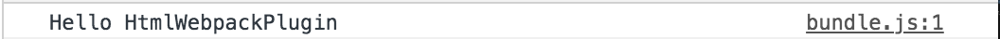
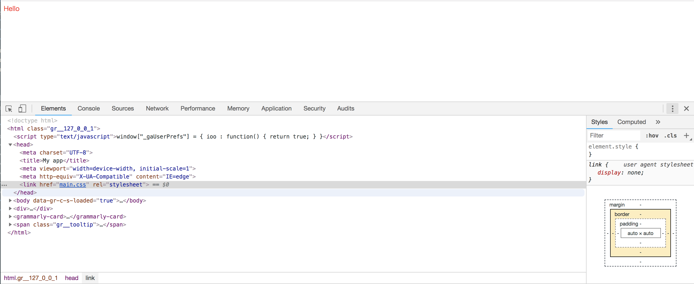

# {{ $page.title }}

<PostMeta/>

`html-webpack-plugin`、`css-loader`、`mini-css-extract-plugin`、`ejs-compiled-loader`を使い、分割したejsをテンプレートにして、ブラウザキャッシュを回避できるCSS、JavaScriptを読み込ませたHTMLを出力できるようにする。

[[toc]]

## html-webpack-pluginとは
[html-webpack-plugin](https://github.com/jantimon/html-webpack-plugin)とはwebpackのプラグインで、**webpackで生成したJavaScriptやCSSを埋め込んだHTMLを生成**する。  
webpackで生成したJavaScriptやCSSにユニークな識別子を付与することでブラウザキャッシュを回避したり、テンプレートとなるHTMLをカスタマイズすることができる。

## html-webpack-pluginでJavaScriptを読み込んだHTMLを生成する
webpackをコマンドラインから実行できるよう`webpack`、`webpack-cli`をインストールする。また、HTMLを生成するために`html-webpack-plugin`をインストールする。

``` sh
npm install webpack webpack-cli html-webpack-plugin --save-dev
```

package.json
``` json
{
  "devDependencies": {
    "html-webpack-plugin": "^3.2.0",
    "webpack": "^4.29.6",
    "webpack-cli": "^3.3.0"
  }
}
```

`webpack.config.js`で`html-webpack-plugin`を読み込む。

webpack.config.js
``` js {2,10-12}
const path = require('path');
const HtmlWebpackPlugin = require('html-webpack-plugin')

module.exports = {
  entry: './src/index.js',
  output: {
    filename: 'bundle.js',
    path: path.resolve(__dirname, 'dist')
  },
  plugins: [
    new HtmlWebpackPlugin()
  ]
}
```

生成するJavaScriptにはHTMLに組み込まれた際のメッセージだけ書いておく。
index.js
``` js
console.info('Hello HtmlWebpackPlugin');
```

用意したファイルは以下の通り配置する。  

ディレクトリ
``` sh
.
├── package-lock.json
├── package.json
├── src
│   └── index.js
└── webpack.config.js
```

<br>

`webpack`コマンドを実行すると、`output.path`で指定した`dist`ディレクトリにJavaScriptとHTMLが出力されている。

``` sh
npx webpack
```

``` sh{1-3}
├── dist
│   ├── bundle.js
│   └── index.html
├── package-lock.json
├── package.json
├── src
│   └── index.js
└── webpack.config.js
```

bundle.js
``` js
!function(e){var t={};function n(r){if(t[r])return t[r].exports;var o=t[r]={i:r,l:!1,exports:{}};return e[r].call(o.exports,o,o.exports,n),o.l=!0,o.exports}n.m=e,n.c=t,n.d=function(e,t,r){n.o(e,t)||Object.defineProperty(e,t,{enumerable:!0,get:r})},n.r=function(e){"undefined"!=typeof Symbol&&Symbol.toStringTag&&Object.defineProperty(e,Symbol.toStringTag,{value:"Module"}),Object.defineProperty(e,"__esModule",{value:!0})},n.t=function(e,t){if(1&t&&(e=n(e)),8&t)return e;if(4&t&&"object"==typeof e&&e&&e.__esModule)return e;var r=Object.create(null);if(n.r(r),Object.defineProperty(r,"default",{enumerable:!0,value:e}),2&t&&"string"!=typeof e)for(var o in e)n.d(r,o,function(t){return e[t]}.bind(null,o));return r},n.n=function(e){var t=e&&e.__esModule?function(){return e.default}:function(){return e};return n.d(t,"a",t),t},n.o=function(e,t){return Object.prototype.hasOwnProperty.call(e,t)},n.p="",n(n.s=0)}([function(e,t){console.info("Hello HtmlWebpackPlugin")}]);
```

HTMLを用意していなくても、`index.html`というHTMLファイルが出力され、そのHTMLファイルの`<script>`タグに出力された`bundle.js`が読み込まれている。

index.html
``` html
<!DOCTYPE html>
<html>
  <head>
    <meta charset="UTF-8">
    <title>Webpack App</title>
  </head>
  <body>
  <script type="text/javascript" src="bundle.js"></script></body>
</html>
```

Google Chromeのデベロッパーツールを確認すると、`index.js`で用意したメッセージが出力されている。

Google Chromeのデベロッパーツール


## titleやmetaタグ、ファイル名を変更する
HTMLを用意しなくても、titleやmetaタグ、出力されるHTML名を設定することができる。

webpack.config.js抜粋
``` js{2-7}
    new HtmlWebpackPlugin({
      title: 'My app',
      meta: [
        {viewport: 'width=device-width, initial-scale=1'},
        { 'http-equiv': 'X-UA-Compatible', content: 'IE=edge'}
      ],
      filename: 'admin.html',
    })
```

`webpack`コマンドを実行すると、先ほどと同じようにJavaScriptとHTMLが出力されている。出力されたHTMLは`filename`オプションで指定した通り`admin.html`になっている。

ディレクトリ
```
├── dist
│   ├── admin.html
│   └── bundle.js
├── package-lock.json
├── package.json
├── src
│   └── index.js
└── webpack.config.js
```

出力されたHTMLの`title`が`title`オプションで指定した値になり、`meta`タグが`meta`オプションで指定した通りに出力されている。
admin.html
``` html{5,6}
<!DOCTYPE html>
<html>
  <head>
    <meta charset="UTF-8">
    <title>My app</title>
  <meta viewport="width=device-width, initial-scale=1"><meta http-equiv="X-UA-Compatible" content="IE=edge"></head>
  <body>
  <script type="text/javascript" src="bundle.js"></script></body>
</html>
```

## Cache Bustingで最新のCSS、JavaScriptを読み込む
最新のCSSやJavaScriptをブラウザに反映するには、Cache Bustingの設定が必要だ。
Cache Bustingとは何かを確認し、CSSの出力の設定、Cache Bustingの設定をしていく。

### Cache Bustingとは
Cache Bustingは**ブラウザキャッシュを回避する**手法だ。  
ブラウザはCSSやJavaScriptなどの静的ファイルをキャッシュしている。  
そのため、それらを変更しても画面に反映されないことがある。そこで、ブラウザにファイルが変更されていることを伝えるため、静的ファイルにユニークな識別子をつけることでブラウザキャッシュを回避する。

### mini-css-extract-plugin、css-loaderでCSSを別ファイルとして出力する
JavaScriptだけでなくCSSにもユニークな識別子がつくことを確認するため、バンドルするJavaScriptからCSSを読み込み、`<head>`タグに`<link>`タグが出力されるようにする。  
CSSの読み込みのために`css-loader`を、JavaScriptないのCSSを抽出して`<link>`タグに出力するために`mini-css-extract-plugin`をインストールする。

``` sh
npm install --save-dev mini-css-extract-plugin css-loader
```

CSSと、そのCSSを読み込むJavaScriptを用意する。

index.js
``` js {1}
import './style.css';
const component = () => {
  const element = document.createElement('div');
  element.innerHTML = 'Hello';
  element.classList.add('hello');
  return element;
}
document.body.appendChild(component());

console.info('Hello HtmlWebpackPlugin');
```

style.css
``` css
.hello {
  color: red;
}
```

CSSを読み込み、そのCSSをJavaScriptとは別ファイルとして出力できるように`mini-css-extract-plugin`を設定する。

webpack.config.js
``` js {3,12,22-32}
const path = require('path');
const HtmlWebpackPlugin = require('html-webpack-plugin');
const MiniCssExtractPlugin = require("mini-css-extract-plugin");

module.exports = {
  entry: './src/index.js',
  output: {
    filename: 'bundle.js',
    path: path.resolve(__dirname, 'dist')
  },
  plugins: [
    new MiniCssExtractPlugin({}),
    new HtmlWebpackPlugin({
      title: 'My app',
      meta: [
        {viewport: 'width=device-width, initial-scale=1'},
        { 'http-equiv': 'X-UA-Compatible', content: 'IE=edge'}
      ],
      filename: 'admin.html',
    })
  ],
  module: {
    rules: [
      {
        test: /\.css$/,
        use: [
          { loader: MiniCssExtractPlugin.loader, options: {} },
          'css-loader'
        ]
      }
    ]
  }
}
```

`webpack`コマンドを実行すると、`main.css`が出力されていることがわかる。  
また、出力されたHTMLファイルをみると`<link href="main.css" rel="stylesheet">`と出力されており、CSSを読み込んでいる。

ディレクトリ
``` sh{5}
.
├── dist
│   ├── admin.html
│   ├── bundle.js
│   └── main.css
├── package-lock.json
├── package.json
├── src
│   ├── index.js
│   └── style.css
└── webpack.config.js
```

admin.html
``` html{6}
<!DOCTYPE html>
<html>
  <head>
    <meta charset="UTF-8">
    <title>My app</title>
  <meta viewport="width=device-width, initial-scale=1"><meta http-equiv="X-UA-Compatible" content="IE=edge"><link href="main.css" rel="stylesheet"></head>
  <body>
  <script type="text/javascript" src="bundle.js"></script></body>
</html>
```

Google Chromeで画面を確認すると、CSSが読み込まれ文字が赤色に変わっている。

Google Chrome


### Cache Bustingを試す
`HtmlWebpackPlugin`のオプションに`hash: true`を追加する。

webpack.config.js抜粋
``` js {8}
    new HtmlWebpackPlugin({
      title: 'My app',
      meta: [
        {viewport: 'width=device-width, initial-scale=1'},
        { 'http-equiv': 'X-UA-Compatible', content: 'IE=edge'}
      ],
      filename: 'admin.html',
      hash: true,
    })
```

`webpack`コマンドを実行するとCSS,JavaScriptのパスの後ろに`?71bc419268b3e133da2d`のような文字列が付与されている。

admin.html
``` html{6,8}
<!DOCTYPE html>
<html>
  <head>
    <meta charset="UTF-8">
    <title>My app</title>
  <meta viewport="width=device-width, initial-scale=1"><meta http-equiv="X-UA-Compatible" content="IE=edge"><link href="main.css?71bc419268b3e133da2d" rel="stylesheet"></head>
  <body>
  <script type="text/javascript" src="bundle.js?71bc419268b3e133da2d"></script></body>
</html>
```


## 独自のHTMLをテンプレートに使う
ここまでは`html-webpack-plugin`が用意しているデフォルトのHTMLをテンプレートとして、HTMLを生成していた。しかし、テンプレートとなるHTMLは自分で指定することができる。  
また、テンプレートでオプションを通して変数を渡すことができる。オプションは`htmlWebpackPlugin.options.[オプション名]`の形で渡す。

template.html
``` html
<!DOCTYPE html>
<html>
  <head>
    <meta charset="utf-8"/>
    <title><%= htmlWebpackPlugin.options.title %></title>
  </head>
  <body>
    <h1><%= htmlWebpackPlugin.options.originalHeader %></h1>
  </body>
</html>
```

プラグインの設定でテンプレートになるHTMLファイルのパスを`template`に指定する。オプションで`title`、`originalHeader`を設定したため、HTMLからそれぞれ`htmlWebpackPlugin.options.title`、`htmlWebpackPlugin.options.originalHeader`として参照することができる。

webpack.config.js抜粋
``` js {2,3,8}
    new HtmlWebpackPlugin({
      title: 'My Template app',
      originalHeader: 'original header title',
      meta: [
        {viewport: 'width=device-width, initial-scale=1'},
        { 'http-equiv': 'X-UA-Compatible', content: 'IE=edge'}
      ],
      template: './src/template.html',
      filename: 'admin.html',
      hash: true,
    })
}
```

`webpack`コマンドを実行して出力されたHTMLを確認すると、プラグインのオプションで指定したタイトルやヘッダー名になっている。

admin.html
``` html {5,8}
<!DOCTYPE html>
<html>
<head>
  <meta charset="utf-8" />
  <title>My Template app</title>
<meta viewport="width=device-width, initial-scale=1"><meta http-equiv="X-UA-Compatible" content="IE=edge"><link href="main.css?4875e63514c6954b2671" rel="stylesheet"></head>
<body>
  <h1>original header title</h1>
<script type="text/javascript" src="bundle.js?4875e63514c6954b2671"></script></body>
</html>
```

## ejsでincludeを使ったHTMLをテンプレートに使う
テンプレートはHTMLだけでなく、ejsのようなテンプレートエンジンを使うこともできる。  
変数や繰り返しのような記述はローダーを用意しなくても使えたが、分割したファイルを読み込む`include`は何らかのローダーが必要なようなので`ejs-compiled-loader`をインストールする。なお、自分は`ejs-loader`では`include`が使えるようにならなかった。

``` sh
npm install --save-dev ejs-compiled-loader
``` 

テンプレートの元となるejsを用意し、`include`で別ファイルのejsを読み込む。

template.ejs
``` html
<!DOCTYPE html>
<html>
<head>
  <meta charset="utf-8" />
</head>
<body>
  <% include src/_header %>
</body>
</html>
```

_header.ejs
``` html
<h1>header title from _header.ejs</h1>
```

`template`オプションでejsファイルを指定し、`ejs-compiled-loader`ローダーを適用する。

webpack.config.js
``` js {18,32-35}
const path = require('path');
const HtmlWebpackPlugin = require('html-webpack-plugin');
const MiniCssExtractPlugin = require("mini-css-extract-plugin");

module.exports = {
  entry: './src/index.js',
  output: {
    filename: 'bundle.js',
    path: path.resolve(__dirname, 'dist')
  },
  plugins: [
    new MiniCssExtractPlugin({}),
    new HtmlWebpackPlugin({
      meta: [
        {viewport: 'width=device-width, initial-scale=1'},
        { 'http-equiv': 'X-UA-Compatible', content: 'IE=edge'}
      ],
      template: './src/template.ejs',
      filename: 'admin.html',
      hash: true,
    })
  ],
  module: {
    rules: [
      {
        test: /\.css$/,
        use: [
          { loader: MiniCssExtractPlugin.loader, options: {} },
          'css-loader'
        ]
      },
      {
        test: /\.ejs$/,
        use: [ 'ejs-compiled-loader' ],
      }
    ]
  }
}
```

`webpack`コマンドを実行すると今までどおりファイルが出力される。

ディレクトリ
``` sh
.
├── dist
│   ├── admin.html
│   ├── bundle.js
│   └── main.css
├── package-lock.json
├── package.json
├── src
│   ├── _header.ejs
│   ├── index.js
│   ├── style.css
│   └── template.ejs
└── webpack.config.js
```

出力されたHTMLを確認すると、ejsで分割していたHTMLが結合されている。
これでテンプレートにejsが使えることを確認できた。  
admin.html
``` html
<!DOCTYPE html>
<html>
<head>
  <meta charset="utf-8" />
<meta viewport="width=device-width, initial-scale=1"><meta http-equiv="X-UA-Compatible" content="IE=edge"><link href="main.css?d9fed43b2d7cf24b0167" rel="stylesheet"></head>
<body>
  <h1>header title from _header.ejs</h1>
<script type="text/javascript" src="bundle.js?d9fed43b2d7cf24b0167"></script></body>
</html>
```

## まとめ
- `html-webpack-plugin`を使うことで出力されたCSSやJavaScriptを読み込んだHTMLを生成できる
- `html-webpack-plugin`の`template`オプションで独自のHTMLをテンプレートに指定できる
- `ejs-compiled-loader`を使うことで、`template`オプションに分割したejsを指定できる
- `html-webpack-plugin`の`hash`オプションでブラウザキャッシュを回避できる
- `css-loader`でCSSをJavaScriptないで読み込めるようになる
- `mini-css-extract-plugin`でCSSをJavaScriptとは別ファイルで出力できる

・参考  
https://github.com/jantimon/html-webpack-plugin  
https://github.com/webpack-contrib/mini-css-extract-plugin  
https://medium.com/@jaketripp/cool-things-with-webpack-9a8019bdbd4a  
