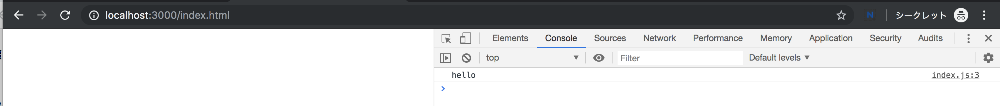
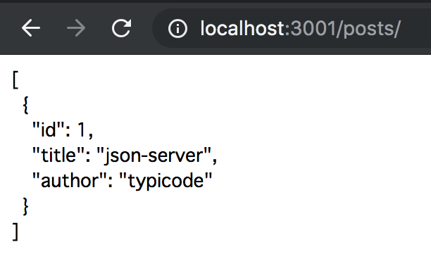
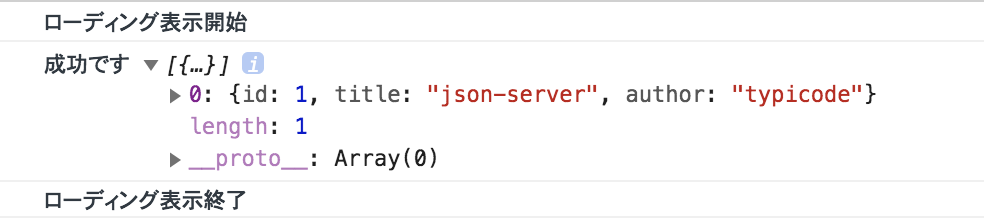
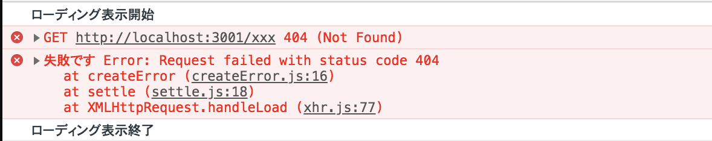
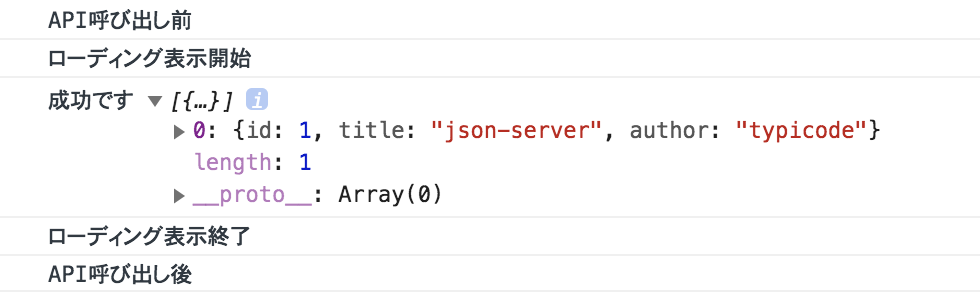
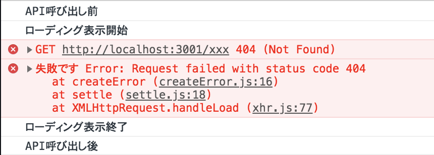

# {{ $page.title }}

<PostMeta/>

HTTP通信ライブラリの[axios](https://github.com/axios/axios)を使って、
**APIを`async`、`await`で制御するコード**を書いていく。

[[toc]]

## webpackでbabel7 + webpack-dev-server + json-serverの環境構築
`Promise`や`async`、`await`を使うために`Babel7`が使える環境を`webpack`で構築していく。ローカルサーバーは`webpack-dev-server`を使う。また、APIのモックサーバーのために`json-server`を使う。  

`Babel7`の設定ファイルは`babel.config.js`を用意し、  
`webpack`の設定ファイルは`webpack.config.js`を用意する。  
`json-server`が返すモックのJSONは`db.json`に用意する。

ディレクトリ
``` sh
.
├── babel.config.js
├── db.json
├── dist
│   └── index.html
├── package-lock.json
├── package.json
├── src
│   └── index.js
└── webpack.config.js
```

npm-scriptsで`webpack-dev-server`と`json-server`が並列で起動するようにしておく。  
`json-server`は`--watch`でモックのJSONを指定する。`--port`を指定しておくことで明示的に`webpack-dev-server`とポートが被らないようにする。

package.json
``` json
{
  "scripts": {
    "dev": "run-p build mock",
    "build": "webpack-dev-server",
    "mock": "json-server --watch db.json --port 3001"
  },
  "devDependencies": {
    "@babel/core": "^7.4.0",
    "@babel/polyfill": "^7.4.0",
    "@babel/preset-env": "^7.4.2",
    "babel-loader": "^8.0.5",
    "json-server": "^0.14.2",
    "npm-run-all": "^4.1.5",
    "webpack": "^4.29.6",
    "webpack-cli": "^3.3.0",
    "webpack-dev-server": "^3.2.1"
  }
}
```

babel.config.js
``` js
module.exports = function (api) {
  api.cache(true);
  const presets = [
    ['@babel/preset-env', {
      "useBuiltIns": "usage",
    }],
  ];
  return {
    presets,
  };
}
```

webpack.config.js
``` js
const path = require("path");

module.exports = {
  mode: 'development',

  entry: './src/index.js',
  output: {
    path: path.join(__dirname, "dist"),
    filename: 'bundle.js',
  },
  module: {
    rules: [
      {
        test: /\.js$/,
        exclude: /node_modules/,
        use: {
          loader: "babel-loader",
          options: {
            presets: ['@babel/preset-env']
          }
        }
      },
    ]
  },

  devtool: 'inline-source-map',
  devServer: {
    open: true,
    openPage: "index.html",
    contentBase: path.join(__dirname, 'dist'),
    watchContentBase: true,
    port: 3000,
  }
};
```

index.html
``` html
<!DOCTYPE html>
<html>
<head>
  <meta charset="utf-8">
  <title>Page Title</title>
  <meta name="viewport" content="width=device-width, initial-scale=1">
</head>
<body>
<script src="bundle.js"></script>
</body>
</html>
```

bundle.js
``` js
import '@babel/polyfill';

console.info('hello')
```

`db.json`のJSONにしたがって、`json-server`は自動で以下のAPIを用意する
```
/posts/
/posts/[id]
```

db.json
``` json
{
  "posts": [
    {
      "id": 1,
      "title": "json-server",
      "author": "typicode"
    }
  ]
}
```

以上の設定をしたら`npm`コマンドでサーバーの起動確認をおこなう。
``` sh
npm run dev
```

ブラウザでを開き3000ポートで`index.html`にアクセスできることを確認する。　　
  

また、3001ポートで`/posts`にアクセスするとJSONが返ってきている。  
  

これで環境構築の確認ができた。

## axiosをPromiseのthen、catch、finallyで制御
`axios`をインストールし、`Promise`でHTTPリクエストが成功する場合と、失敗する場合を確認していく。

```
npm install axios --save
```

package.json抜粋
``` json
  "dependencies": {
    "axios": "^0.18.0"
  }
```
  
### HTTPリクエストが成功する場合
`axios`でAPIに対して`GET`する。  
`/posts`へのリクエストは成功するので、`catch`のコードは実行されず、`then`と`finally`のコードが実行される。

index.js
``` js
import '@babel/polyfill';
import axios from 'axios';

console.info('ローディング表示開始')
axios
  .get('http://localhost:3001/posts')
  .then((response)=> {
    console.info('成功です',response.data);
  })
  .catch((error) => {
    console.error('失敗です', error);
  })
  .finally(() => {
    console.info('ローディング表示終了');
  });
```

ブラウザのコンソールを確認する。  
`axios`呼び出し前に「ローディング表示開始」」と出力され、APIを呼び出してJSONが取得できており、最後に「ローディング表示終了」が出力されている。  



<br>

### HTTPリクエストが失敗する場合
APIのURLを存在しないものに変更することで、HTTPリクエストが失敗する場合をみていく。

index.js
``` js
  .get('http://localhost:3001/xxx')
```  

APIは存在しないため404エラーになる。  
HTTPリクエストが成功する場合と同様に、`GET`前は「ローディング表示開始」と表示される。しかし、`then`は通らなくなるため「成功です」と出力されず、`catch`に書かれている「失敗です」が出力される。そして、HTTPリクエストの成功、失敗に関わらず`finally`が実行される。`finally`は必ず実行されるため、API実行前に表示しておいたローディングを非表示にする処理などで使われる。



## axiosをasync、awaitとtry、catch、finallyで制御
さきほどまでのコードを`async`、`await`を使って書き換える。  
それに伴いエラーのハンドリングも`try`、`catch`、`finally`を使うようにする。
`axios.get`の前に`await`を書いておき、`try`、`catch`で囲む。`finally`は`catch`に連なる形で書く。そして、関数の前に`async`を記載する。

### HTTPリクエストが成功する場合

index.js
``` js
import '@babel/polyfill';
import axios from 'axios';

const getPosts = async () => {
  console.info('ローディング表示開始')
  try {
    const response = await axios.get('http://localhost:3001/posts');
    console.info('成功です', response.data);
  } catch(error) {
    console.error('失敗です', error);
  } finally {
    console.info('ローディング表示終了');
  }
};

(async () => {
  console.info('API呼び出し前');
  await getPosts();
  console.info('API呼び出し後');
})();
```

ブラウザのコンソールで確認すると、非同期でAPIの呼び出しを行う`getPosts`関数の処理が終わってから「API呼び出し後」が出力されていることがわかる。  
そして、`try`と`finally`のコードが実行されている。



### HTTPリクエストが失敗する場合
`async`、`await`でもAPIのURLを存在しないものに変更することで、HTTPリクエストが失敗する場合をみていく。

``` js
    const response = await axios.get('http://localhost:3001/xxx');
```

HTTPリクエストが成功した場合と同様、非同期処理が終わった後に後続の「API呼び出し後」が出力されている。`try`内のHTTPリクエストが失敗した`axios.get`以降の「成功です」は出力されず、
`catch`と`finally`が実行される。  
これで`then`、`catch`で扱っていたときと同様に`async`、`await`でもHTTP通信を制御できることがわかった。


