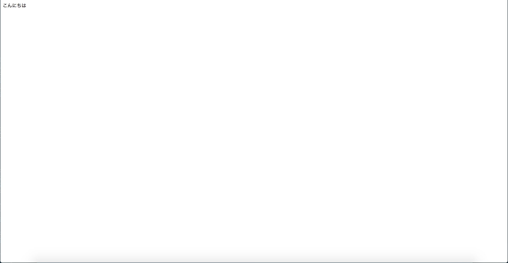
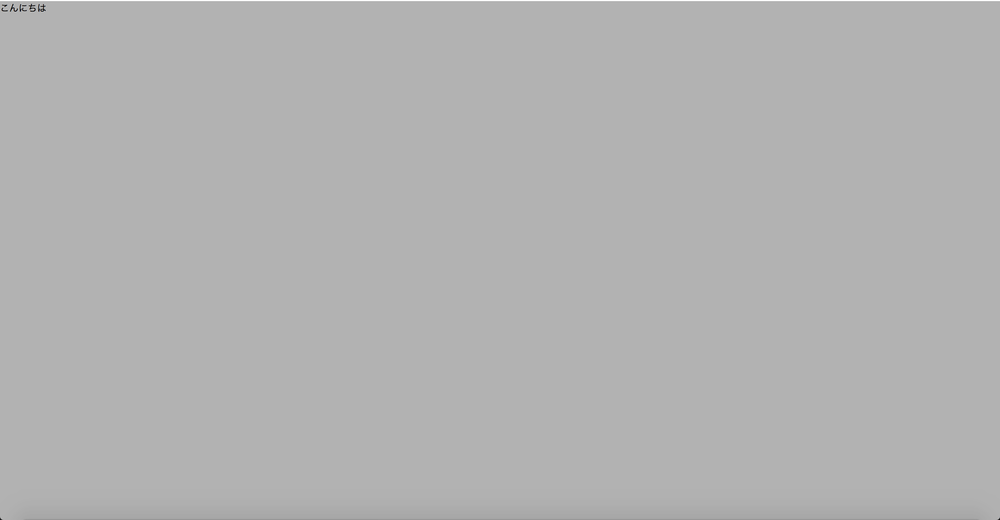
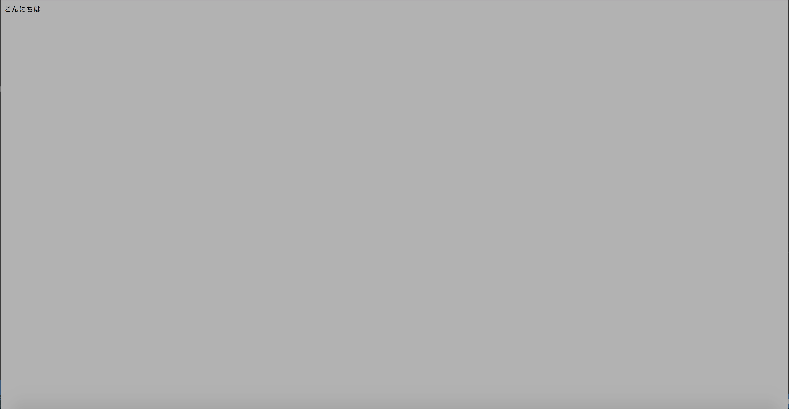
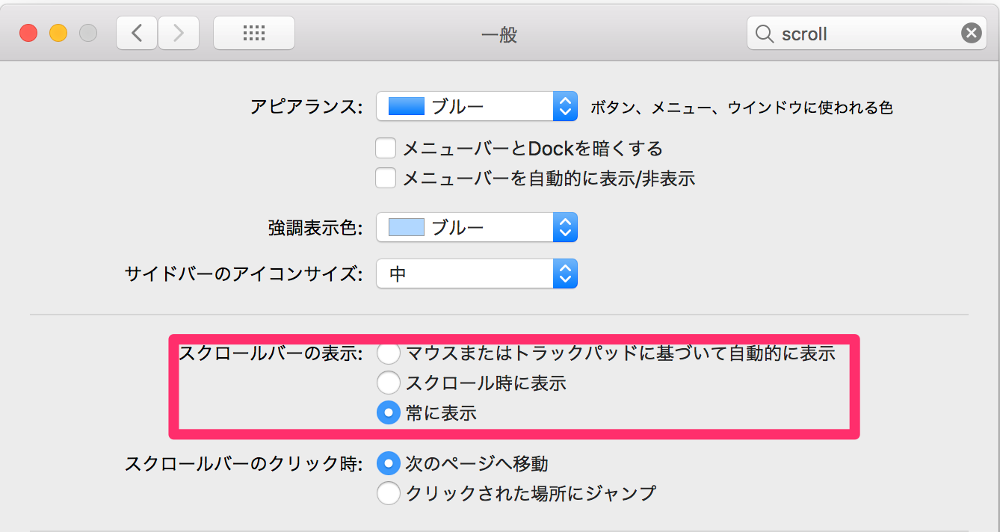
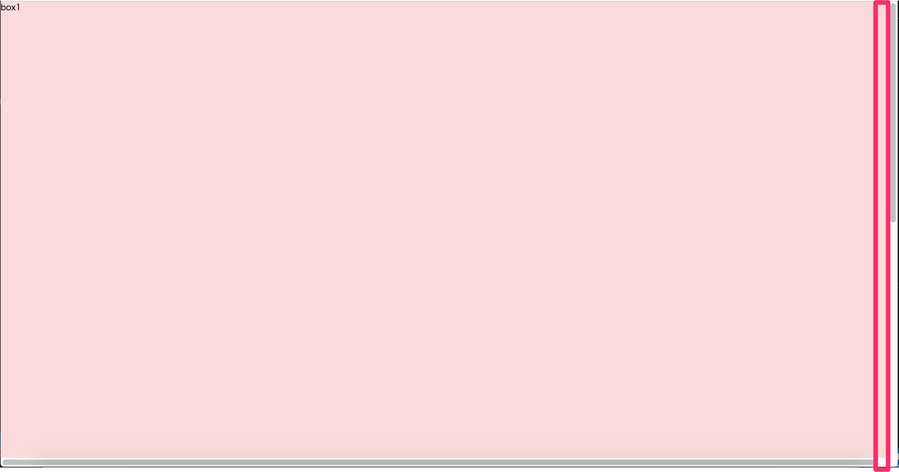
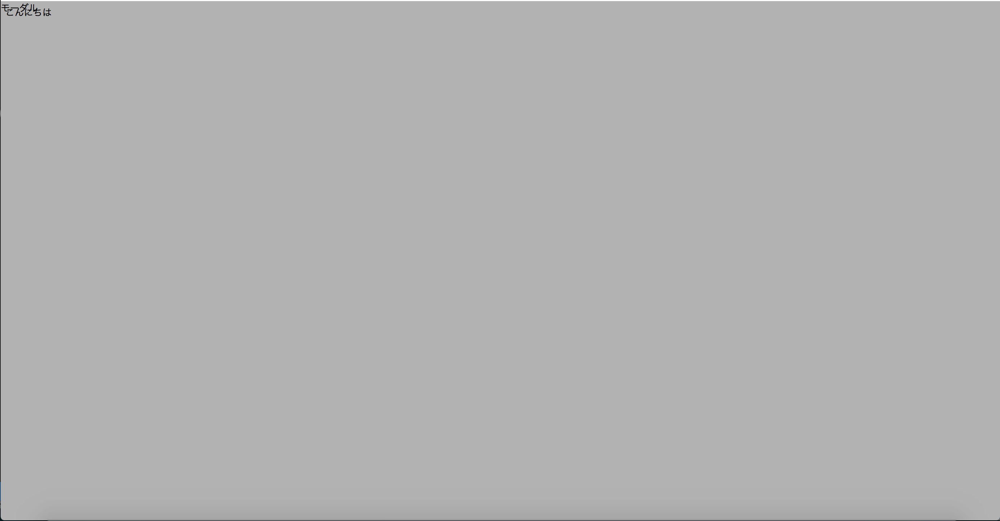

# {{ $page.title }}

<PostMeta/>

ランディングページで全画面(フルスクリーン)に背景色を指定したり、モーダルやドロワーナビの背景全体に半透明な背景色を重ねる(オーバーレイ)方法をまとめる。

[[toc]]

## 用意
ベースとなるHTML、CSSを用意する。

index.html
``` html
<!DOCTYPE html>
<html>
<head>
  <meta charset="utf-8">
  <title>Page Title</title>
  <meta name="viewport" content="width=device-width, initial-scale=1">
  <link rel="stylesheet" type="text/css" media="screen" href="style.css">
</head>
<body>
  こんにちは
</body>
</html>
```

style.css
``` css
```

ディレクトリ
``` sh
.
├── index.html
└── style.css
```

ブラウザで表示確認


## body全体に背景色を指定する
ランディングページのような全画面のデザインが決まっている場合に、`<body>`全体に対して背景色を指定する方法をみていく。

### 100vh、100vwで全画面に背景を表示する

``` html
<body class="full-page">
  こんにちは
</body>
```

``` css
.full-page {
  margin: 0;
  padding: 0;
  width: 100vw;
  height: 100vh;

  background: rgba(0,0,0,.3);
}
```



### html, bodyに100%で全画面に背景を表示する

HTML抜粋
``` html
<body class="full-page">
  こんにちは
</body>
```

``` css
html, body {
  height: 100%;
}

.full-page {
  height: 100%;

  background: rgba(0,0,0,.3);
}
```



### height: 100vh と height: 100%の違い
- `height: 100vh`はビューポート(表示領域)の100%の高さ
- `height: 100%`は親要素の100%の高さ

そのため、`height: 100%`の場合は、親要素である`html`、`body`にも`height: 100%`を指定しておく必要がある。

### width: 100vw と width: 100%の違い
- `width: 100vw`はビューポート(表示領域)の100%の幅。ただし、**スクロールバーの幅を含む**
- `width: 100%`は親要素の100%の幅

ビューポートはスクロールバーを含んだ値になる。したがって、スクロールバーが常に表示されているブラウザでは意図せず横スクロールが表示されることがある。  

この挙動をMacで確認するため、スクロールバーが常に表示されるようにする。「システム環境設定」>「一般」>「スクロールバーの表示」から「常に表示」を選択する。


高さが表示領域を超えるよう`.box1`、`.box2`にそれぞれ`height: 100vh;`を指定したHTMLを用意する。

index.html抜粋
``` html
<body>
<div class="box1">box1</div>
<div class="box2">box2</div>
</body>
``` 

style.css
``` css
html, body {
  margin: 0;
  padding: 0;
}

.box1 {
  height: 100vh;
  width: 100vw;
  background: #FADBDA;
}

.box2 {
  height: 100vh;
  width: 100vw;
  background: #D9E9FA;
}
```

ブラウザで表示を確認すると、縦スクロールバーの横幅分、横にスクロールできるようになってしまった。
これの対処として、`max-width: 100%`を追加して画面幅を超えないようにできるが、それであれば最初から`vw`を使わず`width: 100%`とした方がわかりやすいように思う。


## 子要素を全画面表示して背景色を指定する
モーダルやドロワーナビの背景全体に半透明な背景色を重ねる(オーバーレイ)場合、親要素に影響を受けず画面全体に背景を表示したい。  
そこで、`position: fixed;`を使い画面全体に背景を設定していく。`html`、`body`が親要素となるわけではないため、`html`、`body`に`height: 100%`を指定しなくてよい。

``` html
<body>
  こんにちは
  <div class="full-page">
    モーダル
  </div>
</body>
```

### top: 0、left: 0、width: 100%、height: 100%で全画面に背景を表示する
``` css
.full-page {
  position: fixed;
  top: 0;
  left: 0;
  width: 100%;
  height: 100%;

  background: rgba(0,0,0,.3);
}
```

`top:0`、`left:0`で画面の左上を基準に`width:100%`、`height:100%`で幅と高さを指定することで画面全体に背景を指定している。



### top:0、left:0、right:0、bottom:0で全画面に背景を表示する
`top:0`、`left:0`だけでなく、`right:0`、`bottom:0`も指定することで全画面に背景色を指定することができる。

``` css
.full-page {
  position: fixed;
  top: 0;
  left: 0;
  right: 0;
  bottom: 0;

  background: rgba(0,0,0,.3);
}
```


・参考  
https://stackoverflow.com/questions/28080910/what-does-top-0-left-0-bottom-0-right-0-mean/44488046  
https://hyper-text.org/archives/2014/08/position_absolute_center_layout.shtml  
https://stackoverflow.com/questions/27612931/styling-html-and-body-selector-to-height-100-vs-using-100vh  
