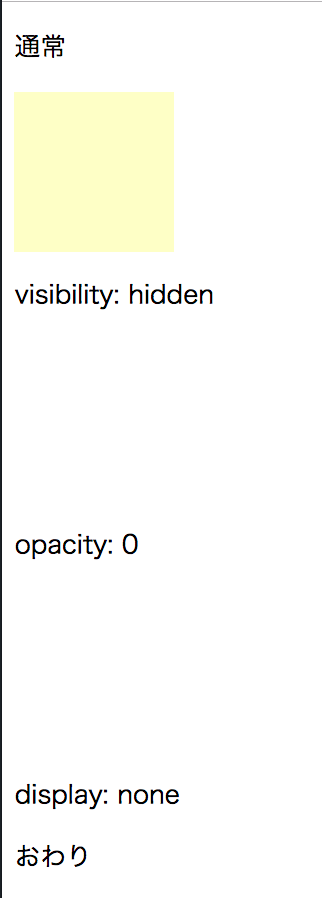
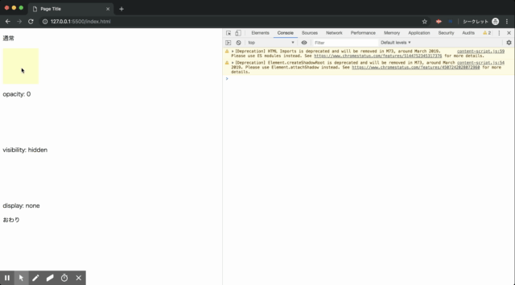
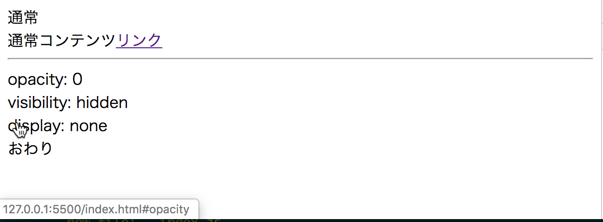
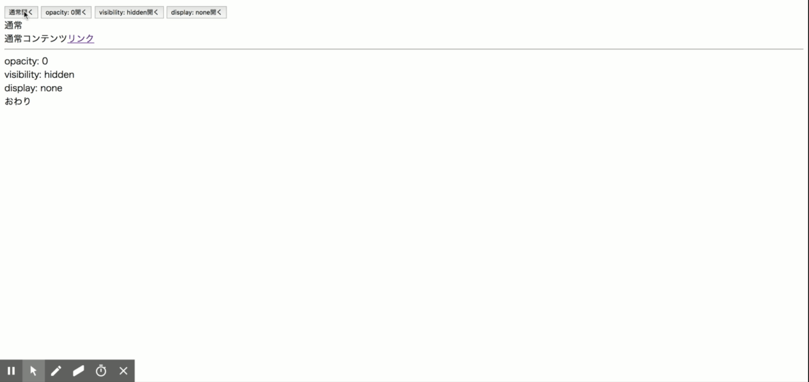
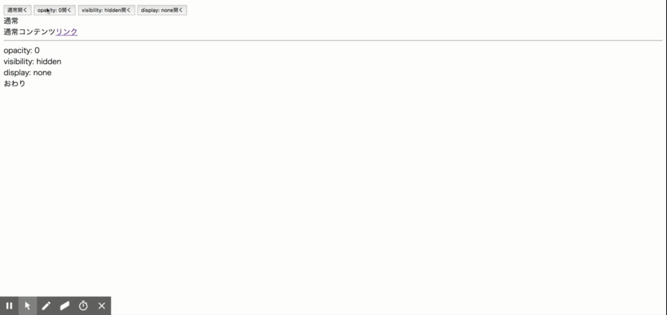

# {{ $page.title }}

<PostMeta/>

非表示にするCSSには`opacity:0`、`visibility:hidden`、`display:none`の3つがある。アコーディオンやドロップダウン、モーダルのようにHTML要素を表示/非表示を切り替えたいことがあるので、それぞれの違いを確かめておく。

[[toc]]

## まとめ
最初に動かしてわかったことをまとめておく。  
非表示から表示へ、表示から非表示へアニメーションさせたい場合、`opacity`と`visibility`を組み合わせるとよい。  
`opacity: 0`だけではコンテンツがクリックできてしまうが、`visibility: hidden`と合わせることでコンテンツがクリックできなくなる。また、`visibility: hidden`から`visibility: visible`にするだけでは徐々に表示される感じが表現できないが、`opacity: 0`から`opacity: 1`であれば徐々に表示される感じを表現できるため。  
CSS Animationで`display`を扱いたい場合はCSSのクラスの付け替えだけでは表示から非表示へのアニメーションができない。

|| opacity:0 |  visibility:hidden | display:none |
----|----|---- |---- 
| ブラウザがレンダリングする | ○ | ○ | × |
| イベントを発火する | ○ | × | × |
| height:0時にコンテンツをクリックできる | ○(コンテンツを非表示にしたつもりでも**クリックできてしまう**) | × | × |
| CSS Transition | `opacity:1`により**徐々**に透明から不透明になる。  その他のプロパティ(heightなど)も**アニメーションする**。 | `visibility: visible`により**即時**に表示される。  その他のプロパティは**アニメーションする**。 | `display:block`により**即時**に表示される。  その他のプロパティは**アニメーションしない**。 |
| CSS Animation | 同上 | 同上 | `display:block`により**即時**に表示される。その他のプロパティは**アニメーションする**。しかし、`display:none`により**即時**に非表示になる。その他のプロパティは**アニメーションしない**。 |

## ブラウザがレンダリングするか
以下1つずつ検証していく。

index.html
``` html
<!DOCTYPE html>
<html>
<head>
  <meta charset="utf-8">
  <title>Page Title</title>
  <meta name="viewport" content="width=device-width, initial-scale=1">
  <link rel="stylesheet" type="text/css" media="screen" href="style.css">
</head>
<body>
  <p>通常</p>
  <div class="box"></div>
  <p>opacity: 0</p>
  <div class="box box--opacity">opacity</div>
  <p>visibility: hidden</p>
  <div class="box box--hidden">visibility</div>
  <p>display: none</p>
  <div class="box box--none">display</div>
  <p>おわり</p>
</body>
</html>
```

style.css
``` css
.box {
  width: 100px;
  height: 100px;
  background-color: #ffffc6;
}

.box--opacity {
  opacity: 0;
}

.box--hidden {
  visibility: hidden;
}

.box--none {
  display: none;
}

```

`opacity: 0`、`visibility: hidden`ともにブラウザにレンダリングされる。ただし、コンテンツや背景色は設定されないため、何も表示されないブロックができる。一方で、`display:none`は何もレンダリングされない。

ブラウザでの表示  


## イベントを発火するか
何も表示されないブロックをクリックして、イベントが発火するか確かめる。
HTMLには`body`の直前に`script`タグを追加する。  

index.html抜粋  
``` html
  <script src="index.js"></script>
</body>
```

`index.js`では`box`クラスの要素を全て取得し、クリックイベントが発生したかわかるようにする。クリック時に何も表示されなければ、クリックイベントが発火しなかったことがわかる。

index.js
``` js
const boxes = document.querySelectorAll('.box');
Array.from(boxes).forEach((element)=> {
  element.addEventListener('click', (event) => {
    console.info(event.target);
  }, false);
});
```

何も表示されないブロックをクリックすると、通常のブロックだけでなく、`opacity:0`をクリックしたときにもイベントが発生している。一方で、`visibility:hidden`はブロックとしては存在するが、クリックしてもイベントは発生しない。また、`display:none`はブロックが表示されないためクリックもできない。

ブラウザでの表示


## height:0時にコンテンツをクリックできるか
ボックスの`heihgt`を0にして、一見ブロックが存在しないようにしてもクリックができるか確認する。

index.html
``` html
<body>
  <p>通常</p>
  <div class="box box-normal">通常コンテンツ<a href="#normal">リンク</a></div>

  <hr style="margin-top:30px;">

  <p>opacity: 0</p>
  <div class="box box-opacity">opacity:0コンテンツ<a href="#opacity">リンク</a></div>

  <p>visibility: hidden</p>
  <div class="box box-hidden">hiddenコンテンツ<a href="#hidden">リンク</a></div>

  <p>display: none</p>
  <div class="box box-none">noneコンテンツ<a href="#none">リンク</a></div>
  <p>おわり</p>

  <script src="index.js"></script>
</body>
```

style.css
``` css
p {
  margin: 0;
}
.box {
  width: 200px;
  height: 0px;
  background-color: #ffffc6;
}
.box-opacity {
  opacity: 0;
}
.box-hidden {
  visibility: hidden;
}
.box-none {
  display: none;
}
```

`opacity:0`の場合のみ、子要素にあるリンクは表示されていないものの、クリックできてしまう。つまり、`opacity:0`と`height:0`を組み合わせて非表示にしたつもりでも、ユーザーはコンテンツをさわれてしまうので注意する🤓


ブラウザでの表示


## CSS Transitionでアニメーションするか
ボタンのクリックでコンテンツが開閉するものをつくり、CSS Transitionでのアニメーションを確かめる。

`index.html`に開閉を制御する`button`を用意する。

index.html抜粋
``` html{2-5}
<body>
  <button class="box-btn">通常開く</button>
  <button class="box-opacity-btn">opacity: 0開く</button>
  <button class="box-hidden-btn">visibility: hidden開く</button>
  <button class="box-none-btn">display: none開く</button>

  <p>通常</p>
  <div class="box box-normal">通常コンテンツ<a href="#normal">リンク</a></div>

  <hr style="margin-top:30px;">

  <p>opacity: 0</p>
  <div class="box box-opacity">opacity:0コンテンツ<a href="#opacity">リンク</a></div>

  <p>visibility: hidden</p>
  <div class="box box-hidden">hiddenコンテンツ<a href="#hidden">リンク</a></div>

  <p>display: none</p>
  <div class="box box-none">noneコンテンツ<a href="#none">リンク</a></div>
  <p>おわり</p>

  <script src="index.js"></script>
</body>
```

`transition-property: all;`ですべてのプロパティでアニメーションするようにしておき、
ボタンが押された際に`opacity`は`0`から`1`、`visibility`は`hidden`から`visible`、`display`は`none`から`block`になるようにしておく。

style.css
``` css
p {
  margin: 0;
}
.box {
  width: 200px;
  height: 0px;
  background-color: #ffffc6;

  transition-property: all;
  transition-duration: 1s;
  transition-timing-function: ease;
}
.box-normal--open {
  height: 100px;
}

.box-opacity {
  opacity: 0;
}
.box-opacity--open {
  opacity: 1;
  height: 100px;
}

.box-hidden {
  visibility: hidden;
}
.box-hidden--open {
  visibility: visible;
  height: 100px;
}

.box-none {
  display: none;
}
.box-none--open {
  display: block;
  height: 100px;
}
```

index.js
``` js
const boxBtn = document.querySelector('.box-btn');
const boxOpacityBtn = document.querySelector('.box-opacity-btn');
const boxHiddenBtn = document.querySelector('.box-hidden-btn');
const boxNoneBtn = document.querySelector('.box-none-btn');

const toggle = (targetClass) => {
  const box = document.querySelector(`.${targetClass}`);
  const openClass = `${targetClass}--open`;
  return () => {
    if (box.classList.contains(openClass)) {
      box.classList.remove(openClass);
    } else {
      box.classList.add(openClass);
    }
  }
}

boxBtn.addEventListener('click', toggle('box-normal') , false);
boxOpacityBtn.addEventListener('click', toggle('box-opacity'), false);
boxHiddenBtn.addEventListener('click', toggle('box-hidden'), false);
boxNoneBtn.addEventListener('click', toggle('box-none'), false);
```

`opacity`はいい感じに徐々に非表示から表示、表示から非表示へアニメーションする。  
`visibility`は非表示から表示になる際に、すぐにコンテンツが表示されてしまう。また、表示から非表示へのアニメーションでは直前までコンテンツが表示されてしまうためスムーズではない。  
`display`は表示、非表示だけでなく、`height`についてもアニメーションされない。

ブラウザでの表示


## CSS Animationでアニメーションするか
`display:none`から`display:block`にするときのみ`transition`と挙動が違う。

index.js抜粋
``` js{4,8,10}
const toggle = (targetClass) => {
  const box = document.querySelector(`.${targetClass}`);
  const openClass = `${targetClass}--open`;
  const closeClass = `${targetClass}--close`;
  return () => {
    if (box.classList.contains(openClass)) {
      box.classList.remove(openClass);
      box.classList.add(closeClass);
    } else {
      box.classList.remove(closeClass);
      box.classList.add(openClass);
    }
  }
}
``` 

style.css抜粋
``` css
p {
  margin: 0;
}
.box {
  width: 200px;
  height: 0px;
  background-color: #ffffc6;

  animation-duration: 1s;
  animation-timing-function: ease;
  animation-fill-mode: forwards;
}

@keyframes none-open{
  from{ display: none;  height: 0; }
  to  { display: block; height: 100px; }
}
@keyframes none-close{
  0% { display: block; height: 100px; }
  99%   { display: block; height: 0; }
  100%   { display: none; height: 0; }
}
.box-none {
  display: none;
}
.box-none--open {
  display: block;
  height: 100px;
  animation-name: none-open;
}
.box-none--close {
  display: none;
  height: 100px;
  animation-name: none-close;
}
```

`display`を使っても非表示から表示へのアニメーションは動くようになったが、
表示から非表示はアニメーションせず即時に非表示になってしまった。

ブラウザでの表示

