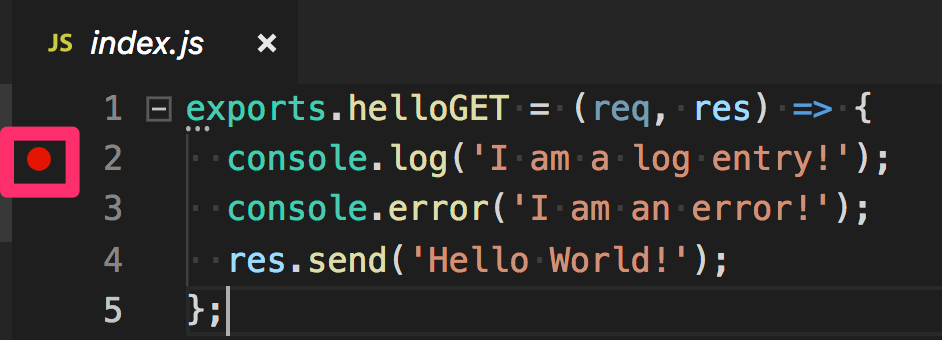
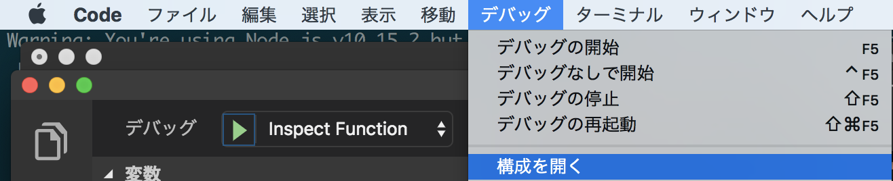
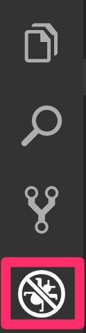
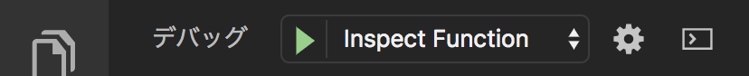
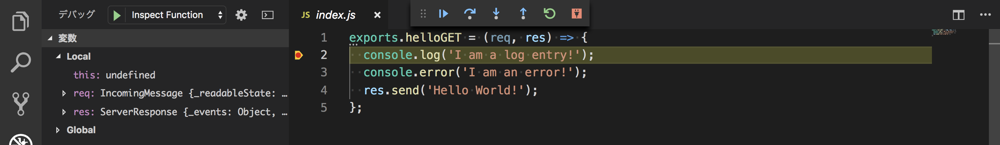

# {{ $page.title }}

<PostMeta/>

Google Cloud Functionsをローカルで開発、デバッグできるようにする。
まずはGoogle Cloud Functionsをローカルで開発できるようエミューレータをインストールし、そのあとにVisual Studio Codeでデバッグできるようにする。

[[toc]]

## Google Cloud Functionsをローカルで動かす
Google Cloud Functionsをローカルで動かすために、エミューレータをインストールする。

``` sh
$ npm install -g @google-cloud/functions-emulator
```

インストールできていることを確認する。
``` sh
$ functions --help
```

確認用の関数を用意する。(ここでexportsした`helloGET`関数をGoogle Cloud Functionsに登録する)
index.js
``` js
exports.helloGET = (req, res) => {
  console.log('I am a log entry!');
  console.error('I am an error!');
  res.send('Hello World!');
};
```

エミュレータを起動する。
``` sh
$ functions start
```

`functions deploy 関数名 トリガー`で関数を Google Cloud Functionsに登録する。
HTTPアクセスで関数が動くことを確認するため、トリガーは`--trigger-http`を指定する。

``` sh
$ functions deploy helloGET --trigger-http
```

デプロイが終わるとURLが表示されるので、そのURLをcurlでたたく。
``` sh
Resource   │ http://localhost:8010/techblog-111111/asia-northeast1/helloGET
```

`res.send`で指定していた`Hello World!`が返ってきている。
``` sh
$ curl http://localhost:8010/techblog-111111/asia-northeast1/helloGET
Hello World!
```

さらに、`functions logs read`でログを確認する。
関数が起動したことが分かり、`info`、`error`それぞれのログが出力されていることを確認できる。

``` sh
$ functions logs read
2019-04-24T11:53:24.949Z - info: User function triggered, starting execution
2019-04-24T11:53:24.949Z - info: I am a log entry!
2019-04-24T11:53:24.950Z - error: I am an error!
2019-04-24T11:53:24.956Z - info: Execution took 8 ms, user function completed successfully
```

## Visual Studio CodeでGoogle Cloud Functionsをローカルでデバッグする
`functions inspect 関数名`によりデバッグでつかうポートが表示される。  
``` sh
$ functions inspect helloGET
Debugger for helloGET listening on port 9229.
```

Visual Studio Codeを開き、`index.js`の行をダブルクリックしてデバッグポイントを追加しておく。 


次にデバッグの設定をしていく。  
「デバッグ」から「構成を開く」をクリックする。  


`launch.json`が開かれるので、次のような値を設定する。

- type:node
- request:attach
- name: 任意の名前
- protocol: inspector
- port: 9229(エミュレータで表示されたポート)

launch.json
``` json
{
  "version": "0.2.0",
  "configurations": [
    {
      "type": "node",
      "request": "attach",
      "name": "Inspect Function",
      "protocol": "inspector",
      "port": 9229,
    },
  ]
}
```

サイドナビからデバッグアイコンをクリックする。  


デバッグ構成に先ほど追加した「Inspect Function」を選択し、緑色の実行ボタンをクリックする。


デバッグが始まるとVisual Studio Codeの下の方がオレンジ色になり、デバッグ中であることがわかるようになる。  


`curl`で関数を実行すると、次のようにデバッグポイントで処理が止まり、ローカルのGoogle Cloud Functionsをデバッグすることができる。  


・参考  
https://cloud.google.com/functions/docs/emulator?hl=ja  
https://cloud.google.com/functions/docs/monitoring/logging  
https://github.com/GoogleCloudPlatform/cloud-functions-emulator/wiki/Debugging-with-Visual-Studio-Code  
