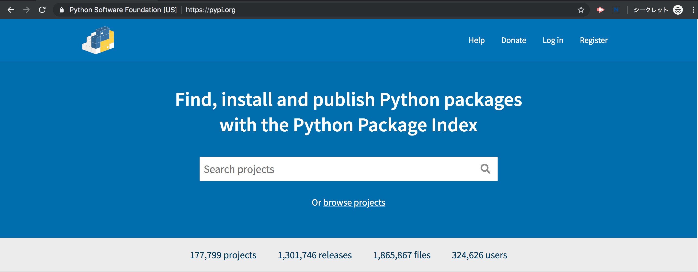
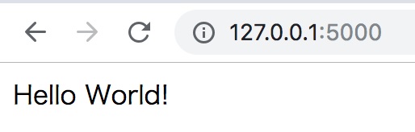

# {{ $page.title }}

<PostMeta/>

Pythonデビューするゾ٩(ˊᗜˋ*)و  
なにはともわれ、MacでPythonが動く環境をつくらねば話しにならぬ。  
Pythonにはバージョン2系と3系があり、それぞれ互換性がないようだ。特に制約がないなら3系を使うのがよいだろう。  
MacのデフォルトのPythonは2系なので、まずは[Python3](https://www.python.org/)をインストールする。  
それから、パッケージ管理ツールを使ってWebフレームワークである[Flask](http://flask.pocoo.org/)をインストールする。  

環境構築には、[pyenv](https://github.com/pyenv/pyenv)と[pipenv](https://github.com/pypa/pipenv)を使うのがモダンらしい。  
ツールの概要を簡単に掴んだ上で、MacでHomebrewを使いインストールしていく。  

## pyenvとは
pyenvとは、**Python自体のバージョンを管理**するツールだ。  
プロジェクトごとに異なるPythonのバージョンを使っている場合に、簡単にPythonのバージョンを切り替えるために使われる。  
なお、Windowsでは使えない。  

## pipenvとは
pipenvとは、**パッケージの管理と、仮想環境を作成**するツールだ。  
パッケージの管理は[pip](https://pip.pypa.io/en/stable/)で行われ、仮想環境の作成には[virtualenv](https://virtualenv.pypa.io/en/latest/)で行われる。  
パッケージとは複数のモジュールをまとめたもので、モジュールは拡張子.pyで書かれたファイルのことだ。(この説明は正確ではないようだが、必要になったときに深掘りしようと思う)  
パッケージは[The Python Package Index (PyPI)](https://pypi.org/)と呼ばれる場所で共有されており、開発者はパッケージ名と必要であればバージョンを指定することで、簡易にパッケージをインストールすることができる。  
  


しかし、pipでパッケージをインストールすると、グローバルにインストールされてしまう。(ただし、オプションでインストール先はコントロールできる模様)  
つまり、複数のプロジェクトで開発している場合、不要なパッケージが入ってしまったり、バージョンをそろえられなくなり不便である。  
そこで、個々のプロジェクトごとにパッケージをインストールすることができるようにする仕組みが必要になった。それを実現するのが仮想環境だ。  
  
このようなPythonで開発をする上で必要になるパッケージの管理(pip)と仮想環境(virtualenv)をまとめて扱いやすくしたツールがpipenvだ。  

## MacでPython3.7.3とFlask1.0.2が動く環境構築
では、MacでPythonが動く環境を構築していく。  
[Homebrew](https://brew.sh/index_ja)でpyenv、pipenvをインストールする。  

### pyenvのインストール
``` sh
$ brew update
$ brew install pyenv
$ echo -e 'if command -v pyenv 1>/dev/null 2>&1; then\n  eval "$(pyenv init -)"\nfi' >> ~/.bash_profile
$ exec $SHELL -l
```

### pipenvのインストール
``` sh
$ brew install pipenv
$ echo 'eval "$(pipenv --completion)"' >> ~/.bash_profile
$ exec $SHELL -l
```

### Python3.7.3のインストール
`pipenv install --python バージョン`によりpipenvは指定したPythonのバージョンがない場合に、pyenvを通してPythonをインストールする。

``` sh
$ pipenv install --python 3.7.3
```

コマンド実行後は`Pipfile`ファイルと`Pipfile.lock`ファイルが生成される。

ディレクトリ
``` sh
.
├── Pipfile
└── Pipfile.lock
```

### Flask1.0.2のインストール

`pipenv install パッケージ名==バージョン`により指定したバージョンのパッケージをインストールする。  

``` sh
$ pipenv install Flask==1.0.2
```

インストールしたパッケージは`Pipfile`ファイルに記載され、`[packages]`に`flask = "==1.0.2"`の行が追加されている。

Pipfile
``` txt{9}
[[source]]
name = "pypi"
url = "https://pypi.org/simple"
verify_ssl = true

[dev-packages]

[packages]
flask = "==1.0.2"

[requires]
python_version = "3.7"
```

ここまででPython、Flaskのインストールができた。  

## FlaskでHTTPリクエストを受け取り、文字列が返せるようにする
FlaskでHTTPリクエストを受け取り、文字列が返せるようにする。


### ルーティングを担当するファイルを作成する
ルーティングを担当するファイル`hello.py`を用意する。  
ファイル名は任意だ。  

ディレクトリ
``` sh{4}
.
├── Pipfile
├── Pipfile.lock
└── hello.py
```

`hello.py`
``` py
from flask import Flask
app = Flask(__name__)


@app.route("/")
def hello():
    return "Hello World!"
```

`from パッケージ名 import オブジェクト(関数や変数、クラス) 文`により、`flask`パッケージから`Flask`オブジェクトを読み込む。  
`__name__`はPythonで使われる特殊変数で、モジュール名が格納されている。これを`Flask`オブジェクトに渡すことでインスタンスを初期化している。  
`@app.router`でルーティングを指定し、`def 関数名(): 処理`により、ルーティングされた際の処理を記載する。

### 仮想環境の有効化
今作成した`hello.py`を仮想環境によりPython3.7.3、Flask1.0.2が動くようにする。

`pipenv shell`により仮想環境を有効にする。  

``` sh
$ pipenv shell
Launching subshell in virtual environment…
~/git/learning-python $  . /Users/nancy/.local/share/virtualenvs/learning-python-DnWY0WUi/bin/activate
(learning-python) ~/git/learning-python $
```

表示されたディレクトリをのぞいてみると、そこに`flask`や`python3.7`が格納されている。  
```
ls /Users/nancy/.local/share/virtualenvs/learning-python-DnWY0WUi/bin/
flask
python3.7
...略
```

### FlaskでWebサーバーを立ち上げる

``` sh
$ FLASK_APP=hello.py flask run
* Running on http://127.0.0.1:5000/ (Press CTRL+C to quit)
```

ブラウザを開くと`hello.py`で`return`していた文字列「Hello World」が表示される。


・参考  
https://www.m3tech.blog/entry/python-packaging  
https://www.python.jp/install/macos/virtualenv.html  
