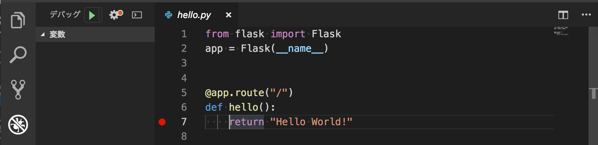

# {{ $page.title }}

<PostMeta/>

サーバーサイドはJavaで開発してきたのだけど、Pythonをさわる機会がありそうなので、基礎構文をおさえておく。  
まずは実行、デバッグ方法を知る。そして変数の定義と代入、データ型、関数、クラスの実装方法を見ていく。Pythonの使い方としては機械学習ではなく、Webアプリケーション(APIサーバー)の作成だ。  
Pythonのバージョンは3.7.3を使っている。  
  
なお、こちらに[Macにpyenvとpipenvを使ってPythonが動く環境](/i-tried-beginning-in-python/)を構築する方法を記載している。

[[toc]]

## 実行
`pipenv`を使ったコマンドラインの実行は、`pipenv shell`で仮想環境を用意し、`python`コマンドを実行することでPythonを実行できるようになる。  

``` bash
$ pipenv shell
$ python
Python 3.7.3 (default, Mar 27 2019, 09:23:39)
[Clang 10.0.0 (clang-1000.11.45.5)] on darwin
Type "help", "copyright", "credits" or "license" for more information.
>>>
```

ファイルの実行は`py`拡張子のファイルに対して、`python hoge.py`として実行する。

## デバッグ
デバッグできれば、大抵のことはなんとかなるからね。  
最初におさえておく。  

### 標準出力を使ったデバッグ
デバッグのなかでも最も古典的でどの言語でも簡易にできるのが、標準出力だ。  
print関数の引数に値を渡せば良い。  
文字列をシングルクォート、ダブルクォートで扱う際の違いはない。  
``` py
>>> print('hoge')
hoge
>>> print("hoge")
hoge
```

### Visual Studio Codeを使ったデバッグ
Visual Studio Codeを使っていればもっと詳細にデバッグできる。  
コード中に赤いデバッグポイントをおく。  


ナビゲーションから「デバッグ」>「デバッグの開始」を選択する。  
「Python File」のようにファイルを指定したり、「Django」や「Flask」のようにフレームワークを指定してデバッグすることができる。


## 変数と代入
`変数名 = 値`で代入する。行の末尾に`;`のようなコードは不要だ。  
変数には型を指定しない。数値や文字列、真偽値(`True`、`False`のいずれかで一文字目は大文字)だけでなく、関数やクラスも代入できる。  
**Pythonには定数がない**ため、必要であれば独自に仕組みをつくる。  

``` py
# 数値
a = 3
# 文字列
b = '文字列'
# 真偽値
c = True
# 関数
def hello():
  return 'hello'

h = hello
# クラス
class Hoge:
    pass

h = Hoge
```

## データ型
int、float、boolこのあたりは特にPythonを使う上でハマらなそうなので飛ばす。

### データ型の判定
`type`関数により判定できる。

``` py
>>> type(True)
<class 'bool'>
```

### None
Noneは空を示すオブジェクトだ。  
何も定義しない状態で変数名`f`を`print`しようとしても`NameError`になる。  
文字列を代入すると、当然文字列が返されるが、同様に`None`を代入すると、`None`が返される。  
`None`の比較は`is`を使って`f is None`のような形が推奨らしい。  

``` py
>>> print(f)
Traceback (most recent call last):
  File "<stdin>", line 1, in <module>
NameError: name 'f' is not defined

>>> f = 'value'
>>> print(f)
value

>>> f = None
>>> print(f)
None

>>> f is None
True
```

### 文字列
strに関してはAPIサーバーの戻り値としてメッセージが返せるようになっておきたい。  
そのため、文字列の連結、フォーマットの方法だけ押さえておく。  

#### 文字列の連結
文字列の連結は`文字列リテラル + 文字列リテラル`の形で行われる。  
ただし、`文字列リテラル 文字列リテラル`のように<strong>`+`がなくても連結される</strong>ので注意する。  
``` py
>>> 'aaa' + 'bbb'
'aaabbb'
>>> 'aaa' 'bbb'
'aaabbb'
```

シングルクォート3つ`'''`、あるいはダブルクォート3つ`"""`で囲むことにより複数行の文字列を連結できる。

``` py
>>> '''hoge
... fuga
... piyo
... '''
'hoge\nfuga\npiyo\n'
```

#### フォーマット
フォーマットする方法はformat関数を使う方法と、f-stringsと呼ばれる2種類の方法がある。

format関数は`{}`だけ指定する方法、`{0}、{1}`のようにformat関数の引数のインデックスを指定する方法、そして、`{one}、{two}`のようにキーワード引数で指定する3つの指定方法がある。

``` py
>>> 'This is a pen {}.This is an {}'.format('pen', 'apple')
'This is a pen pen.This is an apple'
>>> 'This is a {1}.This is an {0}'.format('apple', 'pen')
'This is a pen.This is an apple'
>>> 'This is a {one}. This is an {two}.'.format(two='apple', one= 'pen')
'This is a pen. This is an apple.'
```

f-stringsと呼ばれる方法は、変数名を`f文字列{変数名}`のようにfで始めて、変数名をそのまま`{}`内に指定する。

``` py
>>> one = 'pen'
>>> two = 'apple'
>>> f'This is a {one}. This is an {two}.'
'This is a pen. This is an apple.'
```

### 複数のデータを扱うデータ型 - list、tuple、set、dict
array、list、tuple、set、dictがある。  
array、list、tupleは一覧を扱う。  
setは重複を許容せず、順序は保証されない。  
dictはキーと値を対にして扱い、順序は保証されない。  
  
どうやらarrayは基本的につかうことがないらしいので一旦置いておこう。  
それぞれリテラル表記での生成と、関数での生成ができる。関数での生成は他のデータ型からの変換が行える。
なお、**変数名で`list`や`set`などの名前を使うと、`list関数`や`set関数`が使えなくなってしまう**ので注意する。

| データ型 | 名前 | リテラル表記で初期化 |関数で初期化|
| :--- | :--- | :--- |:--- |
| list |リスト | [1,2,] |**初期化**<br>list()<br> **tupleからlistに変換**<br>list(('りんご','みかん', ))<br>**setからlistに変換**<br>list({'りんご', 'みかん',})|
| tuple |タプル| ('りんご','みかん', ) |**初期化**<br>tuple()<br> **listからtupleに変換**<br> tuple([1,2,3])<br>**setからtupleに変換**<br>tuple({'りんご', 'みかん',})|
| set |セット| {'りんご', 'みかん',} |**初期化**<br>set()<br>**listからsetに変換**<br>set([1,2,])<br> **tupleからsetに変換**<br>set(('りんご','みかん', ))|
| dict |ディクショナリ(辞書)| {'a': 'apple', 'o': 'orange'} |dict()|

## 関数
### 関数の定義と呼び出し
関数の定義はキーワード`def`に続けて、関数名、`()`内に仮引数(関数が受け取る値)を書く。  
仮引数は複数指定することができ、任意でデフォルト値を受け取ることができる。  
関数本体の最初の文としてdocstring(ドキュメンテーション文字列)を書くことができる。  
docstringは任意であり、関数の説明を書いておくとよい。  
  
関数の呼び出しは関数名に続けて`()`で呼び出し、`()`には実引数(関数に渡す値)を指定することができる。  
実引数は`仮引数名 = 値`の形で指定することができ、これをキーワード引数という。  

``` py
# 定義
def 関数名(仮引数 = 'デフォルト値(任意)')
    '''
    docstring(ドキュメンテーション文字列)(任意)
    '''
    return 戻り値

# 呼び出し
関数名(実引数)

# キーワード引数
関数名('仮引数名' = 実引数)
```

具体的には次の形で関数を定義し、呼び出す。  
``` py
>>> def greeting(name, type='morning'):
...     '''
...     あいさつをします
...     '''
...     return f'good {type}, {name}'
...
>>> greeting('jhon')
'good morning, jhon'
>>> greeting(name='jhon')
'good morning, jhon'
```

### 仮引数の受け取り方 - 位置引数、*args(タプル)、**kwargs(ディクショナリ)
仮引数の受け取り方には次の方法がある。  

1. 位置引数
2. *args(タプル)
3. **kwargs(ディクショナリ)

位置引数は通常の引数の受け取り方で`greeting(name)`のように`()`内に順番に引数を書いていく。  
その他に、`*args`、`**kwargs`と呼ばれる**可変長引数**を指定する方法あるので見ていく。  

#### *args(タプル)での引数の受け取り
`*名前`の形で書くことで可変長の引数を指定することができる。仮引数はタプルとして扱われる。  
通常の位置指定型引数と組み合わせて書くことができる。  
なお、名前には慣例として`args`が使われる。  

``` py
>>> def argsfunc(must1, must2, *args):
...     print('must1: {}', must1)
...     print('must2: {}', must2)
...     print('*args: {}', ' '.join(args))
...
>>> argsfunc('必須1', '必須2', '任意1', '任意2')
must1: {} 必須1
must2: {} 必須2
*args: {} 任意1 任意2
```

#### **kwargs(ディクショナリ)での引数の受け取り
`**名前`の形で書くことで可変長の引数を指定することもできる。仮引数はディクショナリとして扱われる。  
実引数は`キー名:値`のキーワード引数で指定する。  
通常の位置指定型引数と組み合わせて書くことができる。さらに、`*名前`とも組み合わせて書くことができる。その場合は
`*名前`を先に書き、後に`**名前`と書く。  
なお、名前には慣例として`kwargs`が使われる。  

``` py
>>> def argsfunc(must1, must2, *args, **kwargs):
...     print('must1: {}', must1)
...     print('must2: {}', must2)
...     print('*args: {}', args)
...     print('**kwargs: {}', kwargs)
...
>>> argsfunc('必須1', '必須2', '任意1', '任意2', キー1='値1', キー2='値2')
must1: {} 必須1
must2: {} 必須2
*args: {} ('任意1', '任意2')
**kwargs: {} {'キー1': '値1', 'キー2': '値2'}
```

### 関数アノテーション(関数注釈)
関数アノテーションは引数や戻り値の型やデフォルト値に関する**注釈**を記載する方法だ。  
あくまで注釈なので、可読性をあげるために引数や戻り値の解説するだけであり、**関数の働きには一切影響しない**。  
関数アノテーションをつけることは任意だ。  
引数の注釈は引数名の後にコロン(`:`)、式と続けることで定義する。  
つまり、デフォルト値がない場合は`引数名: 注釈`の形で指定し、デフォルト値がある場合は`引数名: 注釈 = デフォルト値`の形で指定する。  
戻り値の注釈は、def文最後のコロン(`:`)から仮引数リストの間に`->`と式を挟む。つまり、`(引数リスト) -> 戻り値の注釈:`の形で指定する。  
アノテーションは`__annotations__`属性にディクショナリとして格納される。  

``` py
>>> def greeting(name :'str', type: 'str あいさつの種類'='morning') -> 'str':
...     '''
...     あいさつをします
...     '''
...     print(greeting.__annotations__)
...     return f'good {type}, {name}'
...
>>> greeting('jhon')
{'name': 'str', 'type': 'str あいさつの種類', 'return': 'str'}
'good morning, jhon'
```

### lambda
`lambda`キーワードは無名関数を作成する省略記法だ。  
通常の関数は`def`キーワードから始まり、少なくとも2行以上必要だが、`lambda`キーワードを使うことで関数を1行で定義することができる。  
`lambda 引数: 式`の形で指定できる。

``` py
# 通常の関数
>>> def add(a, b):
...     return a + b
...
>>> print(add(1,2))
3
>>>
>>> # lambdaでの関数
... print((lambda a, b: a + b)(1, 2))
3
```

## pass文
pass文は**構文的に文が必要だが、何もしない**場合に使う。
次のように記述すると空のクラスが生成される。サンプルコードを読んでいるとよく見かけるのでおさえておく。

``` py
class EmptyClass:
    pass
```

## クラス

### クラスの定義とインスタンス化
クラスの定義は`class`文に続けてクラス名、コロン(:)を書き、次の行からクラス本体の内容を記載する。
`クラス名()`の形でインスタンス化する。  
``` py
# クラスの定義
class クラス名:
    クラス本体

# クラスのインスタンス化
x = クラス名()
```

### インスタンス変数とインスタンスメソッド
インスタンスの初期化には`__init__()`という特殊メソッドが用意されている。  
メソッドの第一引数はインスタンス自身を表し、慣例として`self`という名前が使われる。  
インスタンス変数はクラスの下に直接書かず、`__init__()`内で定義する。  

なお、**`private`のようなアクセス修飾子はない**。  
クラスの外からアクセスされることを期待していない場合は、変数名の先頭にアンダースコア(`_`)1つをつける。  
変数名の先頭にアンダースコア2つ`__`をつける方法は、名前マングリング(name mangling)と呼ばれる方法で、サブクラスで定義された名前との衝突を避けるために使われる。  

``` py
class MyClass:
    # インスタンスの初期化
    def __init__(self, name):
        self._name = name  # インスタンス変数

    # getter(インスタンスメソッド)
    def get_name(self):
        return self._name

    # setter(インスタンスメソッド)
    def set_name(self, name):
        self._name = name


x = MyClass('jhon')
print(x._name)
print(x.get_name())
x.set_name('bob')
print(x.get_name())
```

### @property
`@property`を使うことで、2つ以上のインスタンス変数を組み合わせて、1つのインスタンス変数のように扱える。  
例としては、first name(名前(名))とlast name(苗字(姓))をインスタンス変数として持っている場合に、full name(氏名)をメソッドではなくインスタンス変数のようにアクセスしたいとする。  
そのような場合に、メソッドに`@property`をつけることで、`メソッド名()`ではなく、`メソッド名`のようにインスタンス変数と同じく`()`をつけなくてもアクセスできるようになる。  
また、`@propertyを付与したメソッド名.setter`の形でセッターにすることができる。  

``` py
class MyClass:
    def __init__(self, first, last):
        self._first = first
        self._last = last

    @property
    def fullname(self):
        return self._first + ' ' + self._last

    @fullname.setter
    def fullname(self, name):
        first, last = name.split()
        self._first = first
        self._last = last


x = MyClass('Jhon', 'Doe')
print(x.fullname) # Jhon Doe
x.fullname = 'Adam Smith'
print(x.fullname) # Adam Smith
```

### クラス変数とクラスメソッド(@classmethod)
クラス変数は`class`文の直下に定義する。  
`@classmethod`をメソッド名の前につけることで、インスタンス化しなくてもメソッドを呼び出すことができる。  クラスメソッドの第一引数はクラス自身で変数名は慣習的に`cls`が使われる。  

``` py
class MyClass:
    count = 0

    @classmethod
    def count_up(cls):
        cls.count += 1

print(MyClass.count)
MyClass.count_up() # 0
print(MyClass.count)
MyClass.count_up() # 1
```

### スタティックメソッド(@staticmethod)
`@staticmethod`をメソッド名の前につけることで、`@classmethod`と同じくインスタンス化しなくてもメソッドを呼び出すことができる。`@staticmethod`の第一引数は必須ではなく、**インスタンス自身やクラス自身を受け取れない**。  
用途としては、クラスとしてメソッドを集約することができるため、ユーティリティクラスとして使える。

``` py
class MyClass:

    @staticmethod
    def plus_one(num):
        return num + 1

print(MyClass.plus_one(4)) # 5
```

### 継承
class名に`()`を続けて、親クラス名を指定することで継承ができる。  
Pythonは多重継承できる。  

``` py
class BaseClass1:
    def base_method1(self):
        return 'base'


class BaseClass2:
    def base_method2(self):
        return 'base2'


class MyClass(BaseClass1, BaseClass2):
    def child_method(self):
        return self.base_method1() + ' ' + self.base_method2()


x = MyClass()
print(x.base_method1())  # base
print(x.base_method2())  # base2
print(x.child_method())  # base base2
```

### 抽象クラス
abc(abstract base class)モジュールを利用する。  
クラス名の後ろに`metaclass=ABCMeta`を指定することで抽象クラスになる。  
`@abstractmethod`をメソッド名の前につけることで、抽象メソッドにすることができ、継承するクラスにメソッドの実装を強制できる。  
また、抽象クラスには普通のメソッドも定義できる。  
なお、抽象クラス自身をインスタンス化することは**出来てしまう**。

``` py
from abc import ABCMeta, abstractmethod

class MyAbstractClass(metaclass=ABCMeta):
    def base_method(self):
        return 'base'

    @abstractmethod
    def abstract_method(self):
        pass


class MyClass(MyAbstractClass):
    pass


x = MyClass()  # TypeError: Can't instantiate abstract class MyClass with abstract methods abstract_method
```

## インターフェース
ない。抽象クラスと抽象メソッドでなんとかする。  

・参考  
https://docs.python.org/ja/3/reference/index.html  
https://python.swaroopch.com/data_structures.html  
https://qiita.com/gold-kou/items/9713f6fd82baf1eccd6a  
https://qiita.com/tag1216/items/3db4d58b2f4e58c86103  
https://stackoverflow.com/questions/176011/python-list-vs-array-when-to-use  
