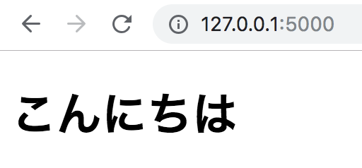
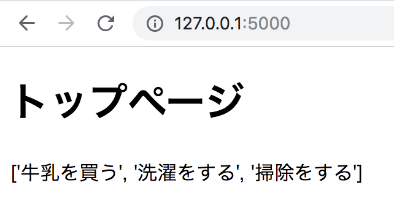
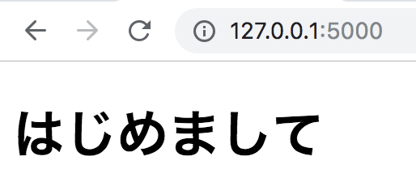
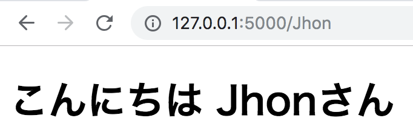
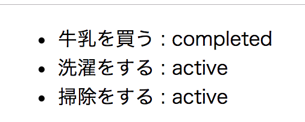
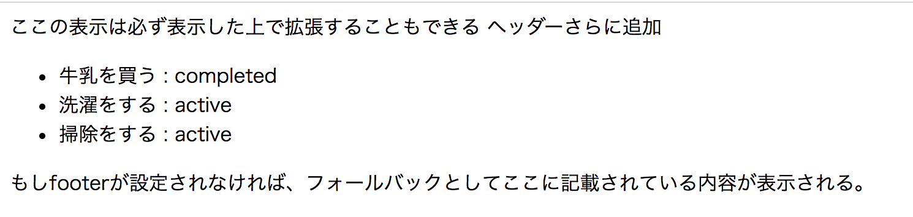

# {{ $page.title }}

<PostMeta/>

[[toc]]

## HTMLを返す
Flask1.0.2からHTMLを返せるようにする。  
`flask`モジュールを読み込むファイルを用意し、`templates`ディレクトリの下にHTMLを配置する。  

ディレクトリ構成は次の通り。  
``` bash
.
├── Pipfile
├── Pipfile.lock
├── application.py
└── templates
    └── index.html
```

`application.py`(ファイル名は任意)で`flask`を読み込みルーティング設定を行う。  
`return`で`render_template()`関数の第一引数にHTML名を指定する。  

`templates`(ディレクトリ名はこの通りにする)ディレクトリの下に`render_template()`関数で指定したHTML名のファイルを配置しておく。  

`application.py`
``` py
from flask import Flask, render_template
app = Flask(__name__)

@app.route('/')
def index():
    return render_template('index.html')
```

`index.html`
``` html
<!DOCTYPE html>
<html lang="ja">
<head>
  <meta charset="UTF-8">
  <meta name="viewport" content="width=device-width, initial-scale=1.0">
  <title>タイトル</title>
</head>
<body>
<h1>こんにちは</h1>
</body>
</html>
```

`FLASK_APP`変数に`flask`を読み込んでいるファイル名を指定してエクポートし、`flask run`コマンドでサーバーを立ち上げる。  

``` bash
$ export FLASK_APP=application.py
$ flask run
```

ブラウザで表示を確認すると、`index.html`に指定したとおり「こんにちは」と表示されている。


## Jinja2
Flaskは[Jinja2](http://jinja.pocoo.org/)テンプレートエンジンによりHTMLを生成しており、変数を埋め込んだり、分岐や繰り返し処理、ファイルの分割ができるようになっている。  

### 変数を埋め込む
まずは変数が埋め込めることを確認する。  

`render_template`関数の第2引数以降に`HTMLで使う変数名 = 値`のように指定する。  
変数は複数指定することができる。

`application.py`抜粋
``` py
@app.route('/')
def index():
    title = 'トップページ'
    todos = ['牛乳を買う', '洗濯をする', '掃除をする']
    return render_template('index.html', title = title, todos=todos)
```

HTMLでは`{{}}`の間に変数名を指定することで、変数を展開できる。  
`index.html`抜粋
``` html
<h1>{{ title }}</h1>
{{ todos }}
```

サーバーを再度たちあげてブラウザを確認すると、サーバーで指定した`title`や`todos`変数が展開されHTMLに埋め込むことができている。  


### 分岐 if
``、``、``を使うことにより分岐を表現できる。  

URLのパスの有無で、HTMLの表示を切り替える処理を追加して分岐を試す。  
`application.py`で`@app.router`を2つつけることで、パスがある場合、ない場合いずれも同じ関数を通るようにする。パスは`<>`で囲んだ名前を、関数の引数で受け取れる。  

`application.py`
``` py
@app.route('/')
@app.route('/<name>')
def index(name=None):
    return render_template('index.html', name = name)
```

`index.html`
``` html

<h1>こんにちは {{ name }}さん</h1>

<h1>はじめまして</h1>

```

パスなしでアクセス(`http://127.0.0.1:5000/`)した場合、`if`文が`False`になり、「はじめまして」と表示される。  


一方で、パスありでアクセス(`http://127.0.0.1:5000/Jhon`)した場合、`if`文が`True`になり、「こんにちは、Jhonさん」とパスで指定した値が表示される。  


### 繰り返し for
``、``を使うことにより繰り返しを表現できる。  

サーバで複数のディクショナリを要素としてもつリストを用意しておく。  
`application.py`抜粋
``` py
@app.route('/')
def index():
    todos = [
        {'title': '牛乳を買う', 'status': 'completed'},
        {'title': '洗濯をする', 'status': 'active'},
        {'title': '掃除をする', 'status': 'active'}
    ]
    return render_template('index.html', todos = todos)
```

各要素は`todo.title`や`todo.status`のような形でアクセスできる。  

`index.html`抜粋
``` html
<ul>

  <li>{{ todo.title }} : {{todo.status}}</li>

</ul>
```



### HTMLを分割する
HTMLをヘッダーやフッター、あるいは意味ある単位でコンポーネントに分割したいことがあるので、ファイルの分割方法を見ていく。  

各ページで共通に利用するレイアウトの元になるHTMLを`templates`ディレクトリ下の`layout`ディレクトリ下に用意する(ディレクトリ場所は任意)。  
また、レイアウトを読み込んで、ヘッダーやフッター、コンテンツを指定するファイルを用意する。

ディレクトリ構成
``` sh{5-8}
.
├── Pipfile
├── Pipfile.lock
├── application.py
└── templates
    ├── index.html
    └── layout
        └── default.html
```

各ページのHTMLでは、`extends レイアウトHTMLへのパス`のように`extends`に続けて、レイアウトのHTMLへのパスを指定する。  
そして、`block ブロック名`でレイアウトHTMLで指定されているブロック名を指定して、各ページの内容を設定していく。  
`super()`を使うことで、レイアウトで指定されているコンテンツを表示した上で、さらに各ページで表示したい内容を追加することができる。  
また、各ページのHTMLでブロックを指定しない場合(このHTMLの場合は`footer`を指定していない)、レイアウトHTMLでのフォールバックの内容が表示される。  

`index.html`
``` html


  {{ super() }}
  ヘッダーさらに追加


<ul>
  
  <li>{{ todo.title }} : {{todo.status}}</li>
  
</ul>

```

レイアウトになるHTMLは``でブロックを宣言する。  
``で囲まれた内容はフォールバックとして機能する。  
つまり、`extends`するファイルでブロック名を指定しない場合、レイアウトHTMLのブロックで囲まれた内容がそのまま表示される。  

`default.html`
``` html
<!DOCTYPE html>
<html lang="ja">
<head>
  <meta charset="UTF-8">
  <meta name="viewport" content="width=device-width, initial-scale=1.0">
  <title>Document</title>
</head>
<body>
<header>
ここの表示は必ず表示した上で拡張することもできる
</header>

<footer>

もしfooterが設定されなければ、フォールバックとしてここに記載されている内容が表示される。

</footer>
</body>
</html>
```

サーバを立ち上げてHTMLの表示を確認すると、`header`は`default.html`の内容に加えて、`index.html`の`header`の内容が追加されており、`content`は`index.html`で指定した内容がそのまま反映され、`footer`は`index.html`で指定していないので、フォールバックとして指定していた`default.html`の`footer`の内容が表示されている。  



・参考  
https://a2c.bitbucket.io/flask/patterns/templateinheritance.html?highlight=super  