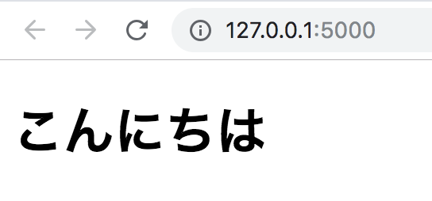
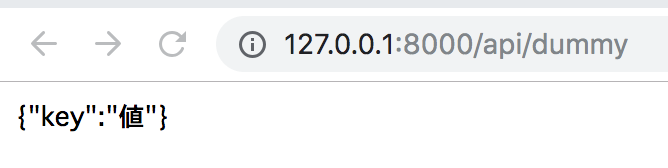
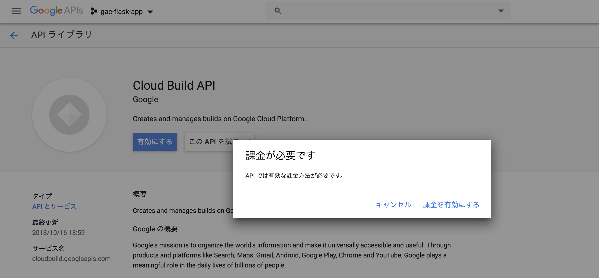
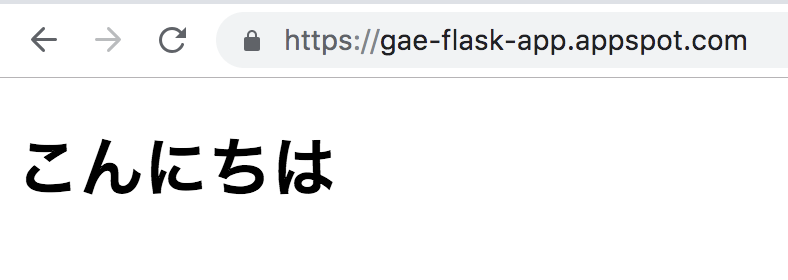
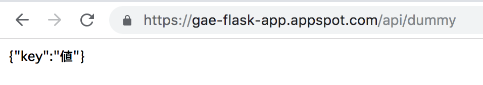

# {{ $page.title }}

<PostMeta/>

2018年12月20日に、Google App EngineでPython3.7が正式版(generally available)として[リリース](https://cloud.google.com/blog/products/compute/python-37-for-app-engine-is-now-generally-available)された🎉  

この記事ではGoogle App Engineのローカル環境での動かし方、そしてデプロイの方法を記載する。  

[[toc]]

## Macでローカル環境のFlaskが動くようにする
こちらに[Macにpyenvとpipenvを使ってPythonが動く環境](/i-tried-beginning-in-python/)を構築する方法を記載している。

pipenvでFlaskをインストールし、`templates`ディレクトリ下に静的ファイルを確認するための`index.html`を用意する(中身はなんでもよい)。  

ディレクトリ
``` sh
.
├── Pipfile
├── Pipfile.lock
├── main.py
└── templates
    └── index.html
```

`main.py`でFlaskを初期化し、`/`アクセス時にHTMLを表示し、`/api/dummy`アクセス時にJSONが返せるようにする。  
HTMLは`render_template関数`でファイル名を指定している。JSONは`app.config['JSON_AS_ASCII'] = False`で文字化けしないようにし、`jsonify関数`でJSONを返している。  

`main.py`
``` py
from flask import Flask, render_template, jsonify

app = Flask(__name__)
app.config['JSON_AS_ASCII'] = False


@app.route('/')
def index():
    return render_template('index.html')


@app.route('/api/dummy')
def dummy():
    return jsonify({
        "key": "値"
    })


if __name__ == '__main__':
    app.run()
```

`python main.py`でアプリケーションサーバーが起動し、`/`でHTML、`/api/dummy`がJSON返されればOK。

``` sh
python main.py
```

## ローカル環境でGunicornを使いFlaskを動かす
Google App Engine standardのローカル環境での開発は、Python2.7では`dev_appserver.py`を使う方法が公式で紹介されていたが、Python3.7では`dev_appserver.py`の使用は非推奨だ。

> We do not recommend that you depend on tools like dev_appserver, the local development server provided with the Google Cloud SDK.  
https://cloud.google.com/appengine/docs/standard/python3/testing-and-deploying-your-app

代わりに、WSGI(Web Server Gateway Interface)サーバである(Gunicorn)[https://gunicorn.org/]を使う方法が紹介されている。  

Gunicornを使いFlaskを動かせるようにしていく。  
まずはGunicornをインストールする。  
``` sh
pipenv install gunicorn==19.9.0
```

gunicornコマンドは次の引数を受け取りサーバーを立ち上げる。  
  
`gunicorn [OPTIONS] APP_MODULE`  
  
`APP_MODULE`は`$(MODULE_NAME):$(VARIABLE_NAME)`を指定する。  
`$(MODULE_NAME)`にはFlaskを初期化しているモジュール名(`main`)を指定する。  
`$(VARIABLE_NAME)`にはFlaskインスタンス名(`app`)を指定する。  

`-b`オプションは`HOST`、`HOST:PORT`、`unix:PATH`のいずれかを指定できる。  
`HOST`にはIPを指定可能だ。  

次のように起動することで`127.0.0.1:8000`にアクセスするとFlaskのウェブアプリケーションにアクセスできる。  
``` sh
gunicorn -b 127.0.0.1:8000 main:app
```

HTML、JSONが想定通り返ってきている。  




なお、`dev_appserver.py`を使わないと`app.yaml`の内容が確認できないため、[dev_appserver.pyを使ってPython3.7を動かす](/run-google-app-engine-standard-python-with-local-dev-appserver/)方法を別記事にしている。  

## Google App EngineにFlaskをデプロイする
次の手順で、ローカルで挙動を確認できたWebアプリケーションをデプロイする。  

1. Google App Engineにデプロイするために必要なファイルを作成する。
    1. `app.yaml`を作成する。
    2. `Pipfile`から`requirements.txt`を生成する。(`pipenv`を使っている場合)
    3. デプロイ不要なファイルを`.gcloudignore`に指定する。
2. Cloud SDKをインストールする。
3. プロジェクトを作成する。
4. Google App Engineを有効にする。
5. 課金を有効にする。
6. デプロイする。
7. プロジェクトを削除する。(お試しでプロジェクトを作成していた場合)

### Google App Engineにデプロイするために必要なファイルを作成する
Pythonのバージョンやオートスケールの設定、静的ファイルの扱いなどを指定する`app.yaml`、依存関係を解決する`requirements.txt`、デデプロイから除外するフィアルを指定する`.gcloudignore`を作成する。

#### app.yamlを作成する
最低限pythonのバージョン3.7を使うこと、そして`gunicorn`を使うことを`app.yaml`に記載する。
`$PORT`は実行時に設定される環境変数で、HTTP リクエストを受信するポートだ。  
その他の環境変数は、[こちら](https://cloud.google.com/appengine/docs/standard/python3/runtime#environment_variables)で確認できる。  

`app.yaml`
``` yaml
runtime: python37
entrypoint: gunicorn -b :$PORT main:app
```

#### requirements.txtを作成する
`Pipfile`および`Pipfile.lock`は2019/5/12時点ではサポートされていない。  
> Dependency specification using the Pipfile/Pipfile.lock standard is currently not supported and your project must not have these files present.  
https://cloud.google.com/appengine/docs/standard/python3/runtime

なので、次のコマンドで`Pipfile`から`requirements.txt`を生成しておく。  
``` sh
$ pipenv lock -r > requirements.txt 
```

#### .gcloudignoreを作成する
`Pipfile`および`Pipfile.lock`があるままデプロイしようとすると、以下のようにエラーになってしまう。そこで、デプロイ不要なファイルとして登録しておく必要がある。  
``` sh
ERROR: (gcloud.app.deploy) INVALID_ARGUMENT: File 'Pipfile' is not supported.
```

デプロイ不要なファイルは[.gcloudignore](https://cloud.google.com/sdk/gcloud/reference/topic/gcloudignore)という名前のファイルにパスを記載する。  

`.gcloudignore`
```
# This file specifies files that are *not* uploaded to Google Cloud Platform
# using gcloud. It follows the same syntax as .gitignore, with the addition of
# "#!include" directives (which insert the entries of the given .gitignore-style
# file at that point).
#
# For more information, run:
#   $ gcloud topic gcloudignore
#
.gcloudignore
# If you would like to upload your .git directory, .gitignore file or files
# from your .gitignore file, remove the corresponding line
# below:
.git
.gitignore

# Python pycache:
__pycache__/
# Ignored by the build system
/setup.cfg

Pipfile
Pipfile.lock
```

以上でGoogle App Engineにデプロイするためのファイルを作成した。

### Cloud SDKをインストールする
[Cloud SDK](https://cloud.google.com/sdk/docs/)をインストールする。  
すでにインストール済みの場合、次のコマンドでgcloudコマンドを最新にする。  
``` sh
$ gcloud components update
```

### プロジェクトを作成する
`gcloud projects create プロジェクト名`でプロジェクトを作成する。  

``` sh
gcloud projects create gae-flask-app
```

次のコマンドでプロジェクトが生成されたことを確認する。  
プロジェクトが生成されると、生成時間やprojectIdなどが表示される。  

``` sh
$ gcloud projects describe gae-flask-app
createTime: '2019-05-09T11:56:23.457Z'
lifecycleState: ACTIVE
name: gae-flask-app
projectId: gae-flask-app
projectNumber: '559536975662'
```

### Google App Engineを有効にする
`gcloud app create --project=プロジェクト名`でGoogle App Engineを有効化する。  
リージョンの選択肢が表示されるので東京リージョン(`asia-northeast1`)を選択する。  

``` sh
$ gcloud app create --project=gae-flask-app
Please choose the region where you want your App Engine application
located:

 [1] asia-east2    (supports standard and flexible)
 [2] asia-northeast1 (supports standard and flexible)
 [3] asia-northeast2 (supports standard and flexible)
 ...略
```

最終的なデプロイ前のディレクトリ構成は以下の通り。  

ディレクトリ
``` sh
.
├── Pipfile
├── Pipfile.lock
├── __pycache__
│   └── main.cpython-37.pyc
├── app.yaml
├── main.py
├── requirements.txt
└── templates
    └── index.html
```

`gcloud app deploy --project プロジェクト名`でデプロイする。
``` sh
gcloud app deploy --project gae-flask-app
```

しかし、Cloud Build APIを有効にしろとエラー表示される。  

``` sh
$ gcloud app deploy --project gae-flask-app
ERROR: (gcloud.app.deploy) Error Response: [7] Access Not Configured. Cloud Build has not been used in project gae-flask-app before or it is disabled. Enable it by visiting https://console.developers.google.com/apis/api/cloudbuild.googleapis.com/overview?project=gae-flask-app then retry. If you enabled this API recently, wait a few minutes for the action to propagate to our systems and retry.
```

エラーメッセージのURLをクリックし、Google Cloudのコンソールを開く。  
Cloud Build APIの「有効にする」ボタンをクリックすると、課金が必要ですというモーダルが表示される。「課金を有効にする」ボタンをクリックして、APIを有効にする。  



さて、Cloud Build APIを有効にしたら、再度デプロイコマンドを実行する。  
今度はデプロイできた！

```
$ gcloud app deploy --project gae-flask-app
...略
Deployed service [default] to [https://gae-flask-app.appspot.com]
```

HTMLへのアクセス、APIへのアクセスともに成功している。感動。




### プロジェクトの削除
確認のためにつくったプロジェクトなので最後に削除しておく。  

``` sh
$ gcloud projects delete gae-flask-app
```

・参考  
https://cloud.google.com/appengine/docs/standard/python3/testing-and-deploying-your-app  
https://cloud.google.com/appengine/docs/standard/python3/config/appref  
http://docs.gunicorn.org/en/stable/settings.html#bind  
