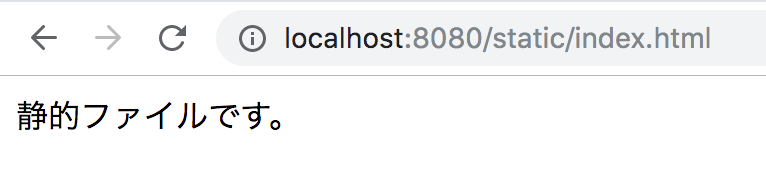

# {{ $page.title }}

<PostMeta/>

Google App Engine StandardのPython3.7ではローカル開発での`dev_appserver.py`は推奨されておらず、GunicornなどWSGIサーバーを使うことが推奨されている。  
しかし、この方法では**ローカルで`app.yaml`の確認ができない**。  
つまり、URLと静的ファイルを紐づける`handlers`や、エラータイプごとにエラーページを指定する`error_handlers`の確認がローカルでできないことになる。  
これでは不便なので、Python3.7でローカル開発時に`dev_appserver.py`を使う方法を記載する。  

<!-- 重複するためコメントアウト[[toc]] -->

## app.yamlを用意する
Python3.7で動かすために`runtime`を`python37`として、`entrypoint`で`gunicorn`で動くようにする。  
静的ファイルは`handlers`の`static_dir`で`./public`ディレクトリ以下を`/static`URL下にマッピングしておく。

`app.yaml`
``` yaml
runtime: python37
entrypoint: gunicorn -b :$PORT main:app

handlers:
  - url: /static
    static_dir: public
```

## dev_appserver.pyをPython2.7で実行できるよう環境変数を設定する
`dev_appserver.py --application=PROJECT_ID app.yaml`で`app.yaml`を読み込んでローカルサーバーを立ち上げる。  

``` sh
$ dev_appserver.py --application=gae-flask-app app.yaml
ERROR: Python 3 and later is not compatible with the Google Cloud SDK. Please use Python version 2.7.x.

If you have a compatible Python interpreter installed, you can use it by setting
the CLOUDSDK_PYTHON environment variable to point to it.
```

しかし、**Google Cloud SDKはPython3と互換性がない**と表示されてしまう。  
`CLOUDSDK_PYTHON`変数にPython2.7.xを指定すればよいので、`pyenv`でPython2.7.16をインストールする。

``` sh
$ pyenv install 2.7.16
$ pyenv versions
  system
  2.7.16
* 3.7.3 (set by /Users/nancy/.pyenv/version)
```

それから、`CLOUDSDK_PYTHON`にインストールしたPython2.7.16を指定する。

``` sh
$ echo 'export CLOUDSDK_PYTHON=~/.pyenv/versions/2.7.16/bin/python' >> ~/.bash_profile
$ . ~/.bash_profile
$ echo $CLOUDSDK_PYTHON
/Users/nancy/.pyenv/versions/2.7.16/bin/python
$ $CLOUDSDK_PYTHON --version
Python 2.7.16
```

## dev_appserver.pyは仮想環境上で動かすとOSError: [Errno 2] No such file or directoryになる
仮想環境上で`dev_appserver.py`を実行すると、**OSError: [Errno 2] No such file or directory**というエラーになってしまう。

``` sh
$ pipenv shell
Launching subshell in virtual environment…
$  . /Users/nancy/.local/share/virtualenvs/gae-flask-r4b-hAq-/bin/activate
(gae-flask) $ dev_appserver.py --application=gae-flask-app ./app.yaml
略
OSError: [Errno 2] No such file or directory
```

そのため、仮想環境上で実行せず、ローカルのPythonのバージョンを3.7にしておき、`dev_appserver.py`を実行する。

## ローカルのPythonを3.7にして、dev_appserver.pyを動かす
```
 $ python --version
Python 3.7.3
 $ dev_appserver.py --application=gae-flask-app app.yaml
INFO     2019-05-13 11:41:48,741 devappserver2.py:278] Skipping SDK update check.
INFO     2019-05-13 11:41:48,938 api_server.py:275] Starting API server at: http://localhost:51038
INFO     2019-05-13 11:41:48,946 instance_factory.py:71] Detected Python 3.7.3
... 略
```

ローカルサーバーが立ち上がり、`handlers`で指定していた静的ファイルを表示できることを確認できる。



・参考  
https://stackoverflow.com/questions/52999747/python-3-7-local-development-server-options-for-new-app-engine-apps  
https://stackoverflow.com/questions/54640695/running-locally-with-gae-python-second-generation  
https://cloud.google.com/appengine/docs/standard/python3/serving-static-files  
