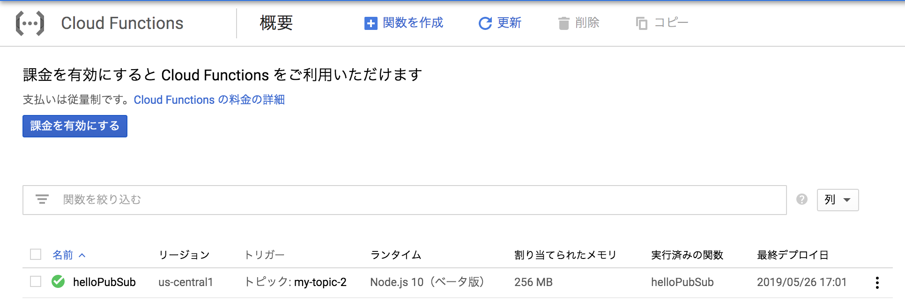
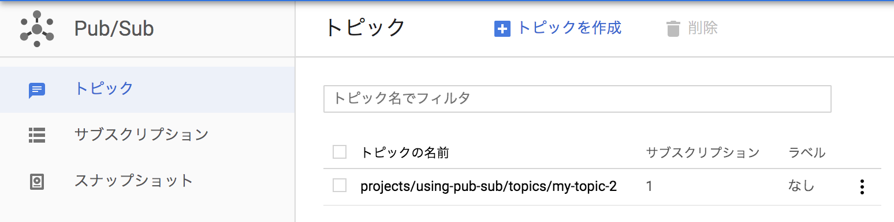
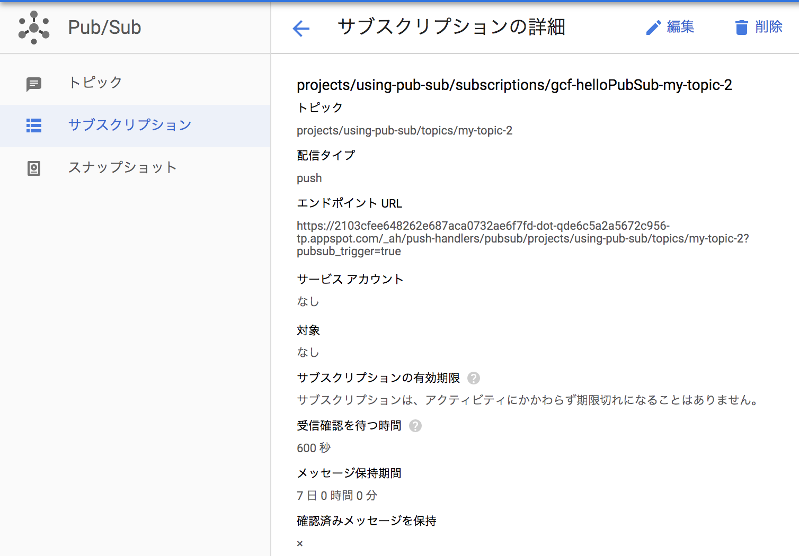

# {{ $page.title }}

<PostMeta/>

Cloud Pub/Subのサブスクリプションの配信タイプをpushにして、配信先にGoogle Cloud Functionsを使ってみる。

なお、Cloud Pub/Subのサブスクリプションの基本的な説明と、配信タイプpullについては[こちらの記事](/using-google-cloud-pub-sub-pull-with-gcloud-tool)に書いている。

## 配信タイプpullとpushの設定の違い
配信タイプがpullの場合は、サブスクライバーが自らメッセージがないか確認しに行くが、配信タイプがpushの場合は、サブスクリプションから**自動で**サブスクライバーへメッセージが配信される。  
したがって、サブスクリプションは事前に配信先を知っておかなければならない。  
配信先にはHTTPSサーバーを指定し、メッセージはそのサーバーにPOSTで通知される。  

## gcloud コマンドライン ツールでCloud Pub/Subをイベントとして駆動するGoogle Cloud Functionsを作成する
gcloud コマンドライン ツールを使うことで、トピック、サブスクリプションを個別で作成しなくても、Cloud Pub/Subをイベントとして駆動するGoogle Cloud Functionsを作成することができる。  
次の手順で作業を進める。  
  
1. Cloud Pub/Subから配信されるメッセージの形式を確認する。
2. Google Cloud Functionsでそのメッセージを受け取れる関数を作成する。
3. 関数をデプロイし、Google Cloudに生成されるものを確認する。
4. 関数単体での挙動を確認する。  
5. メッセージをパブリッシュし、非同期に関数が動くことを確認する。

### Cloud Pub/Subから配信されるメッセージの形式を確認する
Cloud Pub/Subから配信されるメッセージの形式は以下の通りである。  

``` JSON
{
  "message": {
    "data": "SGVsbG8gQ2xvdWQgUHViL1N1YiEgSGVyZSBpcyBteSBtZXNzYWdlIQ==",
    "messageId": "136969346945"
  },
  "subscription": "projects/myproject/subscriptions/mysubscription"
}
```

メッセージのデータは`message.data`フィールドに格納されており、base64でエンコードされている。  
よって、サブスクライバー側でメッセージのデータを取得するには`message.data`をbase64でデコードする必要がある。  
Node.jsでbase64の文字列をデコードするには、`Buffer.from`関数を使う。  
`Buffer.from`関数の第一引数にbase64でエンコードされた文字列、第二引数に`base64`を指定し、`toString()`とすることで元のメッセージが取得できる。  

``` sh
$ node
> Buffer.from('SGVsbG8gQ2xvdWQgUHViL1N1YiEgSGVyZSBpcyBteSBtZXNzYWdlIQ==', 'base64')
<Buffer 48 65 6c 6c 6f 20 43 6c 6f 75 64 20 50 75 62 2f 53 75 62 21 20 48 65 72 65 20 69 73 20 6d 79 20 6d 65 73 73 61 67 65 21>
> Buffer.from('SGVsbG8gQ2xvdWQgUHViL1N1YiEgSGVyZSBpcyBteSBtZXNzYWdlIQ==', 'base64').toString()
'Hello Cloud Pub/Sub! Here is my message!'
>
```

### Google Cloud Functionsでメッセージを受け取れる関数を作成する
Google Cloud FunctionsでCloud Pub/Subからの非同期のメッセージを受け取る関数を作成する。  
Cloud Pub/Subから非同期のメッセージを受け取る関数を作成するには、第一引数に`pubSubEvent`, 第二引数に`context`を指定する。  
第一引数の`pubSubEvent.data`に先ほどのメッセージのデータが格納されている。  
引数で受け取れる内容は[unction parameters](https://cloud.google.com/functions/docs/writing/background#function_parameters)に記載されている。  
Cloud Functionsは、関数が正常に実行されると内部的にサブスクリプションに処理が成功したことを伝えている。  

`index.js`
``` js
exports.helloPubSub = (pubSubEvent, context) => {
  const name = pubSubEvent.data
    ? Buffer.from(pubSubEvent.data, 'base64').toString()
    : 'World';

  console.log(`Hello, ${name}!`);
};
```

### 関数をデプロイし、Google Cloudに生成されるものを確認する
作成した関数を次のコマンドでGoogle Cloud Functionsにデプロイする。  
`gcloud beta functions deploy [Google Cloud FunctionのID] --runtime [実行する環境] --trigger-resource [トピックID] --trigger-event [イベントタイプ]`  
Google Cloud FunctionのIDに関数名を指定する。  
実行する環境はNode.jsやPython、goを選択できるが、ここでは`nodejs10`を指定する。  
また、トピックIDを指定し、イベントタイプはCloud Pub/Subでパブリッシュされたタイミングを表す`google.pubsub.topic.publish`を指定する。  

``` sh
$ gcloud functions deploy helloPubSub --runtime nodejs10 --trigger-resource my-topic-2 --trigger-event google.pubsub.topic.publish
Deploying function (may take a while - up to 2 minutes)...done.
```

上記のコマンドを実行すると、Google Cloud Functionだけでなく、**Cloud Pub/Subのトピック、サブスクリプションも合わせて生成**される。




### 関数単体での挙動を確認する
`gcloud functions call [Google Cloud FunctionのID] --data [メッセージの内容]`で関数を実行する。`--data`でメッセージの内容をBase64エンコードした文字列を指定する。  

``` sh
$ gcloud functions call helloPubSub --data '{"data":"dGVzdCB1c2Vy"}'
executionId: wdqzb2b3y10o
```
関数の実行後に`executionId`が出力される。

`gcloud functions logs read [Google Cloud FunctionのID]`で関数の実行ログを確認する。  
関数の開始終了と、ログとして「Hello, test user!」が出力されたことがわかる。  

``` sh
$ gcloud functions logs read helloPubSub
LEVEL  NAME         EXECUTION_ID  TIME_UTC                 LOG
D      helloPubSub  wdqzb2b3y10o  2019-05-26 07:48:58.671  Function execution started
D      helloPubSub  wdqzb2b3y10o  2019-05-26 07:48:58.671  Billing account not configured. External network is not accessible and quotas are severely limited. Configure billing account to remove these restrictions
       helloPubSub  wdqzb2b3y10o  2019-05-26 07:48:58.739  Hello, test user!
D      helloPubSub  wdqzb2b3y10o  2019-05-26 07:48:58.747  Function execution took 77 ms, finished with status: 'ok'
```

### メッセージをパブリッシュし、非同期に関数が動くことを確認する
`gcloud pubsub topics publish [トピックID] --message [メッセージのデータ]`でメッセージをパブリッシュする。  

``` sh
$ gcloud pubsub topics publish my-topic-2 --message "hello from pub sub my topic2"
messageIds:
- '634756448558277'
```

Google Cloud Functionのログを見ると、「Hello, hello from pub sub my topic2!」とパブリッシュしたメッセージを受け取れていることが確認できる。  
``` sh
$ gcloud functions logs read helloPubSub | grep 634756448558277
D      helloPubSub  634756448558277  2019-05-26 08:24:56.608  Function execution started
D      helloPubSub  634756448558277  2019-05-26 08:24:56.608  Billing account not configured. External network is not accessible and quotas are severely limited. Configure billing account to remove these restrictions
       helloPubSub  634756448558277  2019-05-26 08:24:56.615  Hello, hello from pub sub my topic2!
D      helloPubSub  634756448558277  2019-05-26 08:24:56.615  Function execution took 8 ms, finished with status: 'ok'
```

・参考  
[push サブスクリプションの使用](https://cloud.google.com/pubsub/docs/push?hl=ja)  
[Sample code](https://cloud.google.com/functions/docs/calling/pubsub)  
