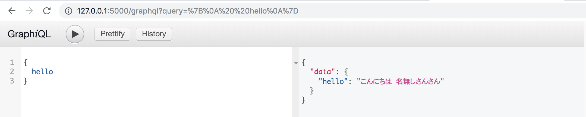
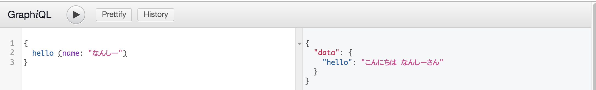
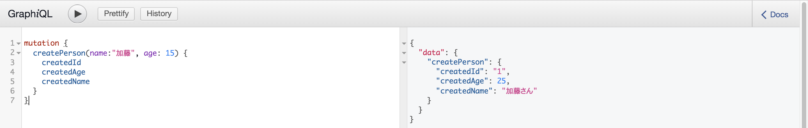

# {{ $page.title }}


<PostMeta/>

Pythonで[GraphQL](https://graphql.org/)サーバーを構築する。  
GraphQLサーバの構築にはPythonのGraphQLライブラリである[Graphene](https://github.com/graphql-python/graphene)を使う。  

[[toc]]

## GraphQLとは
GraphQLは、RESTに代わるAPIの仕様だ。  
APIは、クライアントがサーバーからデータを取得する方法を定義する。  
  
GraphQLクライアントは**GraphQLクエリ言語**(GraphQL query language)によりデータを絞り込み、GraphQLサーバから必要なデータを取得する。  
GraphQLサーバは、固定のデータ構造を返す複数のエンドポイントではなく、**単一のエンドポイントのみを公開**し、クライアントが要求したデータを返す。**GraphQLスキーマ言語**(GraphQL schema language)によりデータの追加や変更、型を定義する。PythonやJavaScriptなど様々な言語で実装されたライブラリのいずれかを使い実装する。  この記事ではPythonを使う。  

## GraphQLサーバの実装で必要なこと
GraphQLサーバを作成するためには、次の2つを実装する必要がある。  

1. スキーマを定義する
2. 各フィールドのリゾルバ関数を実装する

### スキーマを定義する
GraphQLスキーマ言語にしたがってスキーマを定義する。  
スキーマにはQueryタイプ、Mutatinタイプ、あるいは両方をルートに定義する。  
QueryタイプはGraphQLサーバからデータを取得する場合に定義する。  
MutatinタイプはGraphQLサーバに対してデータを更新する場合に定義する。  
意味のあるまとまったデータ(ユーザー、とかブログ)に名前がつけたい場合は、データタイプを定義する。  
なお、Subscriptionタイプというものもあるが、これを実装したい場合は[graphql-ws](https://github.com/graphql-python/graphql-ws)という別のライブラリで実装することになる。Subscriptionタイプはこの記事では紹介しない。  
  
スキーマの最も単純な具体例は次のような定義だ。  
ルートにQueryタイプを定義している。定義されたタイプ内の項目`hello`はフィールドと呼ばれる。  フィールドには型を指定できる。StringはUTF8の文字を意味する定義済みの型だ。  
  
```
type Query {
  hello: String
}
```

### 各フィールドのリゾルバ関数を実装する
**リゾルバ関数**(resolver function)は、1つのフィールドにつき1つ用意する必要のある、データを取得するための関数だ。  
GraphQLサーバはクエリを受け取ると、クエリに指定されているフィールドのすべての関数を呼び出す。その結果をクエリに記述された形式にまとめてGraphQLクライアントに返す。

## AriadneとGraphene
PythonにはGraphQLサーバを実装するためのライブラリとして、[Ariadne](https://github.com/mirumee/ariadne)とGrapheneという2つが用意されている。  
AriadneはスキーマファーストでGraphQLサーバーを作成するのに対して、GrapheneはコードファーストでGraphQLサーバーを作成する。  

スキーマファーストとは、先ほど見たようなスキーマをまずは定義することでGraphQLサーバを実装していく。  
``` py
from ariadne import gql

type_defs = gql("""
    type Query {
        hello: String
    }
""")
```

一方で、コードファーストとは`type Query { ...}`のような記述をせず、その代わりにスキーマの定義を`class Query`のようにコードで記述していく。  
  
``` py
from graphene import ObjectType, String

class Query(ObjectType):
    hello = String()
```

この記事ではGraphQLの公式サイトからリンクされているGrapheneを使いコードファーストで実装していく。  

## GrapheneでGraphQLサーバを実装する
それでは、実際にGrapheneを使ってGraphQLサーバを実装していく。  
名前を与えたら、「こんにちは {名前}さん」と返すようにする。  

### grapheneのインストール
まずはPython3.7.3で仮想環境を作成する。  
``` sh
$ touch Pipfile
$ pipenv --python 3.7.3
$ pipenv shell
```

grapheneをインストールする。  
``` sh
$ pipenv install graphene==2.1.6
```

### Queryの実装
コードは次のようになる。  

`hello.py`  
``` py
from graphene import ObjectType, String, Schema

class Query(ObjectType):
    hello = String(name=String(default_value="名無しさん"))

    def resolve_hello(self, info, name):
        return f'こんにちは {name}さん'


schema = Schema(query=Query)
```

`ObjectType`を継承したクラスを作成する。(`Query`てクラス名に縛りはなく、何でもよい)  
このクラスには、フィールドとそのフィールドのリゾルバ関数を実装する。  
このクラスの属性はフィールドをあらわし、型を表すクラスを代入することで型を定義する。
型を表すクラスとしてInt、Float、String、Boolean、IDのようなスカラー型やEnum、Listなどが用意されている。  
**`resolve_クラスの属性名`はリゾルバ関数**をあらわす。  
リゾルバ関数の引数の説明はこちら。  
https://docs.graphene-python.org/en/latest/types/objecttypes/#resolvers  
  
つまり、`hello`はフィールドで`String`型であり、`resolve_hello`は`hello`フィールドのリゾルバ関数である。  
作成した`ObjectType`を継承したクラスは`Schema`クラスに`query=`の形で渡す。これでルートにQueryタイプを定義したことになる。  
  
さて、定義したスキーマに対してクエリを実行したい。  
`schema.execute()`でクエリを実行できる。  

`hello.py`  
``` py
query_string = '{ hello }'
result = schema.execute(query_string)
print(result.data['hello'])

query_string_with_argument = '{ hello (name: "なんしー") }'
result = schema.execute(query_string_with_argument)
print(result.data['hello'])
```

実行するとクエリで問い合わせた結果が取得できる。  

``` sh
$ python hello.py
こんにちは 名無しさんさん
こんにちは なんしーさん
```

### GraphQL APIをウェブアプリケーション(Flask)で提供する  
GraphQL APIをサーバーで完結させるのではなく、ブラウザから呼び出せるようにする。  
Flaskと[Flask-GraphQL](https://github.com/graphql-python/flask-graphql)というGraphQLと連携するライブラリをインストールする。  

``` sh
$ pipenv install Flask==1.0.3
$ pipenv install Flask-GraphQL==2.0.0
```

Flaskの`add_url_rule`メソッドで`/graphql`にアクセスするとGraph GraphQLからデータを取得できるようにする。  

`app.py`
``` py
from flask import Flask
from flask_graphql import GraphQLView
from hello import schema

app = Flask(__name__)
app.debug = True

app.add_url_rule(
    '/graphql',
    view_func=GraphQLView.as_view(
        'graphql',
        schema=schema,
        graphiql=True  # GraphiQLを表示
    )
)

if __name__ == '__main__':
    app.run()
```

`python app.py`でサーバーを立ち上げる。  
``` sh
$ python app.py
...
 * Running on http://127.0.0.1:5000/ (Press CTRL+C to quit)
```

`http://127.0.0.1:5000/graphql`を開くとGraphQLをGUIで操作できるGraphiQLが表示される。  
左の窓に`{ hello }`と入力して、実行ボタンを押すと、右側の窓に結果が返ってくる！  

`hello (name: "なんしー")`と引数付きで実行すると、それに対応した値が返ってくる。  


### Mutationの実装
Queryの確認ができたので、次はMutationを実装する。  
ユーザーの名前、年齢を渡したら、ID、変更された名前、変更された年齢が返ってくるようにする。  
`graphene.Mutation`を継承したクラスを作成する。  
このクラスの属性が戻り値になる。  
`Arguments`クラスの属性は引数になる。  
そして、`mutate`メソッドで`graphene.Mutation`を継承したクラスのインスタンスを返す。  
本来`mutate`メソッドの中でDBへの永続化などの処理を書く。  

``` py
from graphene import ObjectType, String, Schema, Mutation, ID, Int

class CreatePerson(Mutation):
    # created_id、created_name、created_ageが戻り値
    created_id = ID()
    created_name = String()
    created_age = Int()

    # name, ageが引数
    class Arguments:
        name = String()
        age  = Int()

    # mutateメソッドの引数はself,infoの次に引数が並ぶ
    def mutate(self, info, name, age):
        # ここで永続化する

        # Mutationを継承したクラスをインスタンス化して返す
        return CreatePerson(
            created_id=1,
            created_name=f'{name}さん',
            created_age=age + 10,
        )

class MyMutation(ObjectType):
    create_person = CreatePerson.Field()

schema = Schema(query=Query, mutation=MyMutation)
```

次のように問い合わせると、
``` 
mutation {
  createPerson(name:"加藤", age: 15) {
    createdId
    createdAge
    createdName
  }
}
```

`mutate`メソッドで変更を加えた通り、年齢が加算され、名前にさんがついて返ってくる。  

```
{
  "data": {
    "createPerson": {
      "createdId": "1",
      "createdAge": 25,
      "createdName": "加藤さん"
    }
  }
}
```



参考  
https://graphql.org/  
https://www.howtographql.com/  
https://employment.en-japan.com/engineerhub/entry/2018/12/26/103000  
https://github.com/graphql-python/graphene/tree/master/examples  
https://github.com/howtographql/graphql-python/blob/master/hackernews/links/schema.py  
