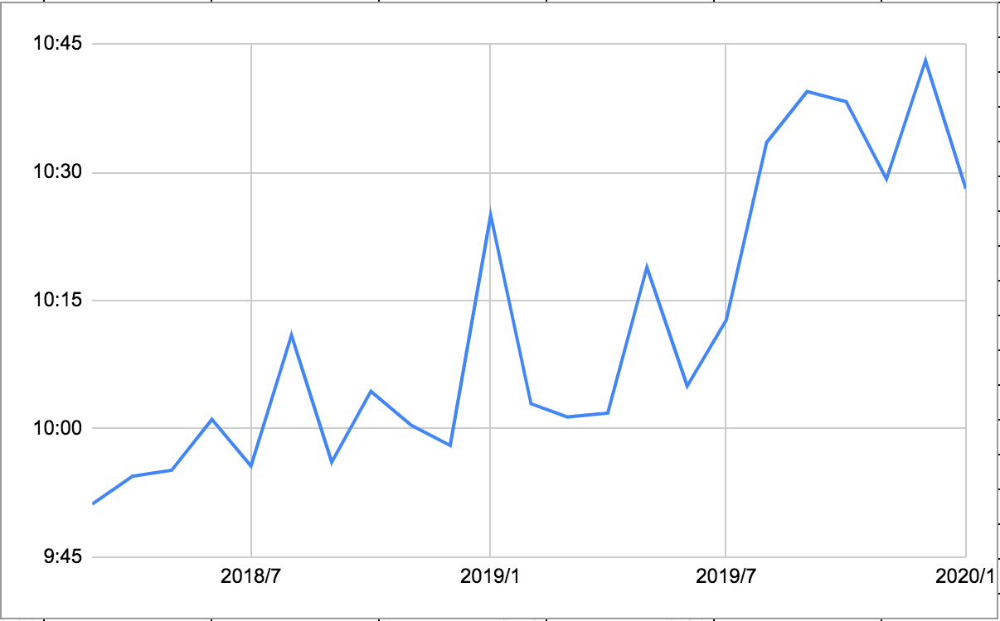

# {{ $page.title }}

<PostMeta/>

自分で決めずに、流されてることが多いなぁと思う。  
  
今わたしが契約している会社はフレックスタイム制を導入している。  
11時～16時のコアタイムといわれる時間、会社にいればよく、出社、退社の時間を管理しやすいと言われている。  
朝の通勤ラッシュをさけることができ、保育園に子供を迎えに行く親は早めに退社できる。  
市役所に書類を取りに行きたい時も出社を遅らせればよく、病院に行きたい時にも便利である。  
  
なんて快適な制度なんだ、と思っていたのだけど、なんだか徐々に出社の時間が遅くなってる気がする...気のせいだろうか...  
自分の出勤時間を月ごとに平均を出して、時系列で見返してみた。

......。  
  
めちゃめちゃお寝坊さんになっとるやないか！！！  
  
2年前は9:50に出社していたのに、ここ半年では10:30以降まで遅くなっている。  
まさに、うなぎのぼり。  
自分の意思で遅い時間に出社するならいいのだけど、ただ日常に流された結果、遅く出社するのは自分の時間を自分で奪ってるようなものだ。 
  
フレックスタイム制自体はたしかに選択の自由があるけれど、楽な方に流されるだけでは自由じゃないなぁと思う。  
時間を取り戻すべく、自分の意思で出社時間を決めることにする。
