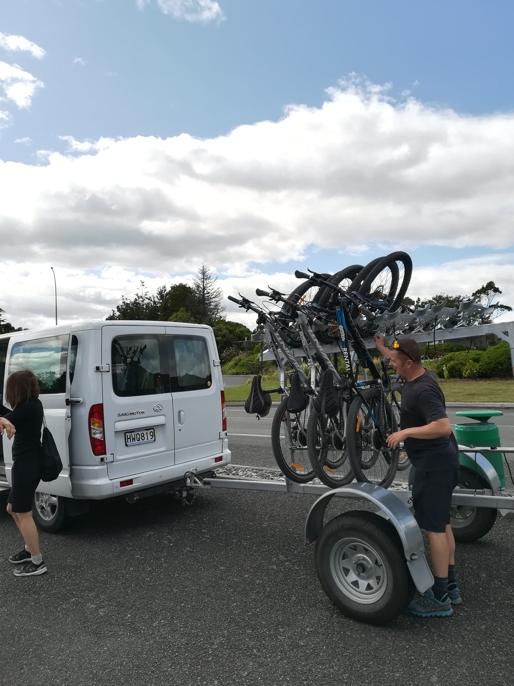
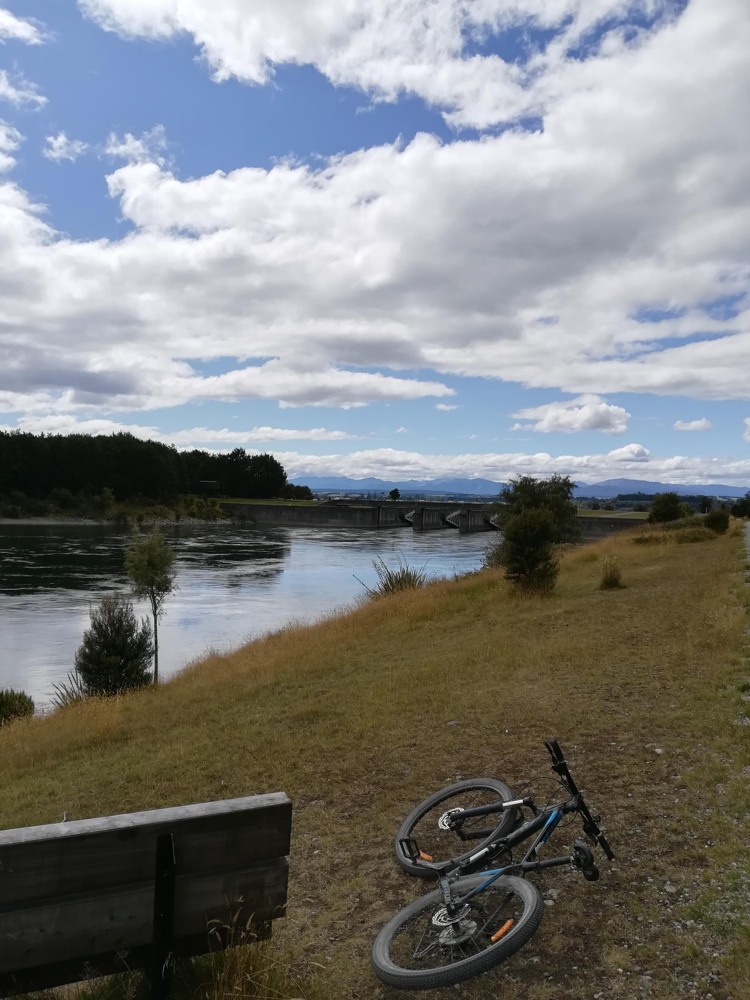
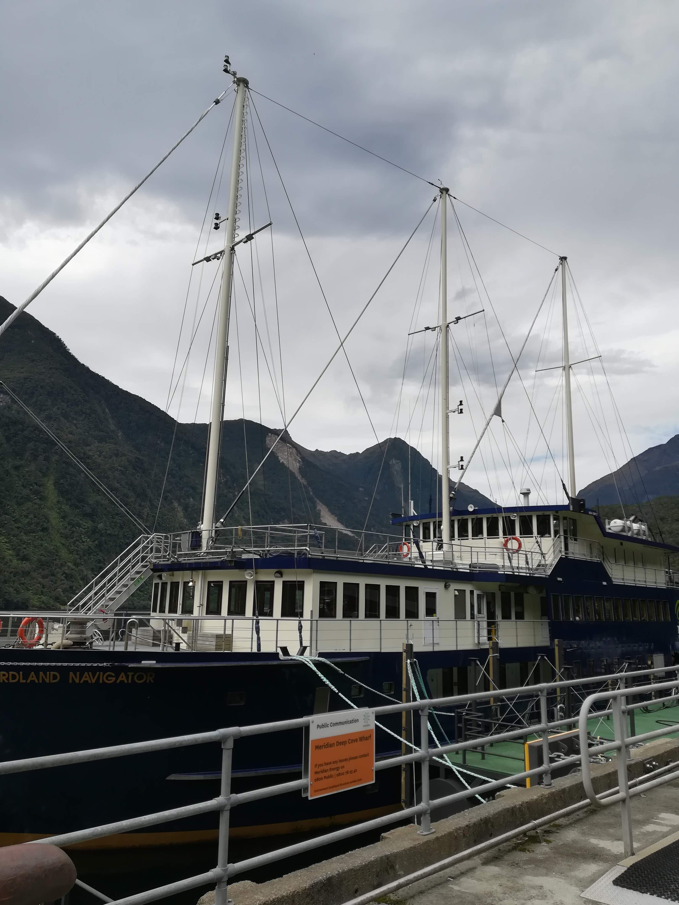
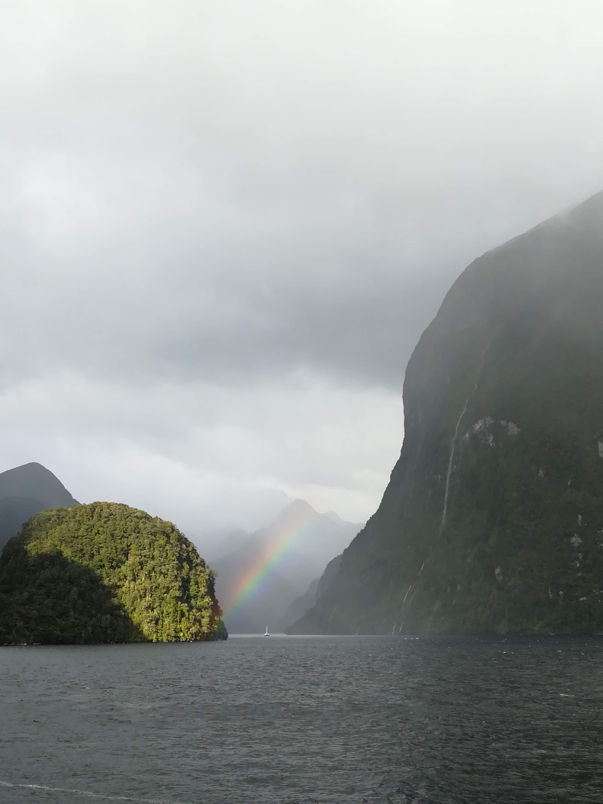
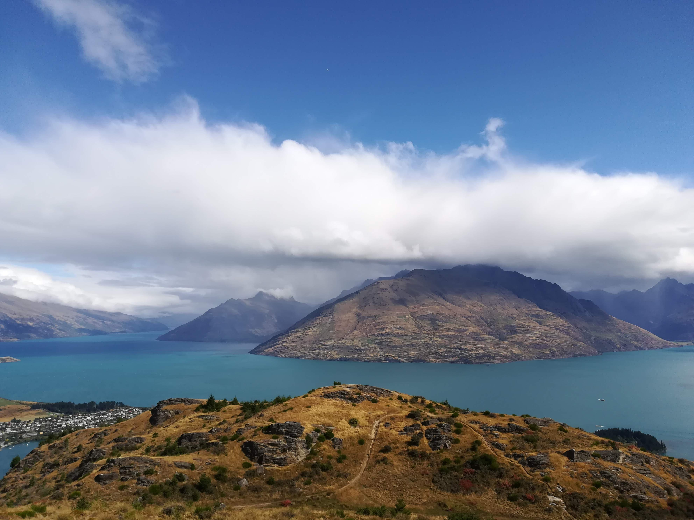
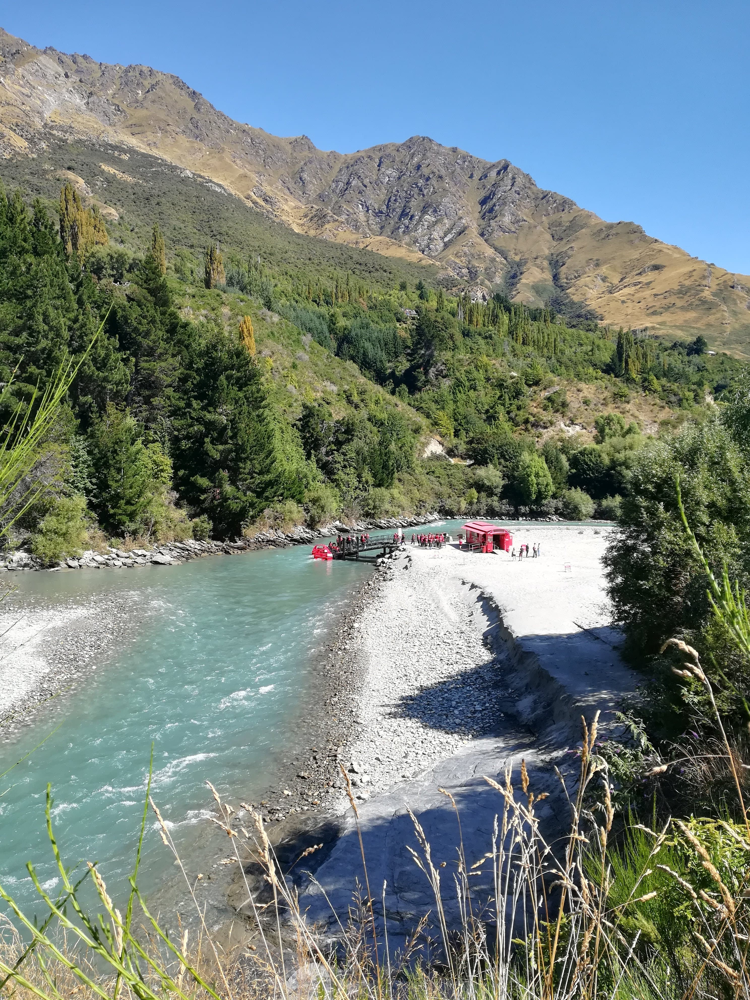
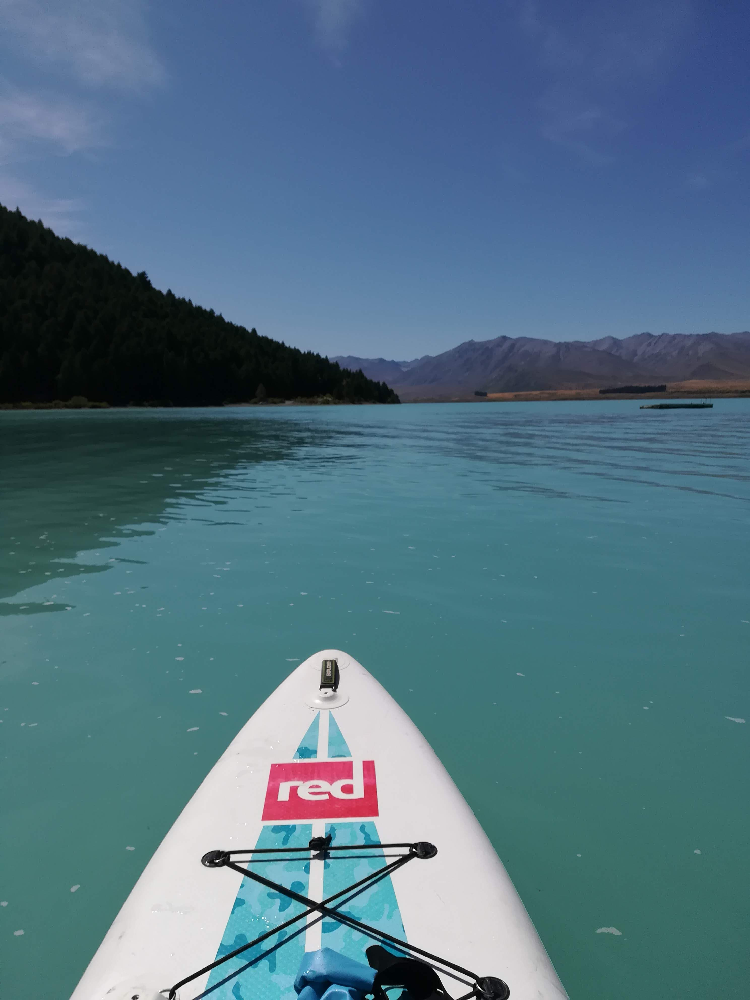
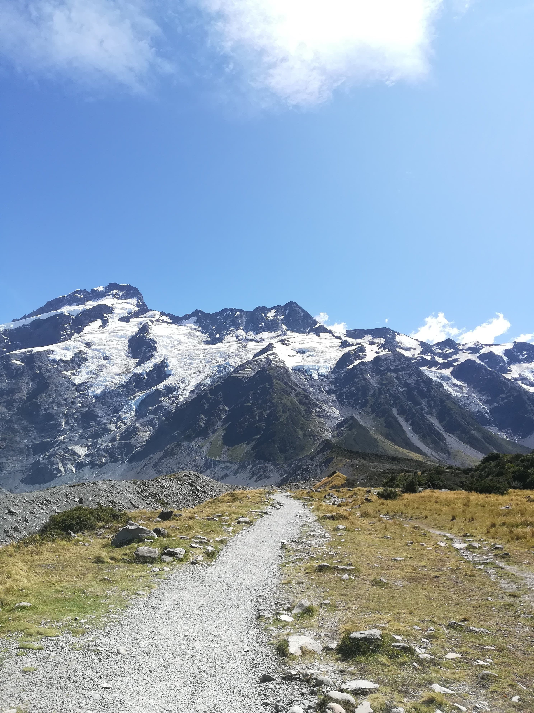

# {{ $page.title }}

<PostMeta/>

ニュージーランドの南島を2週間かけて旅行してきた。  
ニュージーランドはとにかく空気が澄んでいて、見晴らしが良く、山々が美しく見える。  
自然豊かで、その自然を活かしたアクティビティも豊富だ。  
今回は私が体験したアクティビティを振り返ろうと思う。  

## テ アナウ(Te Anau)でのサイクリング

テアナウ湖の周りにはサイクリングコースが用意されている。  
ネットから自転車のレンタルを予約した。  
レンタルだけでなく、テアナウの街から20kmほど離れた地点まで自転車と一緒に車で運んでもらうプランにした。  
街へ向かうサイクリングコースは坂の連続だ。ほんとにこんな坂を上り下りするの？と何度もひるんだ。  
だけどレースではないので、コースのところどころに設置されている椅子にすわって休憩しながら自分のペースで進んだ。  
街に着くまでだいたい4時間ぐらいかかった。  
自転車はしっかり整備されており、美しい景色を存分に楽しめた。  
  
予約したサイト  
https://www.wildridesfiordland.co.nz/  

## ダウトフルサウンド(Doubtful Sound)のクルージング

事前に口コミサイトでおすすめの旅行スポットを聞いていた。  
ミルフォードサウンドという場所があってそこの方が有名なのだけど、それよりもダウトフルサウンドの方がおすすめだよと聞いていたので、どんなとこだろうとワクワクしながら向かった。  
Google Mapの口コミでも、ニュージーランドの旅行中でもっとも素晴らしかったと言う口コミをいくつもみていたので余計に期待が膨らんだ。  
ジェット船、バスで乗り継いで、やっとこさクルーズ船に乗りこめる。  
ダウトフルダウンドはほとんど音がしない。  
聞こえてくるのは滝の音や鳥のさえずりだけだ。  
船から見える景色は幻想的だった。  
ツアーの途中ではカヌーに乗れたりするし、夕食、朝食も付いている。船の上で泊まるという体験も新鮮だった。

予約したサイト  
https://www.realjourneys.co.nz/jp/  

## クイーンズタウン(Queenstown)のハイキング

クイーンズタウンは街に活気がある。  
海に面したこの街では、そこかしこからストリートミュージシャンの歌声が聞こえる。  
観光客も多く、お土産屋さんも多い。  
わたしもお土産屋さんめぐりをしたのだけど、そのうちの1つでサンダルを買った。  
ハイキング用の靴しかもっていかなかったので、足がむれむれになっていたのだ...  
レジで店員さんにサンダルを渡すと、その店員さんは日本人だった。  
せっかくなので軽くハイキングできるスポットを聞いて教えてもらったのが、クイーンズタウン ヒル ウォーキング トラックだった。  
とろいわたしでも全然平気で登れます、と教えてもらったのだけど、わたしは登りながら汗だくになった。どうやらわたしはさらにとろいようだ。  

## クイーンズタウン(Queenstown)のラフティング

ラフティングは大型のゴムボードに乗り、パドルでボードの流れる方向を操作しながら川を下るアクティビティだ。  
実はニュージーランドのラフティングは世界的に有名らしい。  
群馬県のみなかみでラフティングは一度経験しているのだけど、激流の中をゴムのボートで進んでいくのはまさに冒険、という感じがする。  
わたしはシンガポールからきた4人組と同じボートにのった。  
ボートではインストラクターの方が後ろで指示を出してくれる。はい右の人漕いで！、やめ！、はい次は左の人漕いで！、しゃがんで！と川の流れにしたがって次々と指示がだされる。  
流れが緩やかなところでは、インストラクターの方がどこから来たの？好きな食べ物は？とか他愛ない話しをふって盛り上げてくれた。  
わたしが体験したときは、どちらかというと川の流れが緩やかであったらしい。流れが激しい時はけっこうボートから人が落ちるとか。そういう時の方がおれはスリリングで好きだ、ってインストラクターの方は言ってた。  

予約したサイト(予約したのはTripadvisorだったかも)  
https://www.goorange.co.nz/  

## クイーンズタウン(Queenstown)のキャニオニング
キャニオニングは、川の上を歩き、岩の間をバランスを取りながら進み、滝の流れに身を委ねて下っていくアクティビティだ。  
アメリカからきた2人組と、ドイツからきた1人と同じグループでツアーが開催された。  
誰もいない川の上を歩いて、人が1人だけ通れるような狭い岩間を通り抜けたりしながら探検していく。自分の身一つで直接自然を感じられる。  
岩の上を歩いたり、滝を降るのは危険なので、コースに設置されているロープに自分の腰あたりにつけたカラビナをつけて落下防止対策がなされている。  
いざという時は大丈夫、と思いつつ手に汗を握りながら進んでいく。  
美しい自然を自分の身体で直接感じられたという点で、ラフティングよりも楽しかったかな。  

予約したサイト  
https://www.tripadvisor.co.nz/AttractionProductReview-g255122-d11485040-Half_Day_Kawarau_Canyoning_Experience_from_Queenstown-Queenstown_Otago_Region_Sout.html  

## テカポ湖(Lake Tekapo)のSUP

テカポ湖沿いに、ボートをたくさん乗せた車が止まっていた。  
カヌーやSUPのボードを貸し出していて、わたしが着いた頃にはすでに湖の上にカヌーやSUPをしている人が何人もいた。  
ちなみに、湖の平均水温は8～10℃だそう。試しに入ってみたのだけど、1分ぐらい泳いですぐにでた。寒すぎてしばらく鳥肌がきえなかった...。それでもチャレンジする輩はあとを絶たず、皆はしゃいでいた。  
湖沿いには日光浴をしている人たちも多く、のどかな雰囲気だった。  
湖はまさに美しい水色！みているだけで幸せになれる。  
SUPのボードを借りて、湖の真ん中の方まで漕いだ。そこから見える景色を独り占めしているようだった。  
  
なお、テカポは世界一星が美しく見えるらしく、夜は星空ツアーに参加した。  
ほとんどの人はこの星を見にテカポに来ていると思われる。  
実際、天の川、信じられないほどきれいに見えた。空に星、こんなにあったのかってくらい。  
星は一覧レフじゃないと写真を撮れないらしい。  
スマホで撮ってみたらまっくろくろすけだった。  

SUPのサイト(一応サイトはあるけど、わたしは現地で直接声をかけてボードを借りた)  
http://www.paddletekapo.co.nz/  

星空ツアーを予約したサイト  
https://www.jtb.co.jp/kaigai_opt/srh/prddetail/p293053/

## アオラキ/マウント・クック(Aoraki/Mount Cook)のハイキング

ケア ポイント トラック、フッカーバレートラック、レッド ターン トラックといくつもコースがあるのだけど、マウントクックに泊まって3つとも歩いて来た。  
フッカーバレートラックが中でも一番人気らしく、観光客がたくさんいた。  
たしかゴール地点まで2時間ほど歩くのだけど、どの地点からも美しい山々が見えるため全然飽きない。  
歩き終わった後の疲労感も心地よく、旅先でハイキングするのもありだな、と思った。  
  
## 感想
ニュージーランドの魅力にすっかりはまったぞ。  
自然大好き、アクティビティ大好きな自分にとっては楽園だった。  