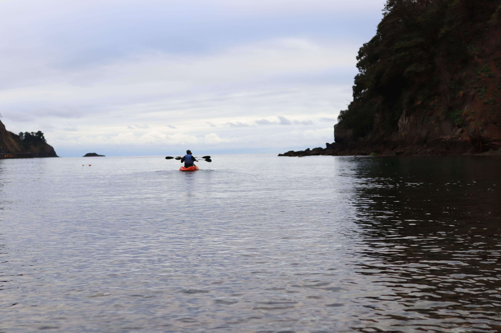

# {{ $page.title }}

<PostMeta/>

伊豆半島にある下田に、先週の金曜日行ってきた。  
品川駅では多くの人とすれ違ったけど、新幹線で熱海まで行き、伊豆急行に乗り換えて下田に着く頃には、電車にのっていたのは自分ともう1人だけだった。  
いつもの金曜日ならすでに家でゴロゴロしていたであろう時間に、下田駅についた時、たまらなくわくわくした。  
  
下田に向かったのは、キャンプ場で働いている友達が大会を企画したからだ。  
土曜の朝にスタートするから前乗りしたのだ。  
大会はトレイルラン3km、カヤック1km、さらに謎解きをしながらゴールに向かうものだ。  
2人1組のチームで参加することになっていた。  
参加者は全国から集まった精鋭、わずか2組...!  
プレ大会という位置付けで、試験的に開催することになったらしい。  
  
翌日の土曜日、車でスタート位置の海岸に向かった。  
そこで初めてもう1組の参加者にお会いした。  
その参加者2人、自分たちのチーム2人、そして友人を含む大会スタッフ2人の計6人が初めて顔を合わした。  
不思議だなと思う。  
今まで接点がなかった人たちが大会があると聞きつけて1箇所に集まるんだから。  
こころのなかでこっそりと、仲間だ、と思った。  
大会と聞いてわくわくするのは、身近にはあまりいない自然の中で運動することが好きな人たちと出会えるからかもしれない。  
  
大会では海岸沿いを走り、街中を抜け、坂道を登ったり降ったり、ひらけた平地で指示書にかかれた物を探し出したりした。  
最後に、島へ向かってカヤックを漕ぎ、ゴール地点はキャンプ場だった。  
ちなみに、あっさり負けた。  
  
その日はそのままキャンプ場に泊まった。  
身体を動かしたあとの気持ちの高まりを感じながら、みんなで焚き火を囲みながら過ごしたゆっくり流れる時間は幸せそのものだった。  
最高かよ。