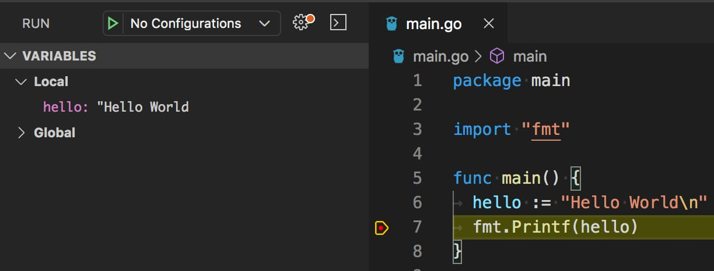

# {{ $page.title }}

<PostMeta/>

Go言語をはじめるぞʕ◔ϖ◔ʔ  
今回はMacにGoをインストールして、Visual Studio Code上でdlvでデバッグできる環境を作る。  

## Goのインストール
まずはGoをbrewでインストールした。  
バージョン1.14がはいった。
``` sh
$ brew install golang
$ go version
go version go1.14 darwin/amd64
```

Go1.14のリリースは2020/2/25だから最近だな。  
https://blog.golang.org/go1.14  
  
Goのリリース周期は6か月ごとにメジャーリリースを作成するらしい。  
頻繁に更新されるのだね。  
> The overall goal is to make a major release every six months  
https://github.com/golang/go/wiki/Go-Release-Cycle  

## dlvのインストール
はやめにデバッグ環境を整えておきたい。
[dlv](https://github.com/go-delve/delve)というツールが有名のようなので、これをインストールする。  

``` sh
$ sudo /usr/sbin/DevToolsSecurity
Password:
Developer mode is now enabled.
$ go get -u github.com/go-delve/delve/cmd/dlv
$ dlv version
-bash: dlv: command not found
```

"command not found"と表示されたので、PATHが通ってなさそうだ。  
そもそも`go get`したコードはどこにインストールされたのだろう。  

> If no GOPATH is set, it is assumed to be $HOME/go on Unix systems
https://github.com/golang/go/wiki/SettingGOPATH

何も設定していない場合、`$HOME/go`下にインストールされるようだ。
いた！  

``` sh
$ ls -l ~/go
total 0
drwxr-xr-x  4 nancy  staff  128  3 28 19:49 bin
drwxr-xr-x  4 nancy  staff  128  3 27 21:37 pkg
drwxr-xr-x  3 nancy  staff   96  3 27 21:51 src
```

この`~/go/bin`にパスを通す。  
``` sh
$ echo 'export PATH=~/go/bin:$PATH' >> ~/.bash_profile
$ . ~/.bash_profile
```

そして`dlv version`を実行してみると、無事実行された。  
``` sh
$ dlv version
Delve Debugger
Version: 1.4.0
Build: $Id: 67422e6f7148fa1efa0eac1423ab5594b223d93b
```

## Visual Studio Codeにgo extentionをインストールする
EXTENSIONSボタンを押して、検索窓に「go」と入力し、「Install」ボタンを押す。

## プロジェクトをつくる
`go mod init [module path]`でプロジェクトを初期化するようだ。  
https://github.com/golang/go/wiki/Modules#quick-start

``` sh
$ mkdir sample-go
$ cd sample-go
$ go mod init github.com/nansystem/sample-go
```
このコマンドを実行すると、実行した場所に`go.mod`ファイルが生成される。  
`go.mod`をルートとしたディレクトリを`module`というのかな。  
このあたりは勉強していこう。  
  
> A module is defined by a tree of Go source files with a go.mod file in the tree's root directory.  
https://github.com/golang/go/wiki/Modules#gomod  

## Hello World
Visual Studio CodeでHello World書いて、デバッグポイントをおく。  
「実行」>「デバッグの開始」から動かす。  


"Hello World"表示されてる！