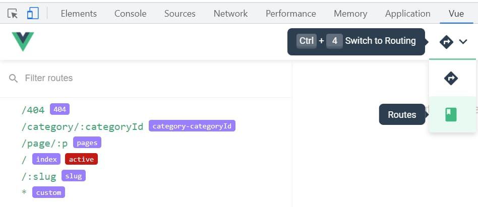

# {{ $page.title }}

<PostMeta/>

Nuxtはディレクトリ構成でルーティングを自動で設定してくれるので、どういうURLが生成せれたのか確認したいことがある。  
  
サーバーサイドのフレームワークは大抵起動するとログにURL一覧を出力してくれる。  
しかし、Nuxtは`npm run dev`で起動すると、以下のように起動したポートは表示しれくれるものの、URL一覧を出力してくれない。
```
ℹ Listening on: http://localhost:3000/                                                                        22:02:05
No issues found.
```

そこで、Nuxtのルーティングで生成されるURL一覧を確認する方法を調べた。  
方法は2つだ。  

## .nuxt/router.jsからURL一覧を確認する
`npm run dev`すると`.nuxt`という隠しディレクトリが生成される。  
そのなかに`router.js`が出力されている。  
ファイルを見ると以下のようになっていて、`path`を確認できる。  

`.nuxt/router.js`
``` js
  routes: [{
    path: "/404",
    component: _703b1310,
    name: "404"
  }, {
    path: "/category/:categoryId",
    component: _62cb9fe2,
    name: "category-categoryId"
  }, {
    path: "/page/:p",
    component: _717845aa,
    name: "pages"
  }, {
    path: "/",
    component: _717845aa,
    name: "index"
  }, {
    path: "/:slug",
    component: _a6344d36,
    name: "slug"
  }, {
    path: "*",
    component: _703b1310,
    name: "custom"
  }],
```

## Chrome拡張のVue.js devtoolsからURL一覧を確認する

Chrome拡張のVue.js devtoolsからURL一覧を確認する。  
ルーティングタブの`Routes`を選ぶと表示される。  
そんなところにあったんかい。  


